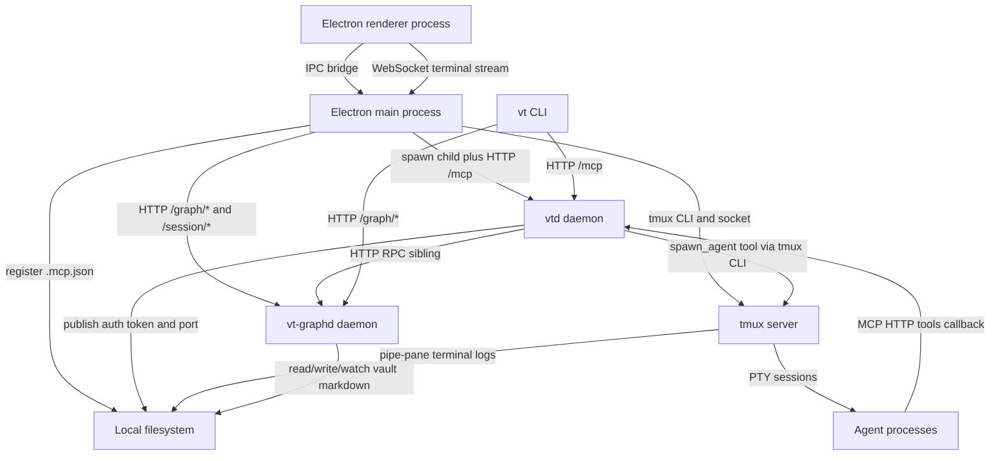

# VoiceTree Architecture

This diagram is the tier-1 architecture-drift contract for VoiceTree's high-level process topology.

```mermaid
flowchart TD
  filesystem[Local filesystem]
  electronMain[Electron main process]
  electronRenderer[Electron renderer process]
  vtd[vtd daemon]
  graphd[vt-graphd daemon]
  tmuxServer[tmux server]
  vtCli[vt CLI]
  agentProcesses[Agent processes]

  electronRenderer -->|IPC bridge| electronMain
  electronRenderer -->|WebSocket terminal stream| electronMain
  electronMain -->|HTTP /graph/* and /session/*| graphd
  electronMain -->|spawn child plus HTTP /mcp| vtd
  electronMain -->|tmux CLI and socket| tmuxServer
  electronMain -->|register .mcp.json| filesystem
  vtd -->|HTTP RPC sibling| graphd
  vtd -->|spawn_agent tool via tmux CLI| tmuxServer
  vtd -->|publish auth token and port| filesystem
  vtCli -->|HTTP /mcp| vtd
  vtCli -->|HTTP /graph/*| graphd
  tmuxServer -->|PTY sessions| agentProcesses
  tmuxServer -->|pipe-pane terminal logs| filesystem
  agentProcesses -->|MCP HTTP tools callback| vtd
  graphd -->|read/write/watch vault markdown| filesystem

  click filesystem "."
  click electronMain "webapp/src/shell/edge/main/runtime/electron/app/main.ts"
  click electronRenderer "webapp/src/shell/UI/App.tsx"
  click graphd "packages/systems/graph-db-server/bin/vt-graphd.ts"
  click vtd "packages/systems/vt-daemon/bin/vtd.ts"
  click tmuxServer "packages/systems/vt-daemon/src/agent-runtime/terminals/tmux"
  click vtCli "packages/systems/voicetree-cli/bin/vt"
  click agentProcesses "packages/systems/vt-daemon/src/agent-runtime/spawn"
```
