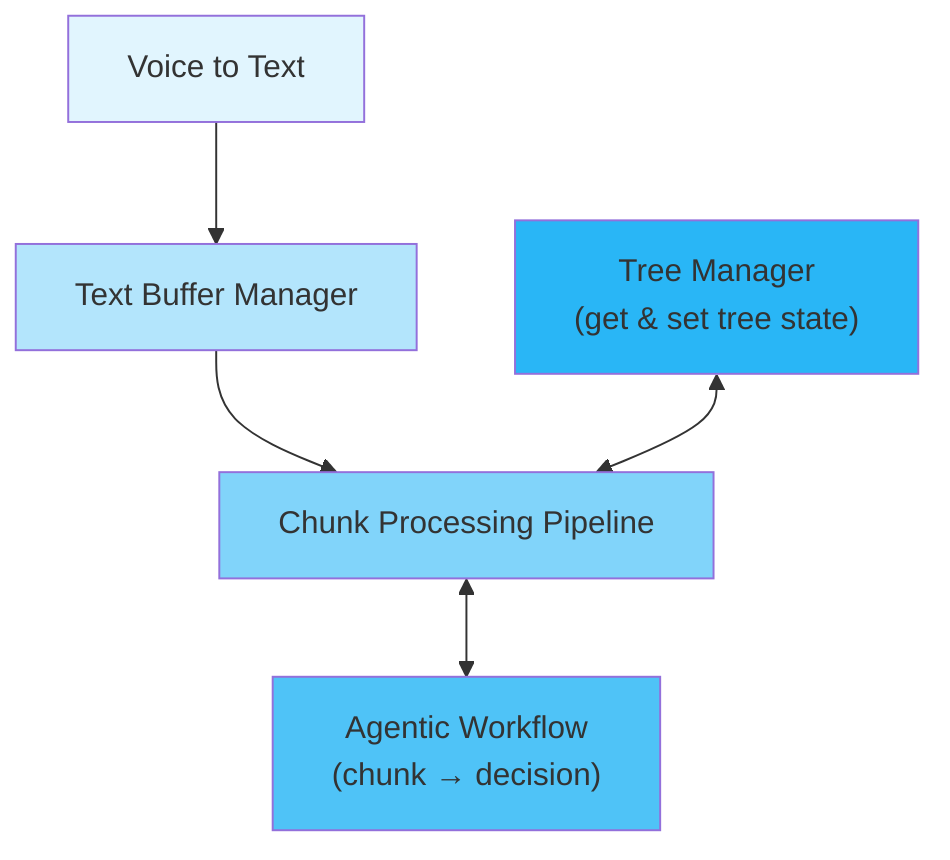

# Backend - Core System Architecture

## Overview

see diagram

## Architecture

```
backend/
├── main.py                                    # System entry point & orchestration
├── enhanced_transcription_processor.py       # Tprocessor
├── workflow_adapter.py                      # Backend ↔ Agentic workflow bridge
├── settings.py                             # System configuration
├── voice_to_text/                         # Voice capture & transcription
├── tree_manager/                          # Tree data structures & buffer management
├── agentic_workflows/                     # 4-stage LLM processing pipeline
├── benchmarker/                          # Quality testing & performance measurement
└── tests/                               # Unit & integration tests
```

## diagram

all I actually want here is a simple ascii diagram of how the components relate to each other

e.g the optimal is the following pipeline:
                                tree_manager (get & set tree state)
                                                V
                                                V
voice_to_text -> text_buffer_manager -> chunk_processing_pipeline 
                                                V
                                                V             
                                agentic_workflow (chunk -> decision) 

