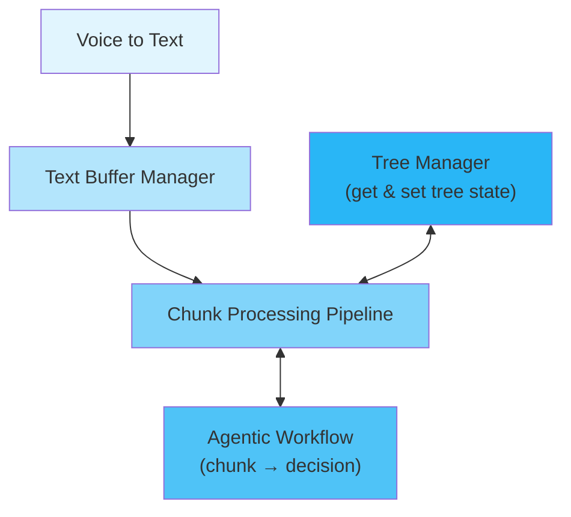

# Backend - Core System Architecture

## Architecture

                                tree_manager (get & set tree state)
                                                V
                                                V
voice_to_text -> text_buffer_manager -> chunk_processing_pipeline 
                                                ↓
                                         agentic_workflow 
                                        (chunk -> decision) 

- **[`backend/text_to_graph_pipeline/tree_manager/`](backend/text_to_graph_pipeline/tree_manager/README-dev.md)** - Tree data structures and buffer management
  - Decision tree data structures (`DecisionTree`)
  - Unified buffer management for streaming input
  - Tree-to-markdown conversion

- **[`backend/text_to_graph_pipeline/agentic_workflows/`](backend/text_to_graph_pipeline/agentic_workflows/README-dev.md)** - 4-stage LLM processing pipeline
  - LangGraph-based workflow execution
  - State management across pipeline stages
  - LLM integration (Gemini API)
  - Workflow visualization and debugging

- **[`backend/benchmarker/`](backend/benchmarker/README-dev.md)** - Quality testing and performance measurement
  - 4-stage quality scoring framework
  - Automated benchmarking system
  - Performance regression detection
  - Debugging and analysis tools