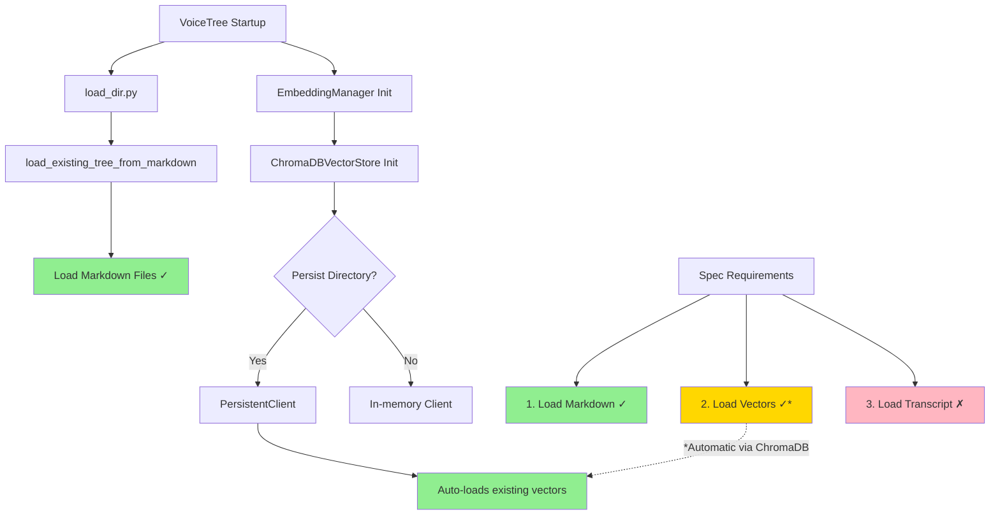

** Summary**
Investigated the current implementation status of vector loading in VoiceTree. Found that vector persistence and loading is **already implemented** in ChromaDBVectorStore, but the load_dir.py script only partially implements the 3 required functions.

** Technical Details  **
- **Files Examined**: 
  - backend/markdown_tree_manager/embeddings/chromadb_vector_store.py
  - backend/setup/load_dir.py
  - backend/markdown_tree_manager/embeddings/embedding_manager.py
- **Key Findings**:
  - ChromaDBVectorStore automatically loads persisted vectors when initialized with a persist_directory
  - The load_dir.py currently only implements markdown loading (function #1 of 3 in spec)
  - Vector loading happens automatically through ChromaDB's PersistentClient
  - EmbeddingManager creates ChromaDB store with persistence to markdownTreeVault/chromadb_data

** Architecture/Flow Diagram**

** Impact**
- **Vector Loading**: Already functional through ChromaDB's automatic persistence/loading mechanism
- **Missing Functionality**: load_dir.py needs to implement transcript history loading (function #3)
- **Integration**: Vector loading doesn't need explicit implementation in load_dir.py as it's handled automatically by ChromaDBVectorStore initialization

-----------------
_Links:_
Parent:
- is_finding_of [[./10_Investigate_Vector_Loading_Status.md]]