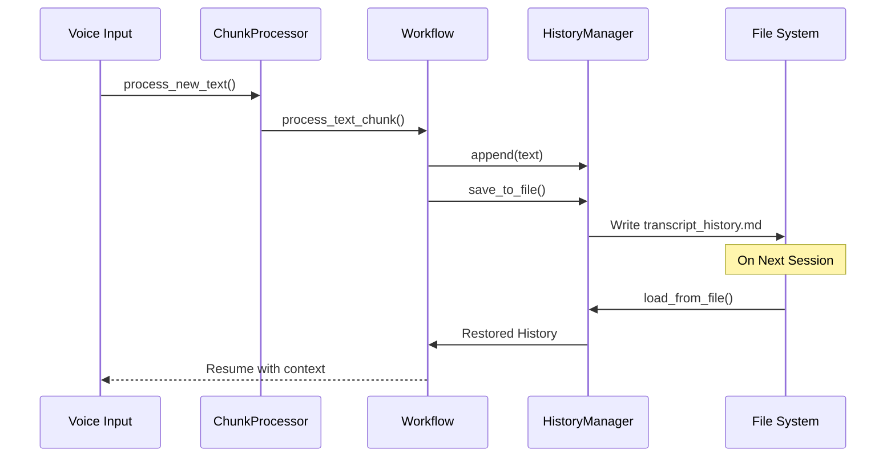

** Summary**
Successfully implemented transcript history saving and loading functionality for VoiceTree. The system now persists transcript history to disk as markdown files, enabling resumability across sessions.

** Technical Details**
- **Files Modified**:
  - history_manager.py: Added save_to_file() and load_from_file() methods
  - tree_action_decider_workflow.py: Added save_transcript_history() and load_transcript_history() methods
  - chunk_processor.py: Integrated automatic saving after processing and loading on initialization
  - load_dir.py: Added transcript history loading when loading existing trees

- **Key Changes**:
  - Transcript history is saved as transcript_history.md in the same directory as node markdown files
  - History is automatically saved after each text processing chunk
  - History is automatically loaded when initializing ChunkProcessor or loading existing trees
  - Format includes YAML frontmatter with metadata (type, updated timestamp)

** Architecture/Flow Diagram**

** Impact**
This implementation completes the requirement specified in load_dir.py to save and load transcript history. The system now maintains context across sessions, improving the continuity of the voice-to-graph conversion process. Users can stop and resume their work without losing the conversation history that helps the AI understand context.

-----------------
_Links:_
Parent:
- is_progress_of [[./11_1_Zoe_Transcript_History_Analysis_Complete.md]]