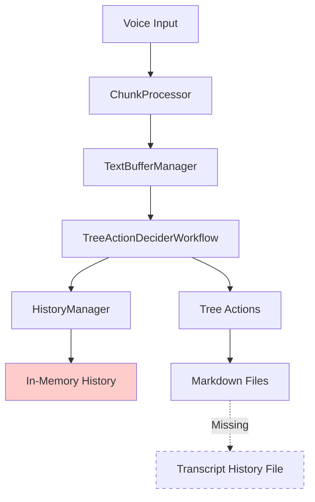

** Summary**
Analyzed the existing VoiceTree codebase to understand how transcript history is currently handled and identified where to implement saving/loading functionality.

** Technical Details**
- **Files Analyzed**: 
  - history_manager.py: Contains HistoryManager class that tracks transcript history in memory
  - tree_action_decider_workflow.py: Uses HistoryManager to track processed text during workflow execution
  - load_dir.py: Has spec comment indicating need to load transcript history (not implemented)
  - chunk_processor.py: Main entry point for text processing

- **Key Findings**:
  - HistoryManager maintains a rolling transcript history in memory with smart word-boundary trimming
  - TreeActionDeciderWorkflow uses HistoryManager to track processed segments
  - System currently doesn't persist transcript history to disk
  - Markdown files are saved to dated directories (e.g., markdownTreeVault/2025-01-15/)

** Architecture/Flow Diagram**

** Impact**
Understanding the current architecture allows us to implement transcript persistence without disrupting the existing workflow. The HistoryManager already provides the data structure and content management - we just need to add save/load capabilities.

-----------------
_Links:_
Parent:
- is_progress_of [[./11_Identify_and_Modify_Code_for_Transcript_Saving.md]]