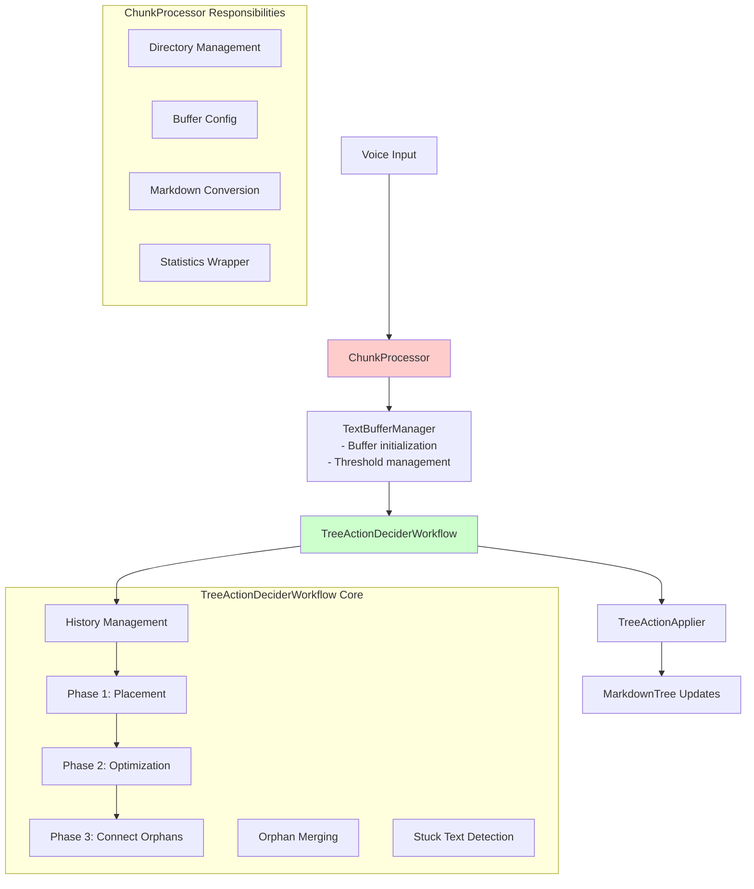
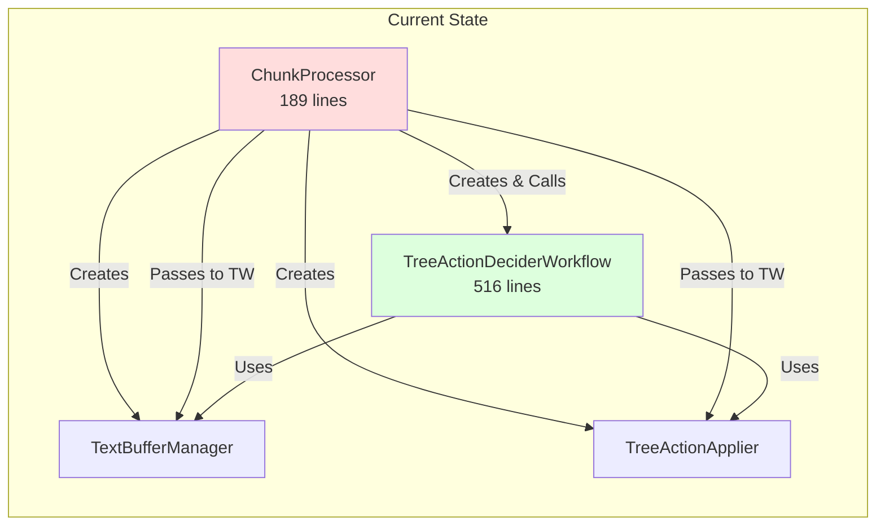

** Summary**
Completed deep analysis of ChunkProcessor and TreeActionDeciderWorkflow to evaluate potential merging. Found significant coupling but identified valid architectural reasons for separation.

** Technical Details**
- **Files Analyzed**: 
  - chunk_processor.py: High-level orchestrator (189 lines)
  - tree_action_decider_workflow.py: Core workflow logic (516 lines)
  - apply_tree_actions.py: Action application layer (216 lines)
  
- **Key Findings**:
  - ChunkProcessor serves as the entry point and handles I/O concerns
  - TreeActionDeciderWorkflow contains all business logic and state management
  - ChunkProcessor instantiates and delegates almost everything to TreeActionDeciderWorkflow
  - Only real ChunkProcessor-specific logic: buffer management initialization and markdown directory setup

** Architecture/Flow Diagram**

** Coupling Analysis**

** Pros/Cons Analysis**

** Arguments FOR Merging:**
1. **High Coupling**: ChunkProcessor creates workflow and passes all dependencies
2. **Minimal Unique Logic**: ChunkProcessor adds only ~20 lines of unique value
3. **Delegation Pattern**: Almost all methods just forward to TreeActionDeciderWorkflow
4. **Single Use**: TreeActionDeciderWorkflow is only used by ChunkProcessor
5. **Simplified Testing**: One less layer to mock/test

** Arguments AGAINST Merging:**
1. **Separation of Concerns**: I/O vs Business Logic clearly separated
2. **Test Isolation**: TreeActionDeciderWorkflow can be tested without I/O setup
3. **Future Flexibility**: Different entry points could reuse TreeActionDeciderWorkflow
4. **Manageable Size**: Combined would be 700+ lines (violates single responsibility)
5. **Clear Boundaries**: Current split makes responsibilities obvious

** Recommendation**
**DO NOT MERGE** - Keep the current separation but consider minor refactoring:

1. The separation follows clean architecture principles (ports and adapters pattern)
2. ChunkProcessor = Infrastructure/Adapter layer
3. TreeActionDeciderWorkflow = Domain/Business logic layer
4. This separation enables better testability and maintainability

** Suggested Improvements:**
1. Consider dependency injection for TextBufferManager and TreeActionApplier
2. Extract transcript history persistence to a separate service
3. Move orphan merging logic into append_agent (as noted in TODO)
4. Consider making ChunkProcessor more of a thin facade pattern

** Impact**
- Current architecture follows best practices for separation of concerns
- Merging would violate single responsibility principle and make testing harder
- The 'unnecessary indirection' mentioned in node 12 is actually valuable architectural layering
- Recommendation aligns with project philosophy: minimize complexity through proper abstractions

-----------------
_Links:_
