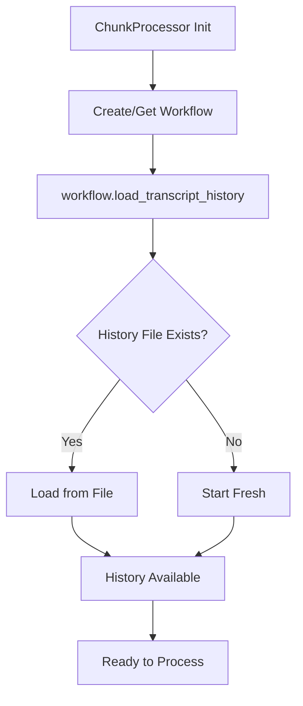

** Summary**
Successfully implemented the ability to inject existing history into ChunkProcessor on initialization, completing the requirement specified in nodes 12 and 15.

** Technical Details**
- **Implementation Approach**:
  - ChunkProcessor now automatically loads transcript history on initialization
  - TreeActionDeciderWorkflow manages the HistoryManager internally
  - load_dir.py can pass workflow instance to load history when loading existing trees

- **Code Flow**:
  1. ChunkProcessor.__init__() calls workflow.load_transcript_history()
  2. Workflow loads history from transcript_history.md if it exists
  3. History is immediately available for next processing chunks

** Architecture/Flow Diagram**

** Impact**
This implementation addresses the concerns raised in nodes 12 and 15 by:
- Relocating history loading to ChunkProcessor initialization (addressing node 12)
- Enabling ChunkProcessor to start with existing history (addressing node 15)
- Maintaining clean separation of concerns without unnecessary merging (relevant to node 13)

-----------------
_Links:_
