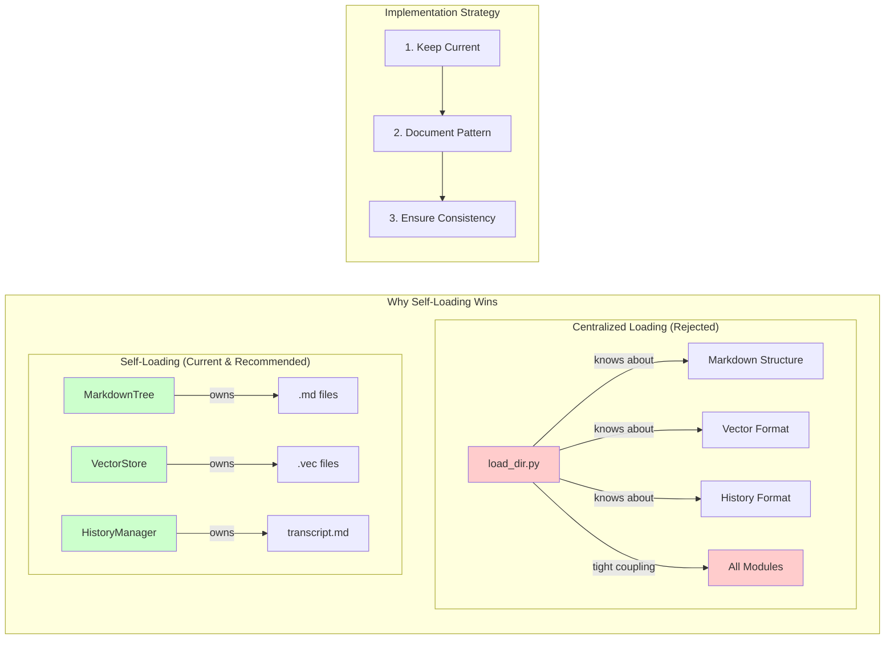

** Summary**
RECOMMENDATION: Keep the current module self-loading strategy. It is well-suited for VoiceTree's architecture and follows best practices for modular design. The decentralized approach reduces complexity and improves maintainability.

** Technical Details**
- **Decision**: Maintain current architecture, no refactoring needed
- **Rationale**: 
  - Follows Single Solution Principle - one clear way to handle state
  - Minimizes complexity - no central coordinator needed
  - Enables fail-fast approach - modules fail independently
  - Supports TDD - modules testable in isolation
- **Alternative Considered**: Centralized load_dir.py would introduce unnecessary coupling

** Architecture/Flow Diagram**

** Impact**
**No Changes Required** - The current architecture is optimal. However, to ensure long-term success:

1. **Documentation**: Document this as the standard pattern for new modules
2. **Convention**: New modules should follow self-loading pattern:
   - Initialize with minimal state in __init__
   - Provide load/save methods for persistence
   - Handle missing files gracefully (fail-fast for critical, default for optional)
3. **Testing**: Continue using dependency injection for test isolation
4. **Future Modules**: When adding vector store or other persistent modules, follow same pattern

The decision to remove load_dir.py (node 19) was correct. The module self-loading strategy provides better separation of concerns and maintainability.

-----------------
_Links:_
Parent:
- provides_recommendation_for [[./32_1_Bob_Module_Self_Loading_Strategy_Evaluation_Complete.md]]