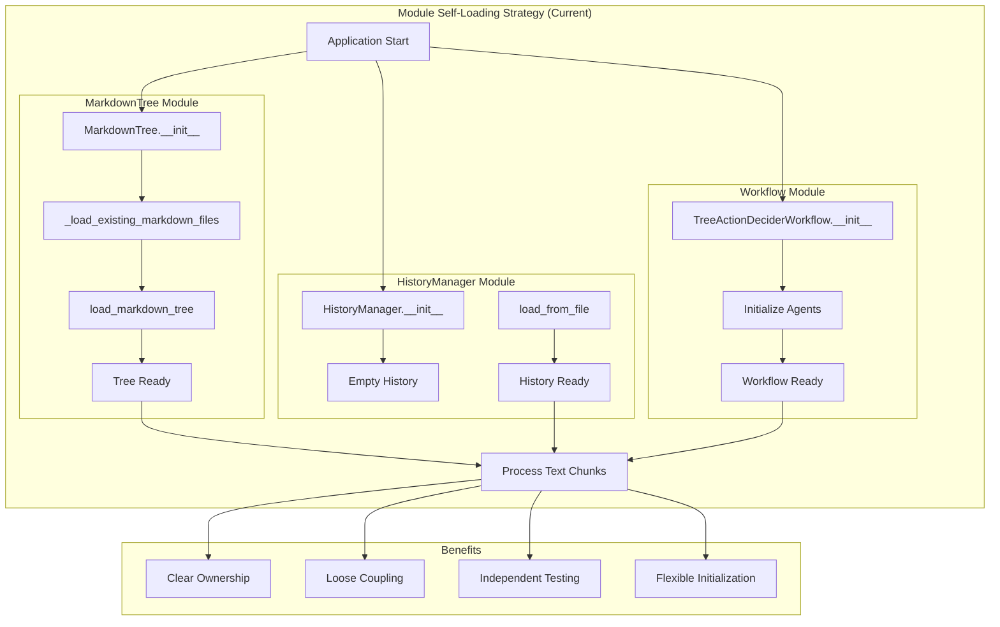

** Summary**
After analyzing the VoiceTree backend architecture, the module self-loading strategy is OPTIMAL for this system. Each module (MarkdownTree, HistoryManager, TreeActionDeciderWorkflow) independently manages its state initialization, which aligns perfectly with the system's streaming text-to-graph architecture.

** Technical Details**
- **Files Analyzed**: 
  - MarkdownTree: backend/markdown_tree_manager/markdown_tree_ds.py
  - HistoryManager: backend/text_to_graph_pipeline/text_buffer_manager/history_manager.py
  - TreeActionDeciderWorkflow: backend/text_to_graph_pipeline/chunk_processing_pipeline/tree_action_decider_workflow.py
- **Key Findings**:
  - MarkdownTree self-loads markdown files in __init__ (line 74: _load_existing_markdown_files)
  - HistoryManager provides save_to_file/load_from_file methods (lines 90-158)
  - Each module encapsulates its own persistence logic
  - No central load_dir.py exists anymore (removed as per node 19)

** Architecture/Flow Diagram**

** Impact**
This decentralized approach provides:
1. **Separation of Concerns**: Each module owns its persistence logic
2. **Testability**: Modules can be tested independently with mock dependencies
3. **Flexibility**: Modules can be initialized with different configurations
4. **Maintainability**: Changes to one module's loading logic don't affect others
5. **Progressive Loading**: Modules can defer loading until needed

The strategy aligns with the Single Solution Principle and minimizes complexity by avoiding a central coordinator that would need to know about all modules' internal states.

-----------------
_Links:_
Children:
- provides_recommendation_for [[32_1_1_Bob_Recommendation_Maintain_Module_Self_Loading_Strategy.md]]
