** Summary**
Implementation approach for the overall integration test that verifies ChromaDB, transcript history, and markdown files all load correctly in the decentralized architecture. This test ensures the system works end-to-end despite modules loading independently.

** Technical Details**
- **Test Type**: Integration test with real file I/O
- **Test Location**: backend/tests/integration_tests/test_module_loading_integration.py
- **Components Tested**:
  - MarkdownTree loading .md files
  - HistoryManager loading transcript_history.md
  - VectorStore loading ChromaDB (when implemented)
- **Approach**: Create test fixture with sample data, initialize system, verify state

** Architecture/Flow Diagram**

```mermaid
sequenceDiagram
    participant Test as Integration Test
    participant TF as Test Fixtures
    participant MT as MarkdownTree
    participant HM as HistoryManager
    participant VS as VectorStore
    
    Test->>TF: Setup test vault
    TF->>TF: Create temp directory
    TF->>TF: Add sample .md files
    TF->>TF: Add transcript_history.md
    TF->>TF: Add vector.db
    
    Test->>MT: Initialize(vault_path)
    MT->>MT: _load_existing_markdown_files()
    MT-->>Test: Loaded N nodes
    
    Test->>HM: load_from_file(vault_path)
    HM->>HM: Parse transcript_history.md
    HM-->>Test: History loaded
    
    Test->>VS: Initialize(vault_path)
    VS->>VS: Load ChromaDB
    VS-->>Test: Vectors loaded
    
    Test->>Test: Assert all states correct
    Test->>Test: ✅ All modules loaded
```


** Impact**
**This integration test provides confidence that decentralized loading works correctly**:

1. **Single Test, Multiple Verifications**: One test verifies all module loading
2. **Realistic Scenario**: Uses actual file structures like production
3. **Clear Failure Points**: If test fails, stack trace shows which module failed
4. **Reusable Fixtures**: Test data can be reused for other integration tests

**Sample Test Code**:
```python
@pytest.mark.integration
def test_overall_module_loading_integration():
    """Verify all modules load their state correctly from a test vault"""
    
    ** Setup test vault with known data**
    with create_test_vault() as vault_path:
        ** Add test data**
        add_sample_markdown_files(vault_path, count=10)
        add_sample_transcript_history(vault_path, 'test history')
        add_sample_vector_db(vault_path)
        
        ** Initialize system components**
        tree = MarkdownTree(vault_path)
        history = HistoryManager()
        history.load_from_file(os.path.join(vault_path, 'transcript_history.md'))
        ** vector_store = VectorStore(vault_path)  # When implemented**
        
        ** Verify each module loaded correctly**
        assert len(tree.tree) == 10, 'MarkdownTree should load 10 nodes'
        assert 'test history' in history.get(), 'History should contain test data'
        ** assert vector_store.count() > 0, 'VectorStore should have embeddings'**
        
        ** Verify integration between modules**
        assert tree.search_similar_nodes('test') != [], 'Search should work'
```

This test proves the decentralized approach works while keeping testing complexity manageable.

-----------------
_Links:_
