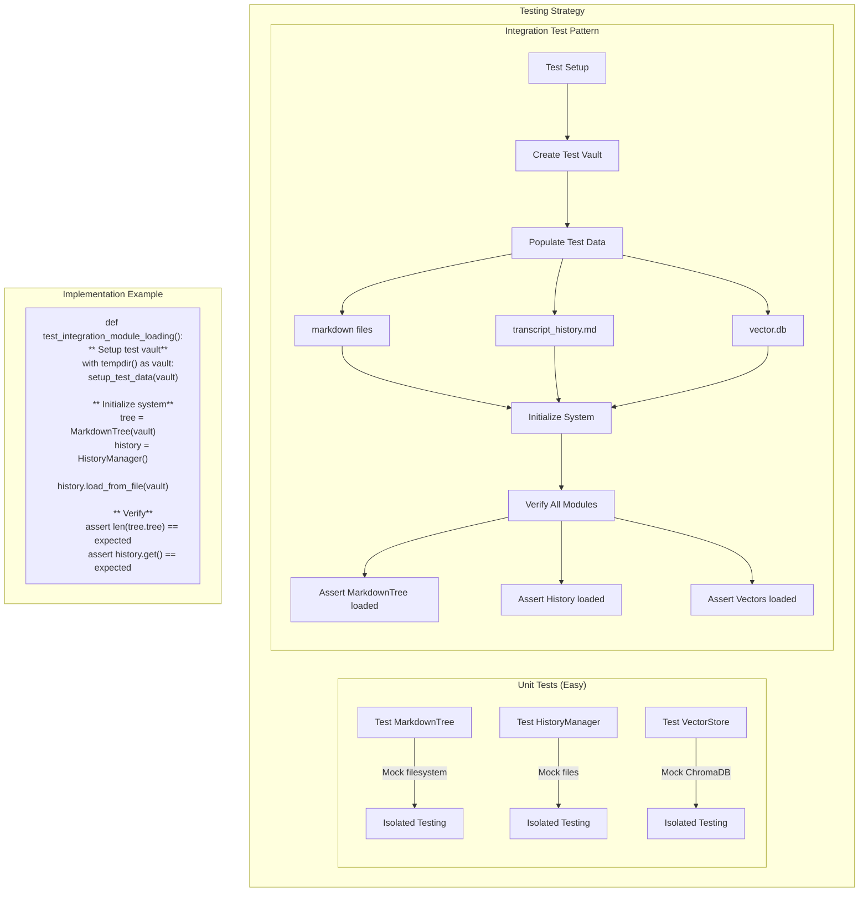

** Summary**
While decentralized module loading does add some testing complexity, it's manageable with proper testing patterns. The benefits of modularity outweigh the minor testing overhead. Here's a comprehensive testing strategy to address these concerns.

** Technical Details**
- **Challenge**: Integration tests need to verify multiple modules load correctly
- **Solution**: Use test fixtures and factory patterns
- **Key Approach**: Test each module in isolation, then test integration
- **Files to Implement**:
  - backend/tests/integration_tests/test_module_loading.py
  - backend/tests/fixtures/sample_vault/ (test data)

** Architecture/Flow Diagram**

** Impact**
**Testing is slightly harder but manageable**:

1. **Unit Tests Remain Simple**: Each module tested in isolation with mocks
2. **Integration Tests Are Explicit**: Clear about what's being tested
3. **Better Error Isolation**: When tests fail, it's clear which module failed
4. **Fixture Pattern**: Reusable test data setup for integration tests

**Recommended Test Structure**:
- Unit tests: Mock all external dependencies (95% of tests)
- Integration tests: Use real files in temp directories (5% of tests)
- System tests: Full end-to-end with all modules (1-2 tests)

This approach maintains the benefits of decentralization while ensuring comprehensive test coverage. The slight additional complexity in integration testing is offset by better unit test isolation.

-----------------
_Links:_
