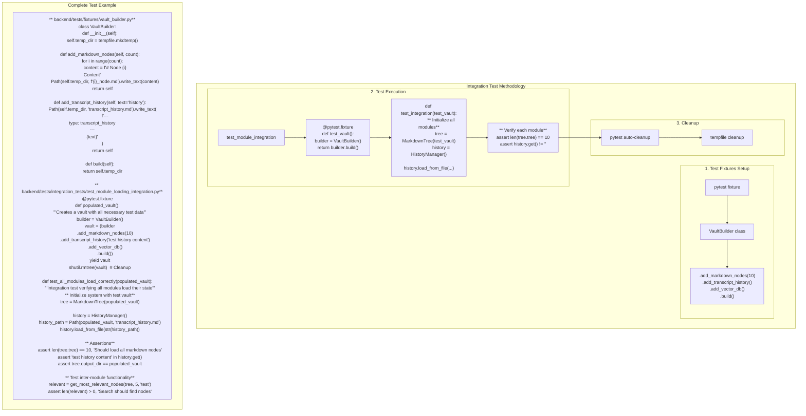

** Summary**
Here's a complete methodology for implementing integration tests with the decentralized module loading architecture. The approach uses pytest fixtures, temporary directories, and clear test organization to make integration testing straightforward despite modules loading independently.

** Technical Details**
- **Test Framework**: pytest with fixtures
- **File Structure**:
  - backend/tests/fixtures/vault_builder.py - Test data creation utilities
  - backend/tests/integration_tests/test_module_loading_integration.py - Main test file
  - backend/tests/fixtures/sample_data/ - Static test data templates
- **Key Patterns**:
  - Fixture-based test data setup
  - Context managers for cleanup
  - Deterministic test data generation

** Architecture/Flow Diagram**

** Impact**
**This methodology makes integration testing manageable and maintainable**:

1. **Builder Pattern**: Fluent API for constructing test vaults
2. **Fixture Reuse**: Same fixtures used across multiple tests
3. **Isolation**: Each test gets fresh test data
4. **Deterministic**: Tests are repeatable and reliable
5. **Clear Structure**: Easy to understand what's being tested

**Benefits over centralized loading for testing**:
- Failures clearly indicate which module has issues
- Can test modules in various states of initialization
- No need to mock a complex central loader
- Each module's test can focus on its specific concerns

The methodology proves that decentralized module loading doesn't significantly complicate integration testing when proper patterns are used.

-----------------
_Links:_
