** Summary**
Refactored the markdown loading logic from a separate load_dir.py module directly into the MarkdownTree.__init__ method, following a simpler and more cohesive design pattern where the tree automatically loads existing files on initialization.

** Technical Details  **
- **Files Modified**: 
  - backend/markdown_tree_manager/markdown_tree_ds.py: Added _load_existing_markdown_files() method
  - server.py: Removed import and function call (now automatic)
  - backend/setup/load_dir.py: DELETED (no longer needed)
- **Key Changes**: 
  - Loading logic now executes automatically in MarkdownTree constructor
  - Simplified to recursively load ALL .md files (removed date subdirectory complexity)
  - Removed need for explicit loading call in server.py
- **Methods/Functions**: 
  - New private method: _load_existing_markdown_files() in MarkdownTree class

** Architecture/Flow Diagram**

```mermaid
flowchart TB
    subgraph Before["Before: Separate Module"]
        S1[server.py] --> IMP1["Import load_dir"]
        IMP1 --> INIT1["MarkdownTree.__init__()"]
        IMP1 --> CALL1["Call load_existing_tree_from_markdown()"]
        
        subgraph Module1["backend/setup/load_dir.py"]
            FUNC1["load_existing_tree_from_markdown()\<br/>- Complex date subdirectory logic<br/>- 60+ lines of code"]
        end
        
        CALL1 --> FUNC1
        FUNC1 --> TREE1["Updates tree.tree"]
    end
    
    subgraph After["After: Integrated in Class"]
        S2[server.py] --> INIT2["MarkdownTree.__init__()"]
        
        subgraph Class["MarkdownTree Class"]
            INIT2 --> AUTO["Automatic Loading"]
            AUTO --> LOAD["_load_existing_markdown_files()\<br/>- Simple recursive .md search<br/>- ~20 lines of code"]
            LOAD --> TREE2["Updates self.tree"]
        end
    end
    
    style Before fill:#ffcccc
    style After fill:#ccffcc
    style Class fill:#e6f3ff
    style Module1 fill:#ffe6e6
```

** Impact**
- **Simplified Architecture**: Removed unnecessary module and directory structure
- **Automatic Loading**: Tree now self-initializes with existing data without explicit calls
- **Reduced Complexity**: Simplified from date-based subdirectory logic to simple recursive .md file loading
- **Better Encapsulation**: Loading logic is now part of the tree's initialization behavior
- **Cleaner API**: No need to remember to call load function after creating MarkdownTree instance

-----------------
_Links:_
Parent:
- is_refactoring_of [[./3_1_Xavier_Extracted_Load_Directory_Function.md]]