** Summary**
Successfully extracted the markdown tree loading functionality from server.py into a dedicated module backend/setup/load_dir.py for better code organization and reusability.

** Technical Details  **
- **Files Modified**: 
  - server.py: Removed 34 lines of inline code
  - backend/setup/load_dir.py: Created new module with load_existing_tree_from_markdown() function
- **Key Changes**: 
  - Encapsulated loading logic into a reusable function
  - Cleaned up server.py imports (removed unused load_markdown_tree import)
  - Maintained all original functionality including date subdirectory handling
- **Methods/Functions**: 
  - New function: load_existing_tree_from_markdown(markdown_dir, decision_tree)

** Architecture/Flow Diagram**

```mermaid
flowchart TB
    subgraph Before["Before Refactoring"]
        S1[server.py] --> L1["Inline Loading Code<br/>(34 lines)"]
        L1 --> MD1[Check markdown_dir]
        MD1 --> DS1[Find Date Subdirs]
        DS1 --> LT1[Load Tree]
        LT1 --> UT1[Update Tree]
    end
    
    subgraph After["After Refactoring"]
        S2[server.py] --> IMP["Import from backend.setup.load_dir"]
        IMP --> CALL["Call load_existing_tree_from_markdown()"]
        
        subgraph Module["backend/setup/load_dir.py"]
            FUNC["load_existing_tree_from_markdown()"]
            FUNC --> MD2[Check markdown_dir]
            MD2 --> DS2[Find Date Subdirs]
            DS2 --> LT2[Load Tree]
            LT2 --> UT2[Update Tree]
        end
        
        CALL --> FUNC
    end
    
    style Before fill:#ffcccc
    style After fill:#ccffcc
    style Module fill:#e6f3ff
```

** Impact**
- **Improved Code Organization**: Loading logic is now in a dedicated setup module following separation of concerns principle
- **Enhanced Reusability**: The function can now be easily imported and used in other parts of the codebase
- **Reduced Complexity**: server.py is cleaner and more focused on server initialization
- **Maintainability**: Future changes to loading logic can be made in one place

-----------------
_Links:_
Children:
- is_refactoring_of [[3_1_1_Xavier_Moved_Loading_Logic_to_MarkdownTree_Constructor.md]]
