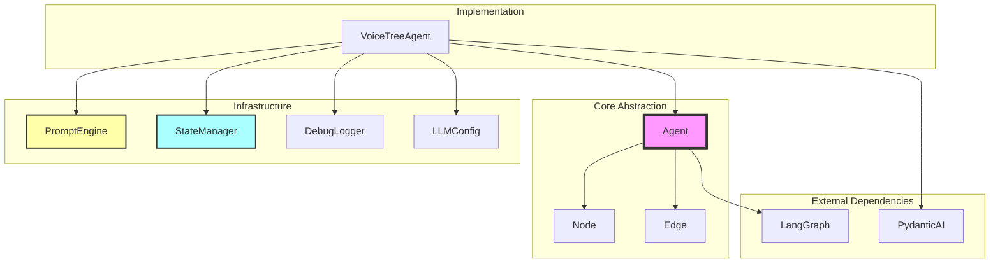
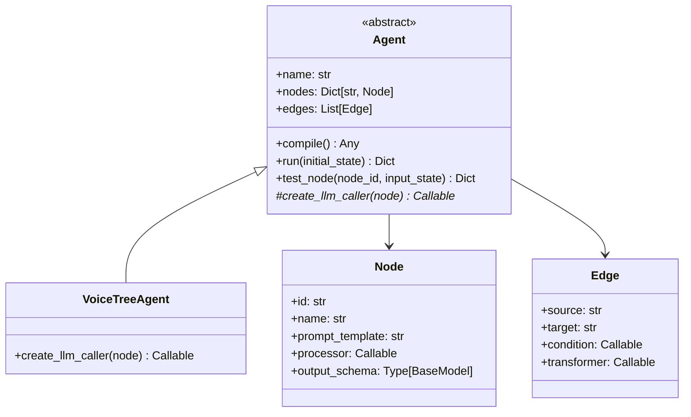

# Agent Abstraction Architecture (Minimal)

This document describes a minimal abstraction layer for building agentic workflows in VoiceTree.

## Core Concepts

Core components and infrastructure:



## Class Structure



## Simplest API

### Define and Run an Agent

```python
# Option 1: Just use dictionaries (recommended)
agent = VoiceTreeAgent(
    name="Pipeline",
    nodes={
        "segmentation": {
            "output_schema": SegmentationSchema
        },
        "relationship_analysis": {
            "output_schema": RelationshipAnalysisSchema
        },
        "integration_decision": {
            "output_schema": IntegrationDecisionSchema
        }
    },
    edges=[
        ("start", "segmentation"),
        ("segmentation", "relationship_analysis"),
        ("relationship_analysis", "integration_decision"),
        ("integration_decision", "end")
    ]
)

result = agent.run({
    "transcript_text": "User input here",
    "existing_nodes": "Node1, Node2"
})
```

### Convention-based Approach

```python
# Even cleaner: The agent automatically infers:
# - prompt_template from node ID (e.g., "segmentation" uses "segmentation" prompt)
# - display name from node ID (e.g., "relationship_analysis" becomes "Relationship Analysis")

agent = VoiceTreeAgent(
    name="Pipeline",
    nodes={
        "segmentation": SegmentationSchema,
        "relationship_analysis": RelationshipAnalysisSchema,
        "integration_decision": IntegrationDecisionSchema
    },
    edges=[
        ("start", "segmentation"),
        ("segmentation", "relationship_analysis"),
        ("relationship_analysis", "integration_decision"),
        ("integration_decision", "end")
    ]
)
```

### Custom Node Example

```python
# Only specify overrides when needed
agent = VoiceTreeAgent(
    name="CustomPipeline",
    nodes={
        "translate": {
            "output_schema": TranslationSchema,
            "prompt_template": "custom_translate_prompt"  # Override only when different from ID
        },
        "review": ReviewSchema  # Use defaults for everything
    },
    edges=[("start", "translate"), ("translate", "review"), ("review", "end")]
)
```

## What This Solves

### Current Pain (300+ lines of boilerplate):
```python
def segmentation_node(state: VoiceTreeState) -> VoiceTreeState:
    return process_llm_stage_structured(
        state=state,
        stage_name="segmentation",
        stage_type="segmentation",
        prompt_name="segmentation",
        prompt_kwargs={
            "transcript": state.get("transcript_text", ""),
            "max_node_name_length": MAX_NODE_NAME_LENGTH,
            "excluded_phrases": ", ".join(EXCLUDED_PHRASES)
        },
        result_key="chunks",
        next_stage="segmentation_complete"
    )

# Plus manual graph construction...
graph = StateGraph(VoiceTreeState)
graph.add_node("segmentation", segmentation_node)
# ... etc
```

### New Way (Define once, declaratively):
```python
agent = VoiceTreeAgent(
    name="Pipeline",
    nodes={"segmentation": SegmentationSchema},
    edges=[("start", "segmentation"), ("segmentation", "end")]
)
```

## Testing

```python
# Mock agent for testing
class TestAgent(VoiceTreeAgent):
    def __init__(self, name, nodes, edges, mock_responses):
        super().__init__(name, nodes, edges)
        self.mock_responses = mock_responses
    
    def create_llm_caller(self, node):
        def mock_caller(state):
            return self.mock_responses.get(node.id, {})
        return mock_caller

# Test usage
agent = TestAgent(
    "Test Pipeline",
    nodes={"segmentation": SegmentationSchema},
    edges=[("start", "segmentation"), ("segmentation", "end")],
    mock_responses={"segmentation": {"chunks": [{"name": "Test"}]}}
)

result = agent.run({"transcript_text": "test"})
assert "chunks" in result
```

## Implementation Notes

The `Agent` base class will:
1. Accept nodes and edges in constructor
2. Auto-compile to LangGraph on first run
3. Handle all boilerplate (error handling, logging, state updates)
4. Provide `test_node()` for isolated testing

The `VoiceTreeAgent` subclass will:
1. Implement `create_llm_caller()` for PydanticAI integration
2. Handle prompt rendering and response parsing
3. Maintain backward compatibility with existing system

## Benefits

1. **Minimal concepts** - Agent = Workflow (no artificial separation)
2. **Declarative** - Define structure, not implementation
3. **No boilerplate** - Agent handles all repetitive code
4. **Easy testing** - Simple mocking strategy
5. **Gradual migration** - Can coexist with current implementation

## What We're NOT Building

- No workflow builders or factories
- No complex type systems
- No workflow inheritance
- No visual designers

Just a simple way to define agents without boilerplate.