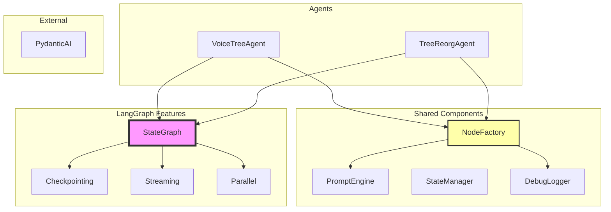

# Agent Architecture Using LangGraph

This document describes how to better organize agentic workflows in VoiceTree by embracing LangGraph rather than hiding it.

## Core Philosophy: Embrace LangGraph, Don't Hide It

Instead of creating another abstraction layer, we organize our code to work WITH LangGraph:



## Agents as First-Class Citizens

Each agent IS a specific workflow, not a builder:

```python
from langgraph.graph import StateGraph, END
from langgraph.checkpoint.filesystem import FileSystemCheckpointer

class VoiceTreeAgent:
    """Agent that processes voice transcripts into tree nodes"""
    
    def __init__(self):
        self.graph = StateGraph(VoiceTreeState)
        self.node_factory = NodeFactory()
        self._setup_workflow()
    
    def _setup_workflow(self):
        """Define the workflow for this agent"""
        # Add nodes using factory
        self.graph.add_node(
            "segmentation",
            self.node_factory.create_llm_node(
                prompt_template="segmentation",
                output_schema=SegmentationSchema
            )
        )
        
        self.graph.add_node(
            "relationship_analysis",
            self.node_factory.create_llm_node(
                prompt_template="relationship_analysis",
                output_schema=RelationshipAnalysisSchema
            )
        )
        
        # Add edges (transformations happen in nodes)
        self.graph.set_entry_point("segmentation")
        self.graph.add_edge("segmentation", "relationship_analysis")
        self.graph.add_edge("relationship_analysis", END)
    
    def compile(self, checkpointer=None) -> CompiledGraph:
        """Compile the agent's workflow"""
        if checkpointer is None:
            checkpointer = FileSystemCheckpointer("./checkpoints")
        return self.graph.compile(checkpointer=checkpointer)
    
    def run(self, transcript: str, existing_nodes: str = "") -> Dict[str, Any]:
        """Run the agent"""
        app = self.compile()
        return app.invoke({
            "transcript_text": transcript,
            "existing_nodes": existing_nodes
        })
```

## NodeFactory: Reducing Boilerplate

The NodeFactory creates standardized nodes without hiding LangGraph:

```python
class NodeFactory:
    """Factory for creating common node patterns"""
    
    def __init__(self, prompt_engine: PromptEngine, debug_logger: DebugLogger):
        self.prompt_engine = prompt_engine
        self.debug_logger = debug_logger
    
    def create_llm_node(
        self,
        prompt_template: str,
        output_schema: Type[BaseModel],
        llm_config: Optional[LLMConfig] = None
    ) -> Callable:
        """Create a node that calls an LLM with structured output"""
        
        def node_fn(state: BaseModel) -> Dict[str, Any]:
            # Log input
            self.debug_logger.log_stage(prompt_template, "input", state)
            
            # Render prompt
            prompt = self.prompt_engine.render(prompt_template, state.model_dump())
            
            # Call LLM with PydanticAI
            agent = Agent(
                llm_config.model if llm_config else "gpt-4o",
                result_type=output_schema
            )
            result = agent.run_sync(prompt)
            
            # Log output
            self.debug_logger.log_stage(prompt_template, "output", result.data)
            
            # Update state
            return {"current_stage": prompt_template, **result.data.model_dump()}
        
        return node_fn
    
    def create_parallel_node(
        self,
        process_fn: Callable,
        items_key: str = "chunks"
    ) -> Callable:
        """Create a node that processes items in parallel"""
        
        async def parallel_node(state: BaseModel) -> Dict[str, Any]:
            items = getattr(state, items_key, [])
            
            # Process in parallel using asyncio
            tasks = [process_fn(item) for item in items]
            results = await asyncio.gather(*tasks)
            
            return {items_key: results}
        
        return parallel_node
    
    def create_transformer_node(
        self,
        name: str,
        transform_fn: Callable[[BaseModel], Dict[str, Any]],
        next_node: str
    ) -> Callable:
        """Create a node that transforms data before passing to next node"""
        
        def transformer_node(state: BaseModel) -> Dict[str, Any]:
            # Log transformation
            self.debug_logger.log_stage(f"{name}_transform", "input", state)
            
            # Apply transformation
            transformed = transform_fn(state)
            
            # Log output
            self.debug_logger.log_stage(f"{name}_transform", "output", transformed)
            
            return transformed
        
        return transformer_node
```

## Handling Data Transformation Between Nodes

Since LangGraph doesn't support transformations in edges, we use these patterns:

### Pattern 1: Transform Inside Target Node
```python
def relationship_analysis_node(state: VoiceTreeState) -> Dict[str, Any]:
    # Transform: Filter only complete chunks
    complete_chunks = [c for c in state.chunks if c.get("is_complete", False)]
    
    # Process only complete chunks
    result = process_chunks(complete_chunks)
    return {"analyzed_chunks": result}
```

### Pattern 2: Dedicated Transformer Nodes
```python
# Add transformer node between stages
builder.graph.add_node(
    "filter_chunks",
    node_factory.create_transformer_node(
        name="filter_chunks",
        transform_fn=lambda state: {
            "chunks": [c for c in state.chunks if c.get("is_complete", False)]
        }
    )
)

# Wire it between nodes
builder.graph.add_edge("segmentation", "filter_chunks")
builder.graph.add_edge("filter_chunks", "relationship_analysis")
```

### Pattern 3: Composable Node Decorators
```python
def with_transformation(transform_fn: Callable):
    """Decorator to add transformation to a node"""
    def decorator(node_fn: Callable):
        def wrapped(state: BaseModel) -> Dict[str, Any]:
            # Transform input
            transformed_state = transform_fn(state)
            # Run original node
            return node_fn(transformed_state)
        return wrapped
    return decorator

# Usage
@with_transformation(lambda s: filter_complete_chunks(s))
def relationship_analysis_node(state):
    # Works with already filtered chunks
    pass
```

### Pattern 4: State Schema with Computed Properties
```python
class VoiceTreeState(BaseModel):
    chunks: List[ChunkModel] = []
    
    @computed_field
    @property
    def complete_chunks(self) -> List[ChunkModel]:
        """Auto-computed filtered chunks"""
        return [c for c in self.chunks if c.is_complete]
    
    @computed_field
    @property
    def incomplete_chunks(self) -> List[ChunkModel]:
        """Auto-computed incomplete chunks"""
        return [c for c in self.chunks if not c.is_complete]
```

### Real Example: VoiceTree Data Flow
```python
class VoiceTreeAgent:
    def _setup_workflow(self):
        # Segmentation outputs all chunks (complete and incomplete)
        self.graph.add_node("segmentation", ...)
        
        # Relationship analysis only processes complete chunks
        self.graph.add_node(
            "relationship_analysis",
            self.node_factory.create_llm_node(
                prompt_template="relationship_analysis",
                output_schema=RelationshipAnalysisSchema,
                pre_transform=lambda state: {
                    **state.model_dump(),
                    "chunks": state.complete_chunks  # Use computed property
                }
            )
        )
        
        # Integration decision gets all analyzed chunks
        self.graph.add_node("integration_decision", ...)
```

### Example: Tree Reorganization Agent
```python
class TreeReorgAgent:
    """Agent that analyzes and reorganizes the knowledge tree"""
    
    def __init__(self, decision_tree: DecisionTree):
        self.decision_tree = decision_tree
        self.graph = StateGraph(TreeReorgState)
        self.node_factory = NodeFactory()
        self._setup_workflow()
    
    def _setup_workflow(self):
        # Analyze current tree structure
        self.graph.add_node(
            "analyze_tree",
            self.node_factory.create_llm_node(
                prompt_template="analyze_tree_structure",
                output_schema=TreeAnalysisSchema
            )
        )
        
        # Plan reorganization
        self.graph.add_node(
            "plan_reorg",
            self.node_factory.create_llm_node(
                prompt_template="plan_tree_reorg",
                output_schema=ReorgPlanSchema
            )
        )
        
        # Execute changes (with side effects)
        self.graph.add_node(
            "execute_reorg",
            self._create_execution_node()
        )
        
        # Define flow
        self.graph.set_entry_point("analyze_tree")
        self.graph.add_edge("analyze_tree", "plan_reorg")
        self.graph.add_edge("plan_reorg", "execute_reorg")
        self.graph.add_edge("execute_reorg", END)
```

## Using LangGraph Features

### 1. Checkpointing for Resumability
```python
# Enable checkpointing
checkpointer = FileSystemCheckpointer("./checkpoints")
app = builder.build().compile(checkpointer=checkpointer)

# Resume from checkpoint
config = {"configurable": {"thread_id": "session-123"}}
state = app.get_state(config)
app.invoke(state.values, config)
```

### 2. Streaming for Real-time Updates
```python
# Stream results as they process
async for chunk in app.astream(initial_state):
    print(f"Stage: {chunk['current_stage']}")
    if 'chunks' in chunk:
        print(f"Found {len(chunk['chunks'])} chunks")
```

### 3. Parallel Processing
```python
# Process multiple chunks in parallel
builder.graph.add_node(
    "parallel_analysis",
    node_factory.create_parallel_node(
        process_fn=analyze_chunk,
        items_key="chunks"
    )
)
```

### 4. Human-in-the-Loop
```python
# Add approval step
from langgraph.prebuilt import ToolExecutor, HumanApproval

builder.graph.add_node(
    "approve_decisions",
    HumanApproval(
        tools=[approve_tool, reject_tool],
        description="Review integration decisions"
    )
)
```

## Testing Strategy

Test using LangGraph's built-in capabilities:

```python
def test_voicetree_agent():
    """Test using LangGraph's testing features"""
    agent = VoiceTreeAgent()
    
    # Test with mock checkpointer
    mock_checkpointer = MemorySaver()
    test_app = agent.compile(checkpointer=mock_checkpointer)
    
    # Run and inspect state at each step
    config = {"configurable": {"thread_id": "test-1"}}
    result = test_app.invoke(test_input, config)
    
    # Inspect intermediate states
    states = list(mock_checkpointer.list(config))
    assert len(states) == 3  # segmentation, analysis, decision
```

## Benefits of This Approach

1. **No Hidden Features** - Full access to LangGraph's power
2. **Less Code** - NodeFactory reduces boilerplate without abstraction
3. **Better Testing** - Use LangGraph's testing utilities
4. **Future-Proof** - New LangGraph features automatically available
5. **Cleaner Organization** - Each agent is a clear, self-contained workflow

## What We're NOT Doing

- NOT creating another graph abstraction
- NOT hiding LangGraph behind interfaces
- NOT reimplementing existing features
- NOT limiting access to advanced features

## Migration Path

1. **Phase 1**: Create NodeFactory to reduce boilerplate
2. **Phase 2**: Refactor current pipeline into VoiceTreeAgent class
3. **Phase 3**: Add checkpointing and streaming
4. **Phase 4**: Implement parallel processing where beneficial
5. **Phase 5**: Create new agents (TreeReorgAgent, etc.) following same pattern

This approach gives us clean code organization while fully embracing LangGraph's capabilities.