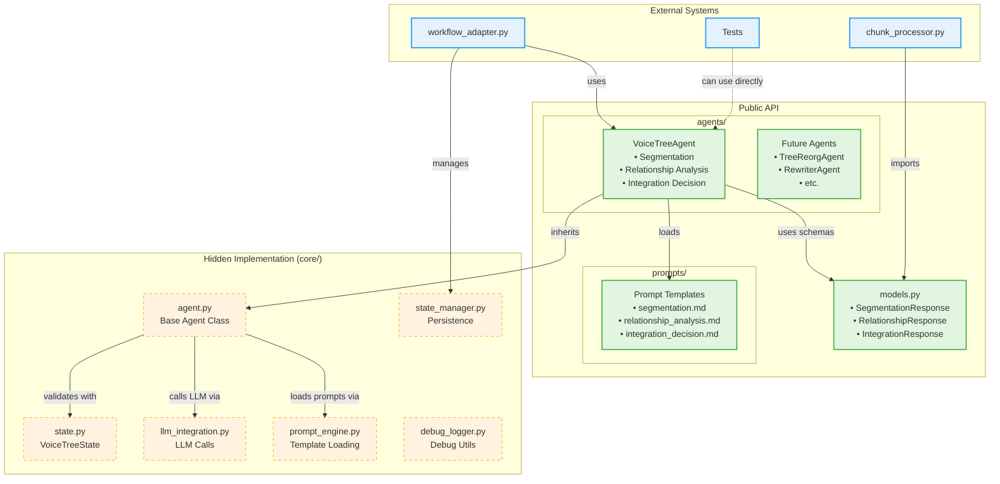

# Agentic Workflows

Clean agent-based implementation of VoiceTree's text-to-graph pipeline.

## Architecture



## Structure

```
agentic_workflows/
├── agents/          # Agent definitions (what you use)
│   └── voice_tree.py
├── prompts/         # Prompt templates
├── core/            # Implementation details (hidden complexity)
└── models.py        # Data schemas
```

## Usage

```python
from agents.voice_tree import VoiceTreeAgent

# Create and run agent directly
agent = VoiceTreeAgent()
result = agent.run("Voice transcript text...")
```

## Key Concepts

- **Agents** = Prompts + Dataflow
- **Prompts** = Processing steps with templates
- **Dataflow** = How data moves between prompts

See `agents/README.md` for available agents.