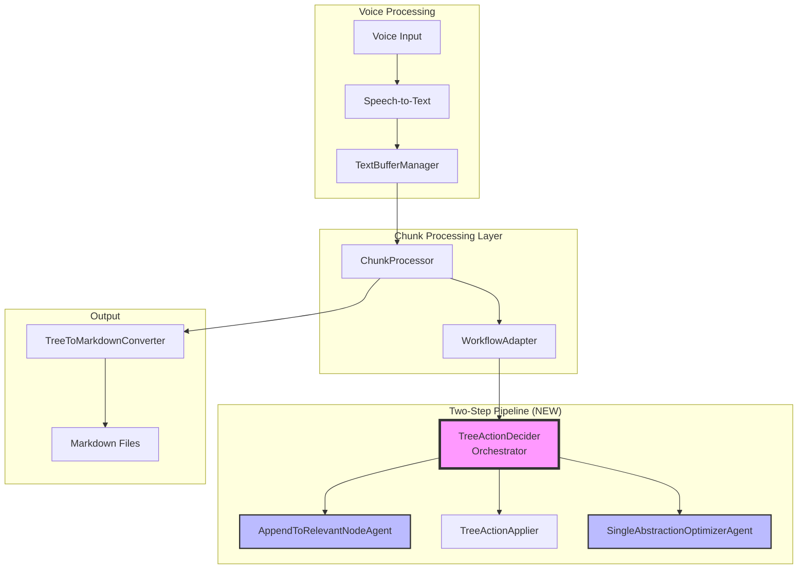
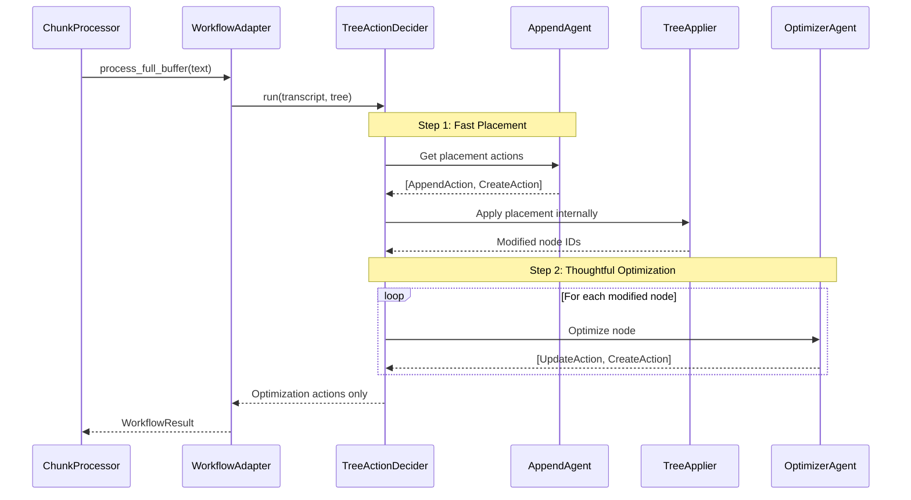
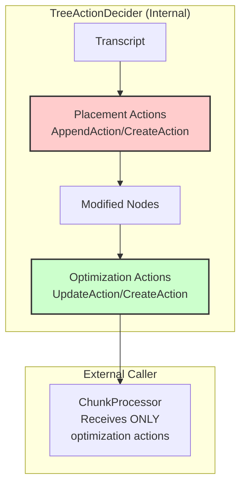
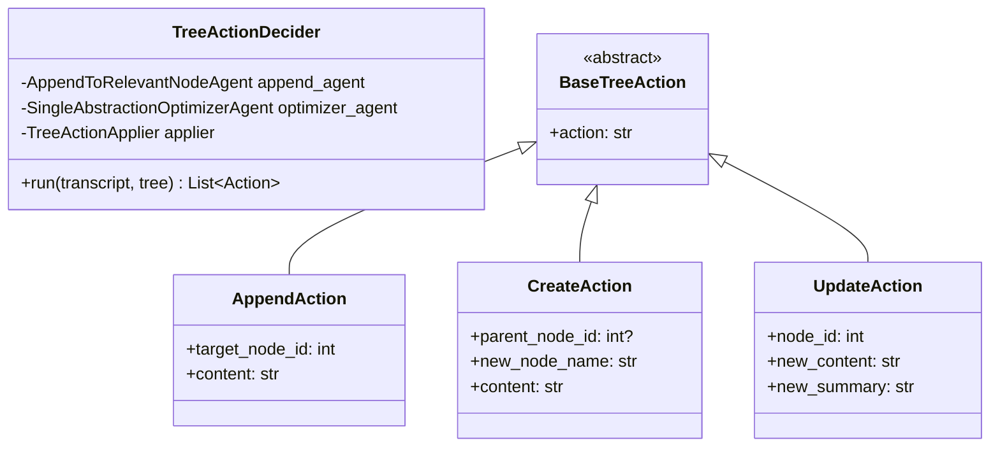

# VoiceTree Pipeline Architecture

## Overview

The new two-step pipeline replaces the monolithic TreeActionDeciderAgent with a cleaner orchestration pattern that separates placement from optimization.

## System Architecture



## Execution Flow



## Action Types & Flow



**Key Point**: Placement actions are internal. Only optimization actions are returned.

## Component Structure



## Integration Changes Required

### 1. WorkflowAdapter
```python
# Change import
from backend.text_to_graph_pipeline.orchestration.tree_action_decider import TreeActionDecider

# Update initialization
self.agent = agent or TreeActionDecider()

# Update return to handle optimization actions only
```

### 2. ChunkProcessor
```python
# FROM:
updated_nodes = self.tree_action_applier.apply_integration_decisions(result.integration_decisions)

# TO:
updated_nodes = self.tree_action_applier.apply(result.tree_actions)
```

## Architecture Issues & Solutions

| Issue | Current State | Solution |
|-------|--------------|----------|
| Action Types | Mixed placement and optimization | Placement internal, only optimization returned |
| Return Format | All actions returned | Only final optimization actions |
| Chunk Tracking | Agent tracks chunks | Orchestrator returns processed text metadata |

## Directory Structure

```
backend/text_to_graph_pipeline/
├── chunk_processing_pipeline/     # Existing, keep as-is
│   ├── chunk_processor.py
│   ├── workflow_adapter.py      # Update to use new orchestrator
│   └── apply_tree_actions.py
├── agentic_workflows/
│   └── agents/                  # LLM-powered agents
│       ├── append_to_relevant_node_agent.py
│       └── single_abstraction_optimizer_agent.py
└── orchestration/               # NEW
    └── tree_action_decider.py  # Deterministic orchestrator
```

## Key Design Principles

1. **Separation of Concerns**: Agents do LLM work, orchestrator coordinates
2. **Two-Step Process**: Fast placement → Thoughtful optimization  
3. **Internal vs External Actions**: Placement stays internal, optimization is exposed
4. **Minimal Changes**: Reuse existing infrastructure where possible