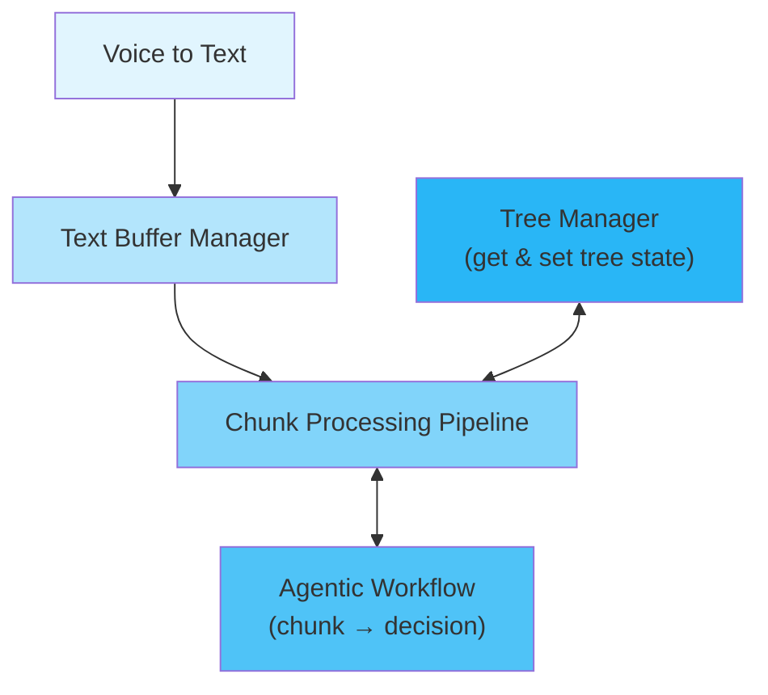

# CLAUDE.md

This file provides guidance to Claude Code (claude.ai/code) when working with code in this repository.

## Project Overview

VoiceTree is a Python backend system that converts voice input into structured graphs using an LLM agentic pipeline. The system transcribes audio, processes it through agentic workflows, and outputs interconnected markdown files representing ideas as a visual tree.

## Essential Commands

### Development Testing (Fast Feedback)
```bash
# Run unit tests
pytest backend/tests/unit_tests

# run integration testt
pytest backend/tests/integration_tests/

# run benchmarker
```

### Quality Testing
```bash
# Run quality benchmarker (generates output and debug logs)
python backend/benchmarker/quality_tests/quality_LLM_benchmarker.py
```

### Environment Setup
```bash
# Install dependencies
pip install -r requirements.txt

# Required: Set Google Gemini API key
export GOOGLE_API_KEY="your_gemini_api_key"  # Get from Google AI Studio
```

## Architecture & Code Structure

Please see @current_architecture.md for a more up to date and in depth architecture review. 

### System Flow
```
Voice Input → Transcription → 4-Stage Pipeline → Knowledge Tree → Markdown Files

Pipeline Architecture:
                                tree_manager (get & set tree state)
                                                V
voice_to_text -> text_buffer_manager -> chunk_processing_pipeline 
                                                V
                                agentic_workflow (chunk -> decision)
```



### 4-Stage Agentic Workflow for "tree action decider agent"
1. **Segmentation** - Breaks transcript into atomic idea chunks
2. **Relationship Analysis** - Analyzes connections to existing nodes
3. **Integration Decision** - Decides CREATE vs APPEND actions  
4. **Node Extraction** - Creates final tree structure (todo, unnecessary this was just for testing)

### Key Components
- `backend/main.py` - System entry point
- `backend/text_to_graph_pipeline/` - Core pipeline (recently reorganized)
  - `agentic_workflows/` - 4-stage LLM processing
  - `chunk_processing_pipeline/` - Processes text chunks
  - `text_buffer_manager/` - Manages streaming text buffer
  - `tree_manager/` - Tree data structures and operations
- `backend/voice_to_text/` - Audio capture and transcription
- `backend/settings.py` - Configuration (models, parameters)
- `backend/benchmarker/` - Quality testing framework

### Two-Agent System
- **TADA (Tree-Action-Decider-Agent)**: Real-time processing, 2.5-3/5 quality
- **TROA (Tree-Reorganization-Agent)**: Background optimization, take the mediocre tree, to a much better quality, by having acccess to the full transcript history at once.

## Development Guidelines

### Testing Strategy
- **Development / pre-commit**: Use smoke tests (under 10 seconds)
- **Pre-push**: Use integration tests (under 2 minutes)
- **CI/CD**: Full test suite with API tests

### Test Markers
```python
@pytest.mark.unit       # Isolated unit tests
@pytest.mark.integration # Integration tests
@pytest.mark.api        # Real API calls (expensive)
@pytest.mark.slow       # > 5 seconds
```

### Quality Debugging Workflow
1. Run benchmarker to generate output: `python -m backend.benchmarker.quality_tests.quality_LLM_benchmarker`
2. Check generated markdown files in `output/` directory
3. Identify quality issues (missing content, poor structure)
4. Review debug logs in `output/debug_output_[timestamp]/`
5. Trace problems through the 4-stage pipeline
6. Fix at the appropriate stage

### Configuration Settings
- **LLM Models**: 
  - Primary: `gemini-2.5-pro-preview-06-05`
  - Fast: `gemini-2.0-flash`
- **Voice Model**: `large-v3` (alt: `distil-large-v3`)
- **Buffer Threshold**: 83 characters
- **Recent Nodes Context**: 10

## Recent Changes & Gotchas

1. **Major Refactoring**: Components moved to `text_to_graph_pipeline/` directory
2. **Streaming Mode**: Now standard (dual-mode confusion eliminated)
3. **Import System**: Cleaned up (removed 40+ sys.path.append hacks)
4. **Test Framework**: Enhanced with pytest markers for speed categories

## Key Documentation

For deeper understanding, read these files in order:
1. `README-dev.md` - High-level developer overview
2. `backend/benchmarker/Benchmarker_Agentic_feedback_loop_guide.md` - Primary developer guide
3. `DEVELOPMENT_SPEED_GUIDE.md` - Fast testing strategies
4. `backend/README-dev.md` - Backend architecture details
5. Component-specific `README-dev.md` files in major directories

## KEY RULES TO FOLLOW DURING DEV

1. NEVER have more than 1 solution for the same problem. That means never have a new and old version at the saem time. Instead, evolve the system incrementally towards the desired state. Never have fallbacks. 
2. Minimize added complexity to the system when new features are added. Try reduce the complexity by re-architecting, introducing abstractions that hide complexity and seperating concerns. 
3. Add high quality unit tests for any non-trivial changes. These will undergo mutation testing so make sure they are actually testing the method well. Make sure they pass.