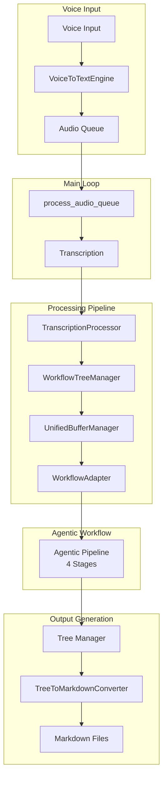
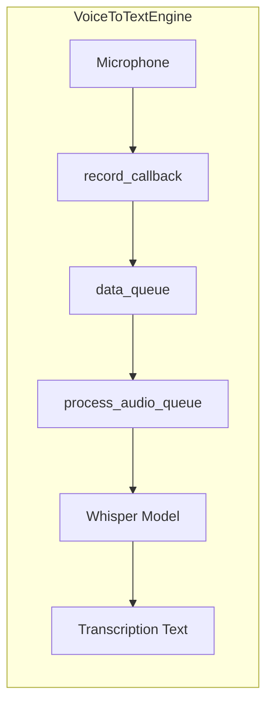
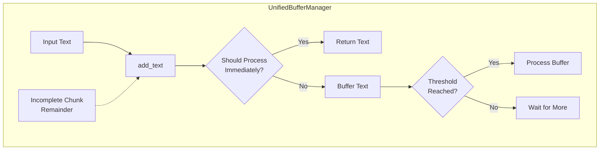
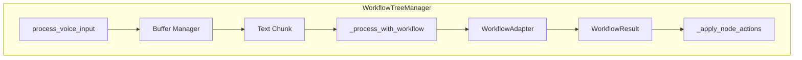
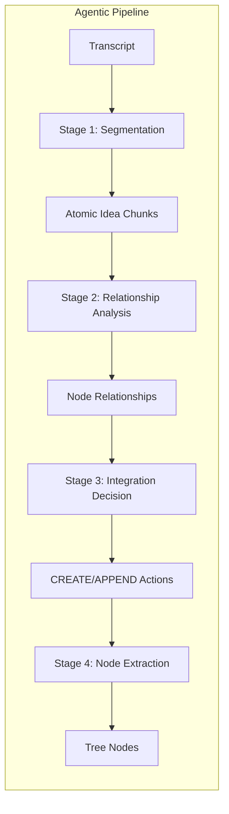
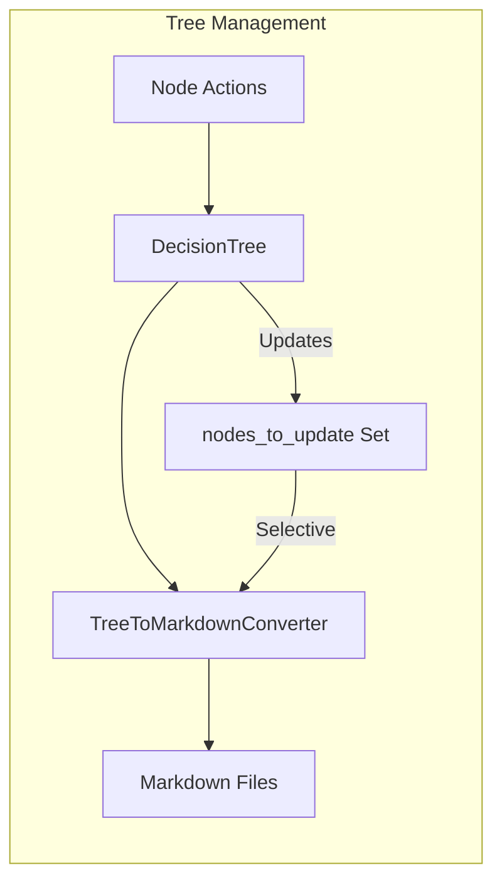
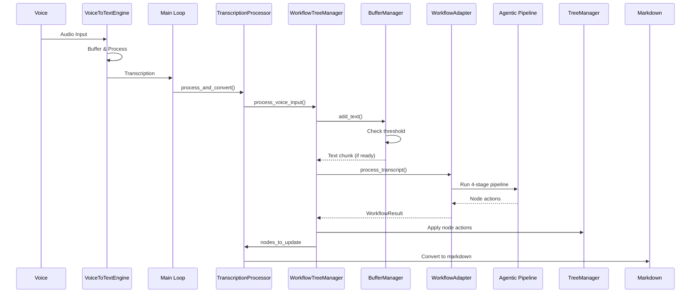

# VoiceTree Current Architecture

## System Overview

VoiceTree is a voice-to-knowledge-graph system that converts spoken input into structured markdown files organized as a tree. The system uses a 4-stage agentic pipeline to process voice input in real-time.

## High-Level System Flow



## Component Details

### 1. Entry Point (main.py)
- Initializes core components:
  - `DecisionTree`: Tree data structure
  - `WorkflowTreeManager`: Orchestrates the pipeline
  - `TreeToMarkdownConverter`: Converts tree to markdown
  - `TranscriptionProcessor`: Processes transcriptions
- Runs async main loop that:
  - Polls audio queue for transcriptions
  - Processes transcriptions through the pipeline
  - Converts results to markdown files

### 2. Voice to Text Component



Key features:
- Uses Whisper model (large-v3 or distil-large-v3)
- Audio buffering with timeout detection
- Continuous listening with callback mechanism

### 3. Text Buffer Management



Buffer characteristics:
- Adaptive processing based on input patterns
- Buffer threshold: 83 characters
- Handles incomplete chunks between processing cycles
- Maintains transcript history for context

### 4. Workflow Processing Pipeline



### 5. Agentic Workflow (4 Stages)



Stage details:
1. **Segmentation**: Breaks transcript into atomic ideas
2. **Relationship Analysis**: Analyzes connections to existing nodes
3. **Integration Decision**: Decides CREATE vs APPEND actions
4. **Node Extraction**: Creates final tree structure

### 6. Tree Operations & Output



## Data Flow Sequence



## Key Configuration

- **LLM Models**: 
  - Primary: `gemini-2.5-pro-preview-06-05`
  - Fast: `gemini-2.0-flash`
- **Voice Model**: `large-v3` (alt: `distil-large-v3`)
- **Buffer Threshold**: 83 characters
- **Recent Nodes Context**: 10

## Architecture Insights

1. **Streaming Architecture**: The system processes voice input in a streaming fashion, buffering text until meaningful chunks are ready for processing.

2. **Adaptive Processing**: The buffer manager adaptively decides whether to process immediately or buffer based on input characteristics.

3. **Stateful Tree Management**: The WorkflowTreeManager maintains state across processing cycles, tracking which nodes need updates.

4. **Modular Design**: Clear separation between voice capture, text processing, agentic workflow, and output generation.

5. **Async Processing**: Uses Python's asyncio for non-blocking operation, allowing continuous voice capture while processing.

## File Structure

```
backend/
├── main.py                           # Entry point (imports from parent)
├── process_transcription.py          # Transcription processor
├── voice_to_text/
│   └── voice_to_text.py             # Voice capture & transcription
├── tree_manager/
│   ├── workflow_tree_manager.py      # Main workflow orchestrator
│   ├── unified_buffer_manager.py     # Text buffering logic
│   ├── decision_tree_ds.py          # Tree data structure
│   └── tree_to_markdown.py          # Markdown conversion
├── workflow_adapter.py               # Agentic workflow adapter
└── text_to_graph_pipeline/          # Agentic workflow implementation
    └── agentic_workflows/           # 4-stage pipeline
```