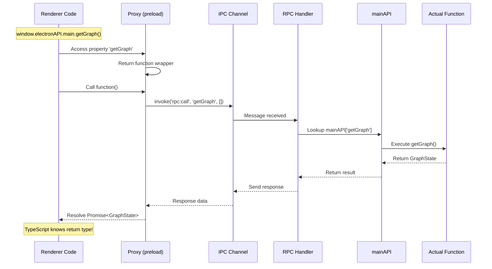

** Summary**
Implementation plan for zero-boilerplate RPC pattern: renderer → main. Flat structure, original function names, automatic type inference.

** Technical Details**

** Files to Create/Modify**

**1. CREATE: `src/functional/shell/main/api.ts`**

```typescript
// Import existing functions (no wrappers, no type rewriting)
import {applyGraphDeltaToDB, getGraph} from './graph/graphState'
import {loadSettings, saveSettings} from './settings/settingsManager'

// Flat export with original names
export const mainAPI = {
    applyGraphDeltaToDB,
    getGraph,
    loadSettings,
    saveSettings,
}
```

**2. CREATE: `src/electron/edge/rpc-handler.ts`**
```typescript
import { ipcMain } from 'electron'
import { mainAPI } from '../../functional/shell/main/api'

export function setupRPCHandlers() {
  ipcMain.handle('rpc:call', async (_event, fnName: string, args: any[]) => {
    const fn = mainAPI[fnName]
    
    if (typeof fn !== 'function') {
      throw new Error(`Function not found: ${fnName}`)
    }
    
    return await fn(...args)
  })
}
```

**3. MODIFY: `src/electron/preload.ts`**
```typescript
import { contextBridge, ipcRenderer } from 'electron'
import type { mainAPI } from '../functional/shell/main/api'

const api = new Proxy({} as typeof mainAPI, {
  get(_target, fnName: string) {
    return (...args: any[]) => ipcRenderer.invoke('rpc:call', fnName, args)
  }
})

contextBridge.exposeInMainWorld('electronAPI', {
  main: api,
  // Keep existing event handlers for now
  on: (channel: string, callback: Function) => {
    ipcRenderer.on(channel, (_event, ...args) => callback(...args))
  },
  off: (channel: string, callback: Function) => {
    ipcRenderer.removeListener(channel, callback)
  },
})
```

**4. MODIFY: `src/electron/main.ts`**
```typescript
import { setupRPCHandlers } from './edge/rpc-handler'

// In app.whenReady()
app.whenReady().then(() => {
  setupRPCHandlers()  // Add this line
  // ... existing code
})
```

**5. MODIFY: `src/types/electron.d.ts`**
```typescript
import type { mainAPI } from '../functional/shell/main/api'

declare global {
  interface Window {
    electronAPI: {
      main: typeof mainAPI  // Auto-typed from mainAPI
      on: (channel: string, callback: Function) => void
      off: (channel: string, callback: Function) => void
    }
  }
}
```

** Migration Example**

**Before (4 file changes):**
```typescript
// 1. preload.ts - manual wrapper
applyGraphDelta: (action) => ipcRenderer.invoke('graph:applyDelta', action)

// 2. ipc-terminal-handlers.ts - manual handler
ipcMain.handle('graph:applyDelta', async (_event, action) => {
  await applyGraphDeltaToDB(getGraph(), action)
})

// 3. electron.d.ts - manual type
applyGraphDelta: (action: GraphDelta) => Promise<unknown>

// 4. Renderer usage
await window.electronAPI?.graph.applyGraphDelta(graphDelta)
```

**After (1 line change):**

```typescript
// 1. api.ts - add import and name
export const mainAPI = {
    applyGraphDeltaToDB,  // Just add this
}

// 2. Renderer usage (auto-typed)
await window.electronAPI.main.applyGraphDeltaToDB(getGraph(), graphDelta)
```

** High-Level Flow (Pseudocode)**

```
** Adding a new function**
1. Write function in main process (or it already exists)
2. Import and add to mainAPI object in api.ts
3. Call from renderer: window.electronAPI.main.functionName(args)

** Runtime flow**
Renderer: window.electronAPI.main.getGraph()
  ↓
Proxy intercepts: get(_target, 'getGraph')
  ↓
Returns function: (...args) => ipcRenderer.invoke('rpc:call', 'getGraph', args)
  ↓
IPC message: {channel: 'rpc:call', data: ['getGraph', []]}
  ↓
Main process: rpc-handler receives message
  ↓
Lookup: mainAPI['getGraph']
  ↓
Execute: mainAPI.getGraph() 
  ↓
Return result via IPC
  ↓
Renderer: Promise resolves with result (fully typed)
```

** Architecture Diagram**



** Impact**

** Benefits**
- **4x faster development:** Add function = 1 line instead of 4 files
- **Zero type duplication:** Types inferred from actual function signatures
- **Impossible type drift:** TypeScript ensures preload matches main API
- **Flat structure:** Original function names preserved, no artificial nesting
- **Testable:** Functions can be tested independently of IPC

** Migration Strategy**
1. Create new RPC infrastructure (5 files)
2. Start using for NEW functions immediately
3. Gradually migrate existing 27 channels
4. Remove old preload entries and handlers as channels migrate
5. Delete electron.d.ts when migration complete

** Files Changed**
- **Create:** api.ts, rpc-handler.ts
- **Modify:** preload.ts (~127 lines → ~15 lines), main.ts (+1 line), electron.d.ts (~50 lines → ~10 lines)
- **Total reduction:** ~150 lines of boilerplate eliminated

-----------------
_Links:_
Parent:
- is_progress_of [[./6_VoiceTree_IPC_Layer_Boilerplate_Removal.md]]