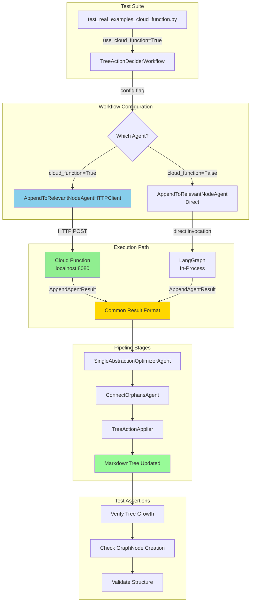
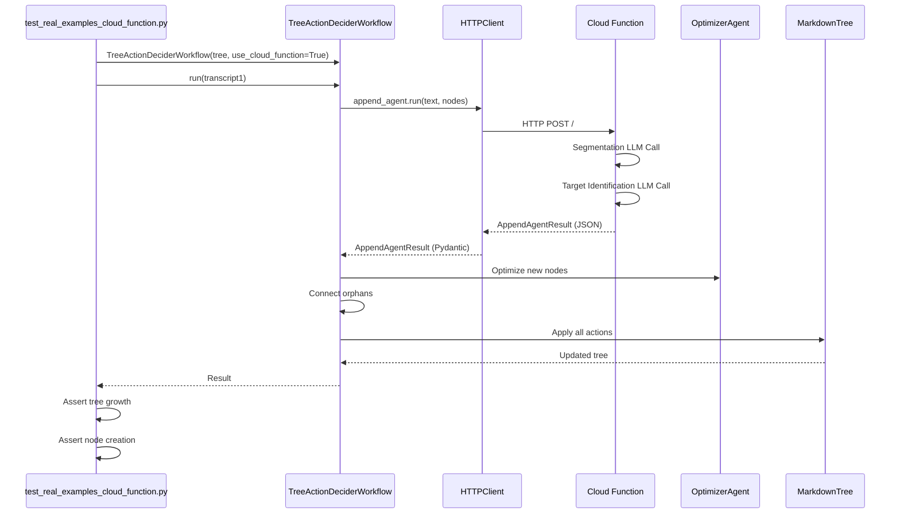

** Summary**
Plan to integrate Cloud Function into the full system test () by adding a configuration flag to  to toggle between direct agent instantiation and HTTP client.

** Technical Details**

** Current State Analysis**

**Where append agent is used:**
- **File**: `backend/text_to_graph_pipeline/chunk_processing_pipeline/tree_action_decider_workflow.py`
- **Line 88**: Instantiated in `__init__()` - `self.append_agent = AppendToRelevantNodeAgent()`
- **Line 198**: Called via `self.append_agent.run()` with transcript text and existing nodes

**Test structure:**
- `test_real_examples.py` creates `TreeActionDeciderWorkflow` which internally uses `AppendToRelevantNodeAgent`
- Test runs 3 transcripts through full pipeline
- Pipeline: Append Agent → Optimizer → Orphan Connector → TreeActionApplier
- Verifies tree growth after each transcript

** Changes Required**

**1. Modify TreeActionDeciderWorkflow** (`tree_action_decider_workflow.py`):
```python
def __init__(
    self, 
    decision_tree=None, 
    use_cloud_function=False, 
    cloud_function_url="http://localhost:8080"
):
    self.decision_tree = decision_tree
    
    ** Toggle between direct agent and HTTP client**
    if use_cloud_function:
        from cloud_functions.agentic_workflows.http_client import AppendToRelevantNodeAgentHTTPClient
        self.append_agent = AppendToRelevantNodeAgentHTTPClient(cloud_function_url)
    else:
        self.append_agent = AppendToRelevantNodeAgent()
    
    ** Other agents remain unchanged**
    self.optimizer_agent = SingleAbstractionOptimizerAgent()
    self.connect_orphans_agent = ConnectOrphansAgent()
```

**2. Create new test file**: `test_real_examples_cloud_function.py`
- Copy `test_real_examples.py`
- Modify line 61 and similar: `agent = TreeActionDeciderWorkflow(decision_tree, use_cloud_function=True)`
- Keep all assertions identical

**3. Run test** with Cloud Function server running

** Architecture Diagram**



** Execution Flow**



** Impact**

** Validates**
- ✅ Cloud Function integrates seamlessly with full pipeline
- ✅ End-to-end system test (3 transcripts → tree growth)
- ✅ Optimizer and orphan connector work correctly with Cloud Function results
- ✅ TreeActionApplier handles HTTP-sourced actions identically to direct actions
- ✅ No serialization issues in multi-agent workflow

** Enables**
- **Easy Toggle**: Switch between local and Cloud Function modes via config flag
- **No Breaking Changes**: Existing tests continue to work unchanged
- **Same Coverage**: Both modes tested with identical assertions
- **Production Path**: Config flag can be environment variable in production

** Implementation Steps**

1. Add `use_cloud_function` parameter to `TreeActionDeciderWorkflow.__init__()`
2. Add conditional import and instantiation of HTTP client
3. Copy `test_real_examples.py` → `test_real_examples_cloud_function.py`
4. Update workflow instantiation to pass `use_cloud_function=True`
5. Run test with Cloud Function server running in background
6. Verify all 3 transcripts process correctly and tree grows as expected

** Next Actions**
Ready to implement this plan.

-----------------
_Links:_
Parent:
- is_progress_of [[2025-09-30/14_1_1_2_Victor_Local_Cloud_Function_Testing_Complete_All_Tests_Pass.md]]
[[14_1_1_2_Victor_Local_Cloud_Function_Testing_Complete_All_Tests_Pass.md]]