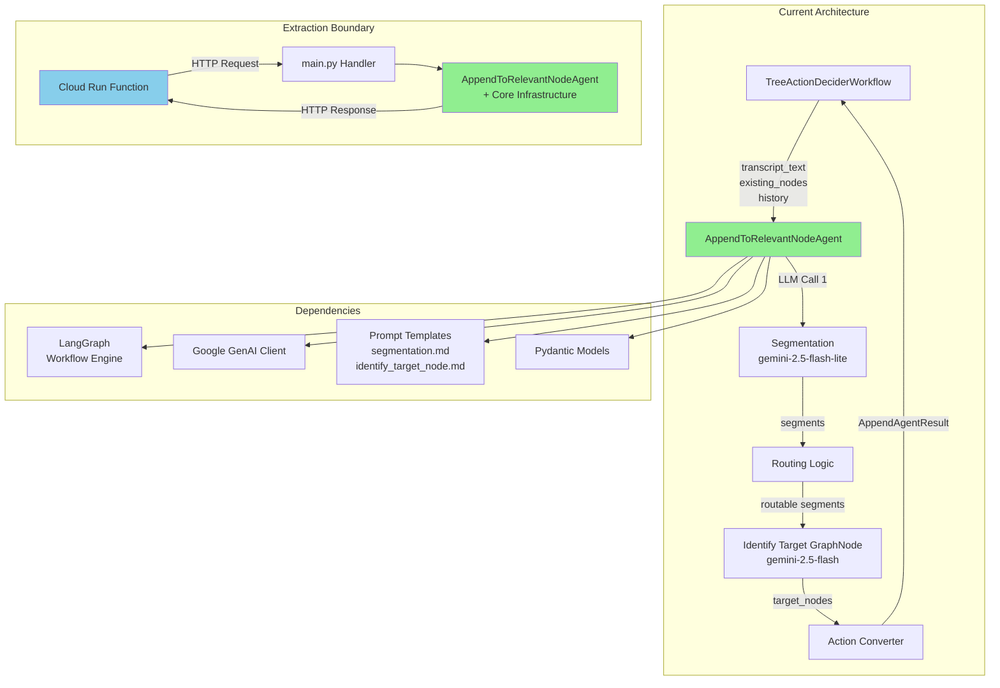
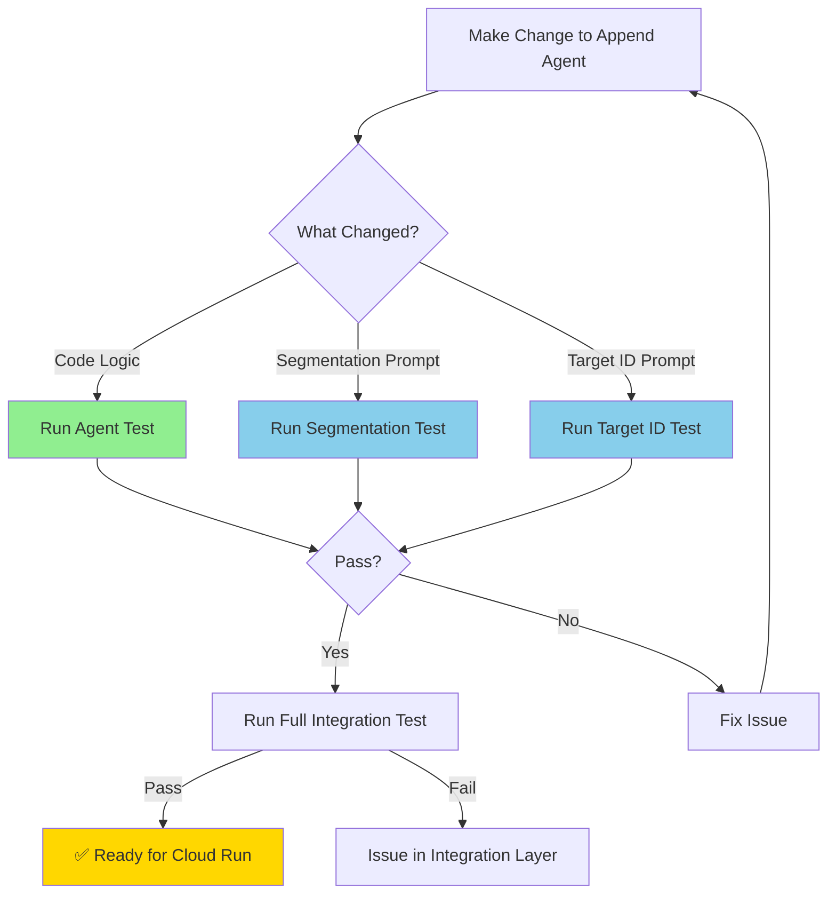

part of [[27_Two_Streams_of_Work]]

** Summary**
Analyzed the AppendToRelevantNodeAgent for Cloud Run Function extraction. The agent is **already stateless and well-architected** for serverless deployment - no refactoring required, only packaging needed.

** Technical Details**

** Files Analyzed**
- **Workflow File**: `backend/text_to_graph_pipeline/chunk_processing_pipeline/tree_action_decider_workflow.py:198`
  - Usage: `append_agent.run(transcript_text, existing_nodes_formatted, transcript_history)`
- **Agent Implementation**: `backend/text_to_graph_pipeline/agentic_workflows/agents/append_to_relevant_node_agent.py`
- **Base Infrastructure**: `backend/text_to_graph_pipeline/agentic_workflows/core/agent.py`
- **LLM Integration**: `backend/text_to_graph_pipeline/agentic_workflows/core/llm_integration.py`

** Key Findings**
- ✅ **Stateless Design**: No instance state, pure function behavior
- ✅ **Clean Interface**: String inputs → Pydantic model outputs
- ✅ **No External Services**: Only Google GenAI API dependency
- ✅ **Self-Contained**: 2 LLM calls (segmentation + target identification)

** Architecture Diagram**



** Extraction Requirements**

** Must Package (Copy to Cloud Run):**
1. **Agent Code**:
   - `agents/append_to_relevant_node_agent.py`
   - `core/agent.py`, `core/state.py`
   - `models.py`

2. **Infrastructure**:
   - `core/llm_integration.py` (adapt env vars)
   - `core/prompt_engine.py`
   - `core/json_parser.py`, `core/debug_logger.py`

3. **Assets**:
   - `prompts/segmentation.md`
   - `prompts/identify_target_node.md`

4. **Dependencies**:
   - `langgraph`, `google-genai`, `pydantic`, `python-dotenv`

** Can Exclude:**
- ❌ MarkdownTree management
- ❌ TreeActionApplier
- ❌ Other agents (optimizer, orphans)
- ❌ Workflow orchestration

** Configuration Needs:**
- **Environment**: `GOOGLE_API_KEY` in Cloud Run
- **Timeout**: >60s (2 sequential LLM calls @ 30s each)
- **Memory**: 512MB-1GB recommended

** Impact**

** Enables:**
- **Independent Scaling**: Agent can scale separately from main pipeline
- **Cost Optimization**: Pay-per-use vs. always-on backend
- **Flexibility**: Easy A/B testing, canary deployments
- **Latency**: Potential improvement with regional deployment

** Next Steps:**
1. Create Cloud Run function structure
2. Extract and package dependencies
3. Adapt environment variable handling
4. Create HTTP handler (`main.py`)
5. Test locally with `functions-framework`
6. Deploy to GCP Cloud Run

** Validation Testing Strategy:**

### Test Feedback Loop


### Recommended Test Commands

**Primary Validation Test** (Run after each extraction step):
```bash
uv run pytest backend/e2e-tests/integration_tests/text_to_graph_pipeline/agentic_workflows/agents_and_prompts_tests/AppendToRelevantNodeAgent/test_AppendtoRelevantNodeAgent.py -v -s
```

**Prompt-Level Tests** (For faster iteration):
```bash
# Test segmentation prompt
uv run pytest backend/e2e-tests/integration_tests/text_to_graph_pipeline/agentic_workflows/agents_and_prompts_tests/AppendToRelevantNodeAgent/segmentation/test_segmentation.py -v

# Test target identification prompt
uv run pytest backend/e2e-tests/integration_tests/text_to_graph_pipeline/agentic_workflows/agents_and_prompts_tests/AppendToRelevantNodeAgent/identify_target_node/test_identify_target_node_hard.py -v
```

**Final Integration Test** (After Cloud Run deployment):
```bash
uv run pytest backend/e2e-tests/integration_tests/text_to_graph_pipeline/agentic_workflows/test_real_examples.py -v
```

**Why NOT use `test_real_examples.py` for feedback loop:**
- ❌ Tests entire workflow (append + optimizer + orphan connector + tree application)
- ❌ Too broad for isolated append agent validation
- ❌ Slower due to multiple LLM calls across agents
- ✅ Use only for final end-to-end validation

**Testing Timeline:**
1. **Before extraction**: Run agent test to establish baseline behavior
2. **During extraction**: Run agent test after copying each major component
3. **After local packaging**: Run agent test in isolated environment
4. **After Cloud Run deployment**: Run full integration test to ensure no breakage

** Recommendation:**
**Proceed with extraction** - architecture is ideal for this use case.

-----------------
_Links:_
Parent:
- is_progress_of [[2025-09-30/14_Assign_Agent_to_Identify_Boundaries.md]]
[[27_Two_Streams_of_Work.md]]
[[14_Assign_Agent_to_Identify_Boundaries.md]]
[[ctx-nodes/14_1_Victor_Append_Agent_Extraction_Analysis_Complete.md_context_1764732085477.md]]
[[ctx-nodes/14_1_Victor_Append_Agent_Extraction_Analysis_Complete.md_context_1764733610626.md]]
[[ctx-nodes/14_1_Victor_Append_Agent_Extraction_Analysis_Complete.md_context_1764808746396.md]]
[[ctx-nodes/14_1_Victor_Append_Agent_Extraction_Analysis_Complete.md_context_1764808787799.md]]
[[ctx-nodes/14_1_Victor_Append_Agent_Extraction_Analysis_Complete.md_context_1764836541809.md]]
[[ctx-nodes/14_1_Victor_Append_Agent_Extraction_Analysis_Complete_context_1765196306727.md]]
[[ctx-nodes/14_1_Victor_Append_Agent_Extraction_Analysis_Complete_context_1765196592395.md]]
[[ctx-nodes/14_1_Victor_Append_Agent_Extraction_Analysis_Complete_context_1765197352431.md]]
[[ctx-nodes/14_1_Victor_Append_Agent_Extraction_Analysis_Complete_context_1765235319521.md]]
[[ctx-nodes/14_1_Victor_Append_Agent_Extraction_Analysis_Complete_context_1765246883193.md]]
[[ctx-nodes/14_1_Victor_Append_Agent_Extraction_Analysis_Complete_context_1765266541865.md]]
[[ctx-nodes/14_1_Victor_Append_Agent_Extraction_Analysis_Complete_context_1765272727016.md]]
[[ctx-nodes/14_1_Victor_Append_Agent_Extraction_Analysis_Complete_context_1765275247120.md]]
[[ctx-nodes/14_1_Victor_Append_Agent_Extraction_Analysis_Complete_context_1765514144575.md]]
[[ctx-nodes/14_1_Victor_Append_Agent_Extraction_Analysis_Complete_context_1765514411213.md]]
[[ctx-nodes/14_1_Victor_Append_Agent_Extraction_Analysis_Complete_context_1765515209274.md]]
[[ctx-nodes/14_1_Victor_Append_Agent_Extraction_Analysis_Complete_context_1765618469365.md]]
[[ctx-nodes/14_1_Victor_Append_Agent_Extraction_Analysis_Complete_context_1765623965353.md]]
[[ctx-nodes/14_1_Victor_Append_Agent_Extraction_Analysis_Complete_context_1765741950235.md]]
[[ctx-nodes/14_1_Victor_Append_Agent_Extraction_Analysis_Complete_context_1765743597523.md]]
[[ctx-nodes/14_1_Victor_Append_Agent_Extraction_Analysis_Complete_context_1765755436733.md]]