** Summary**
Successfully configured gcloud CLI with VoiceTree project authentication and settings.

** Technical Details**
- **Configuration Name**: voicetree
- **Account**: hello@voicetree.io  
- **Project ID**: vocetree-alpha
- **Previous Config**: Kept existing 'default' config separate
- **Authentication**: OAuth2 browser-based flow completed

** Configuration Flow**

```mermaid
flowchart LR
    A[gcloud init] --> B[Created 'voicetree' config]
    B --> C[Browser Auth]
    C --> D[Selected hello@voicetree.io]
    D --> E[Selected vocetree-alpha project]
    E --> F[✅ Ready for Cloud Functions]
    
    F --> G{Next: Deploy Append Agent}
    G --> H[Enable Cloud Functions API]
    G --> I[Prepare agent code]
    G --> J[Deploy function]
    
    style F fill:#90EE90
    style G fill:#FFE4B5
```

** Impact**
- Can now deploy Cloud Functions to vocetree-alpha project
- Ready to convert append agent to serverless function
- All gcloud commands will use this configuration by default
- Can switch configs with: gcloud config configurations activate [nodeId]

** Next Steps**
1. Enable Cloud Functions API: `gcloud services enable cloudfunctions.googleapis.com`
2. Set default region: `gcloud config set functions/region us-central1`
3. Prepare append agent code for Cloud Function deployment
4. Deploy with: `gcloud functions deploy append-agent ...`

-----------------
_Links:_
Parent:
- completes [[2025-09-30/4_Setup_G_Cloud_CLI.md]]
[[4_Setup_G_Cloud_CLI.md]]