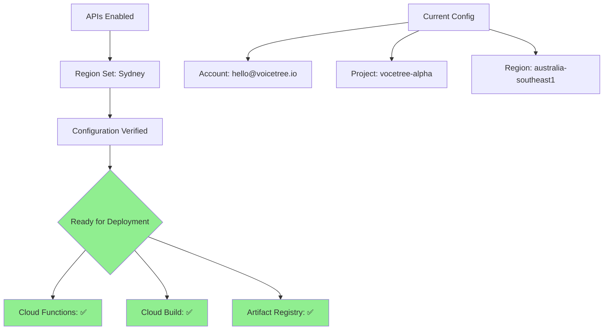

** Summary**
Successfully enabled all required Google Cloud APIs and configured default region to Sydney, Australia.

** Technical Details**
- **APIs Enabled**:
  - Cloud Functions API (cloudfunctions.googleapis.com)
  - Cloud Build API (cloudbuild.googleapis.com)
  - Artifact Registry API (artifactregistry.googleapis.com)
- **Default Region**: australia-southeast1 (Sydney)
- **Configuration**: Applied to both Cloud Functions and Cloud Run

** Configuration Status**

** Impact**
- All infrastructure ready for Cloud Function deployment
- Low latency for Australian users
- Can now deploy append agent as serverless function
- Build and deployment will use Sydney region resources

** Verified Commands Working**
- `gcloud functions list` - Ready (0 functions deployed)
- `gcloud config list` - Shows correct configuration
- All APIs successfully enabled in single operation

-----------------
_Links:_
Parent:
- completes_setup_for [[2025-09-30/4_Setup_G_Cloud_CLI.md]]
[[4_Setup_G_Cloud_CLI.md]]
