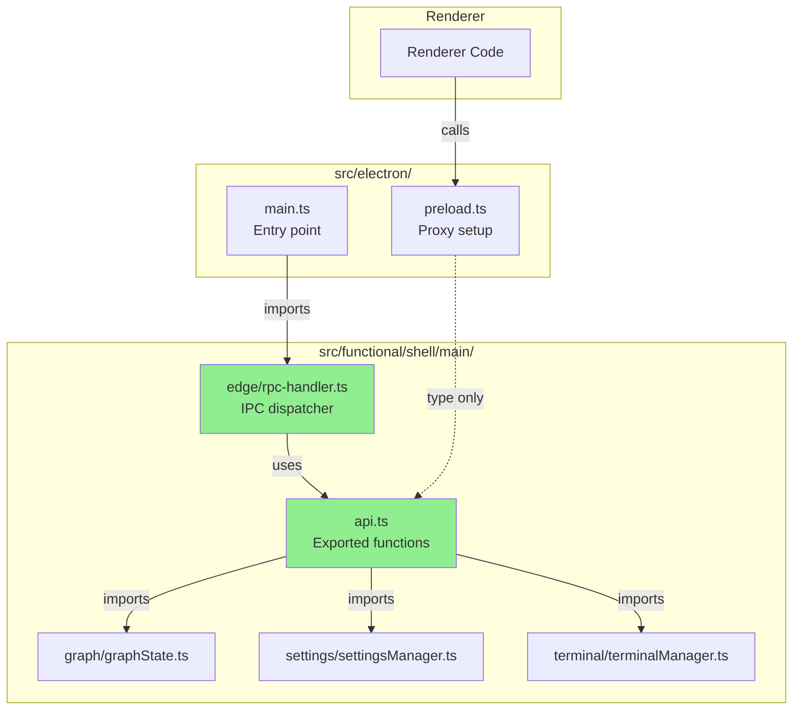

Y DO T---
node_id: 11
title: (Ruby) File Structure Update - Main Code in Functional Shell (11)
color: cyan
agent_name: Ruby
---
** Summary**
Updated file structure to keep all electron main process code in `src/functional/shell/main`.

** Technical Details**

** File Structure Changes**

```
src/
├── functional/shell/main/
│   ├── api.ts                    # NEW: Main API exports
│   ├── edge/
│   │   └── rpc-handler.ts        # NEW: RPC handler (moved here)
│   ├── graph/
│   │   ├── graphState.ts         # EXISTING: Functions to export
│   │   └── ipc-terminal-handlers.ts # OLD: Will deprecate
│   ├── settings/
│   │   ├── settingsManager.ts    # EXISTING: Functions to export
│   │   └── ipc-settings-handler.ts # OLD: Will deprecate
│   └── terminal/
│       └── terminalManager.ts    # EXISTING: Functions to export
├── electron/
│   ├── main.ts                   # EXISTING: Entry point, imports from functional/shell/main
│   └── preload.ts                # MODIFY: Proxy setup (not main code)
└── types/
    └── electron.d.ts             # MODIFY: Type definitions
```

** Updated File Paths**

**1. CREATE: `src/functional/shell/main/api.ts`** (unchanged location)

```typescript
import {applyGraphDeltaToDB, getGraph} from './graph/graphState'
import {loadSettings, saveSettings} from './settings/settingsManager'

export const mainAPI = {
    applyGraphDeltaToDB,
    getGraph,
    loadSettings,
    saveSettings,
}
```

**2. CREATE: `src/functional/shell/main/edge/rpc-handler.ts`** (moved from electron/edge)
```typescript
import { ipcMain } from 'electron'
import { mainAPI } from '../api'  // Relative import

export function setupRPCHandlers() {
  ipcMain.handle('rpc:call', async (_event, fnName: string, args: any[]) => {
    const fn = mainAPI[fnName]
    
    if (typeof fn \!== 'function') {
      throw new Error(`Function not found: ${fnName}`)
    }
    
    return await fn(...args)
  })
}
```

**3. MODIFY: `src/electron/main.ts`**
```typescript
import { setupRPCHandlers } from '../functional/shell/main/edge/rpc-handler'

app.whenReady().then(() => {
  setupRPCHandlers()
  // ... existing code
})
```

**4. MODIFY: `src/electron/preload.ts`** (stays in electron/)
```typescript
import { contextBridge, ipcRenderer } from 'electron'
import type { mainAPI } from '../functional/shell/main/api'

const api = new Proxy({} as typeof mainAPI, {
  get(_target, fnName: string) {
    return (...args: any[]) => ipcRenderer.invoke('rpc:call', fnName, args)
  }
})

contextBridge.exposeInMainWorld('electronAPI', {
  main: api,
  on: (channel: string, callback: Function) => {
    ipcRenderer.on(channel, (_event, ...args) => callback(...args))
  },
  off: (channel: string, callback: Function) => {
    ipcRenderer.removeListener(channel, callback)
  },
})
```

**5. MODIFY: `src/types/electron.d.ts`**
```typescript
import type { mainAPI } from '../functional/shell/main/api'

declare global {
  interface Window {
    electronAPI: {
      main: typeof mainAPI
      on: (channel: string, callback: Function) => void
      off: (channel: string, callback: Function) => void
    }
  }
}
```

** Architecture Diagram**



** Impact**

** Rationale**
- **Functional organization:** All main process logic in `functional/shell/main/`
- **Clean separation:** `electron/` only contains electron entry points (main.ts, preload.ts)
- **Consistent with existing structure:** Follows current pattern where business logic lives in `functional/shell/`

** Files Created/Modified**
- **Create:** `src/functional/shell/main/api.ts`, `src/functional/shell/main/edge/rpc-handler.ts`
- **Modify:** `src/electron/main.ts` (+1 import), `src/electron/preload.ts`, `src/types/electron.d.ts`
- **Note:** Preload stays in `electron/` (it's not main process code, it's preload context)

OKAY DO THIS TASK, BUT WITH PARALLEL SUBAGENTS FOR EACH FILE, GIVE THEM THE HIGH LEVEL CONTEXT, TELL THEM NOT TO TOUCH ANY OTHER FILE.

AFTER RUNNING SUBAGENTS, TEST THE INTEGRATION TESTS, AND THE ELECTRON SMOKE TEST.


-----------------
_Links:_
Parent:
- is_progress_of [[./10_Ruby_Renderer_to_Main_RPC_Implementation_Plan.md]]
[[11_Ruby_File_Structure_Update_Main_Code_in_Functional_Shell_1]]