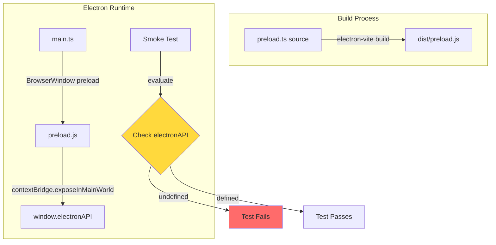
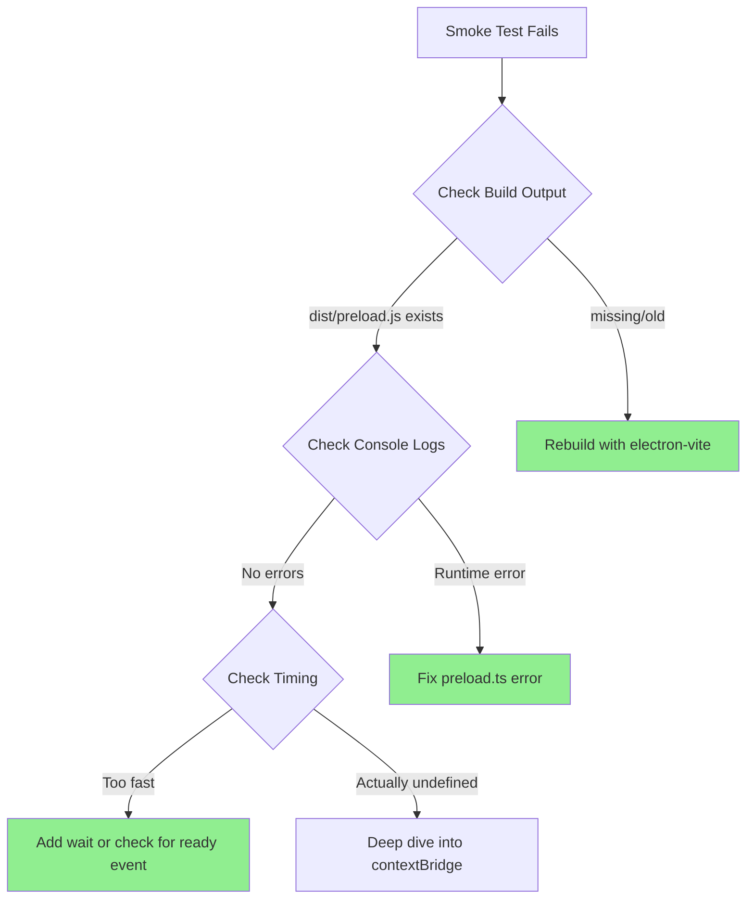

** Progress Completed**

**1. Files Modified Successfully:**
- `src/functional/shell/main/api.ts` - Added renderer-friendly RPC wrappers
- `src/electron/preload.ts` - Migrated graph and settings to use `mainAPIProxy`

**2. Migrations Completed:**
- ✅ `graph:applyDelta` → `mainAPIProxy.applyDelta()`
- ✅ `graph:getState` → `mainAPIProxy.getGraphState()`
- ✅ `settings:load` → `mainAPIProxy.loadSettings()`
- ✅ `settings:save` → `mainAPIProxy.saveSettings()`

**3. Testing:**
- ✅ TypeScript compilation passes (`npx tsc --noEmit`)
- ⚠️ Unit tests: Out of memory, but no new failures in visible results
- ❌ **Electron smoke test: FAILS**

** Current Issue - Smoke Test Failure**

**Test Output:**
```
expect(appReady).toBe(true);
// Expected: true
// Received: false
```

**What the test checks:**
```javascript
const appReady = await appWindow.evaluate(() => {
  return !!(window as ExtendedWindow).cytoscapeInstance &&
         !!(window as ExtendedWindow).electronAPI;
});
```

**Problem:** `window.electronAPI` is `undefined` when the test runs.

**Evidence from error snapshot:**
- App UI renders correctly (menu, graph placeholder, speed dial visible)
- Electron starts successfully
- But `electronAPI` is not available on window object

** Architecture Diagram**



** Hypothesis - Root Cause**

The app UI renders correctly, so Electron is starting. The issue is likely one of:

1. **Runtime Error in Preload** - Preload script has a runtime error preventing `contextBridge.exposeInMainWorld` from executing
2. **Build Issue** - Build process not including updated preload.ts changes
3. **Timing Issue** - Test checks before preload completes (but note from Ruby agent mentioned this was a test timing issue)

**Most Likely:** Since we modified preload.ts significantly (moved mainAPIProxy declaration, changed type annotations), there may be a runtime error preventing the script from completing.

** Investigation Flow**



** Next Steps**

** Immediate Actions:**
1. **Check build output** - Verify `dist/preload.js` has our changes
2. **Check console logs** - Look for runtime errors in preload execution
3. **Add defensive logging** - Add console.log statements to trace execution path
4. **Test in isolation** - Create minimal test that just checks if electronAPI is defined

** If Runtime Error Found:**
- Fix the error in preload.ts
- Ensure all imports resolve correctly
- Check for any circular dependencies or missing types

** If Build Issue Found:**
- Run `npx electron-vite build` explicitly
- Check electron-vite config for preload compilation settings
- Verify source maps point to correct files

** If Timing Issue:**
- Add proper wait condition in test
- Check for `DOMContentLoaded` or custom ready event
- Add retry logic with timeout

** Code Reference**

**Current preload.ts structure (lines 7-18):**
```typescript
// Zero-boilerplate RPC proxy for main API
const mainAPIProxy = new Proxy({} as typeof mainAPI, {
  get(_target, fnName: string) {
    return (...args: unknown[]) => ipcRenderer.invoke('rpc:call', fnName, args)
  }
})

// Expose protected methods that allow the renderer process to use
// the ipcRenderer without exposing the entire object
const electronAPI: ElectronAPI = {
  // Zero-boilerplate RPC pattern - automatic type inference from mainAPI
  main: mainAPIProxy,
  // ... rest of API
```

**Exposure (line 137):**
```typescript
contextBridge.exposeInMainWorld('electronAPI', electronAPI);
```

If there's a runtime error anywhere between lines 1-137, the `exposeInMainWorld` call never happens.

-----------------
_Links:_
Parent:
- is_progress_of [[./13_Tara_Tara_RPC_Migration_Graph_and_Settings_Complete.md]]