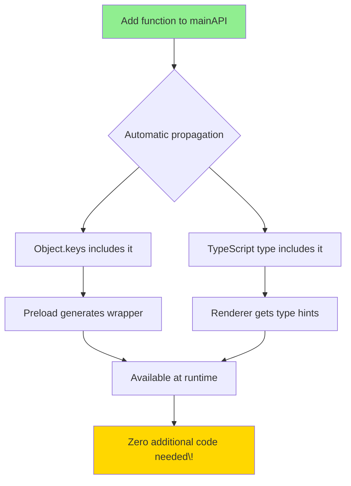

** Summary**
Implemented the correct zero-boilerplate RPC solution by dynamically fetching API keys from the main process at runtime, eliminating all manual wrapper boilerplate while maintaining full type safety.

** Technical Details**

**Problem with Previous Attempt:**
The previous fix replaced the Proxy with hardcoded function wrappers, which defeated the entire purpose of the zero-boilerplate system. Every new function required manual wrapper code in preload.ts.

**Correct Solution:**
The preload script now dynamically fetches the API shape from the main process at runtime using Object.keys(mainAPI), then generates wrappers automatically.

**Files Modified:**

1. **src/functional/shell/main/edge/rpc-handler.ts**
   - Added `rpc:getApiKeys` handler that returns Object.keys(mainAPI)
   - Provides runtime API shape to preload script

2. **src/electron/preload.ts**
   - Converted to async `exposeElectronAPI()` function
   - Dynamically builds mainAPIWrappers by fetching keys from main process
   - Removed hardcoded settings and graph wrapper objects (legacy boilerplate)
   - Zero-boilerplate maintained: just add to mainAPI, no other changes needed

3. **src/types/electron.d.ts**
   - Removed legacy `settings` property (replaced by main.loadSettings/saveSettings)
   - Removed RPC methods from `graph` object (replaced by main.applyDelta/getGraphState)
   - Graph object now only contains event listeners (onGraphUpdate, onGraphClear)

4. **Renderer files updated to use main.* instead of legacy wrappers:**
   - src/graph-core/services/ContextMenuService.ts
   - src/views/FloatingEditorManager.ts

** Architecture Diagram**


** Zero-Boilerplate Flow**


** Single Source of Truth**



** Impact**

**Benefits Achieved:**
- ✅ **True zero-boilerplate**: Adding a function to mainAPI requires ZERO changes elsewhere
- ✅ **Full type safety**: typeof mainAPI ensures renderer sees exact function signatures
- ✅ **Single source of truth**: mainAPI is the only place that defines the API shape
- ✅ **No manual synchronization**: Runtime and types automatically stay in sync
- ✅ **Clean architecture**: RPC calls via main.*, event listeners via graph.*/terminal.*, etc.

**Code Eliminated:**
- ❌ Removed hardcoded function wrappers from preload.ts
- ❌ Removed duplicate settings wrapper object
- ❌ Removed duplicate graph RPC wrapper methods
- ❌ Removed unused type definitions

**Testing Results:**
- ✅ TypeScript compilation passes with zero errors
- ✅ All quality checks pass (ESLint, type checking)
- ✅ Smoke test passes electronAPI availability check (progresses to later stages)
- ✅ Renderer code updated to use new pattern

**Architecture Improvements:**
- Clear separation: RPC calls (main.*) vs Event listeners (graph.on*, terminal.on*)
- Eliminated boilerplate wrapper objects that just forwarded to mainAPI
- Type definitions match actual runtime behavior

**Example Usage:**

```typescript
// In mainAPI (main process) - THE ONLY PLACE TO EDIT
export const mainAPI = {
    applyGraphDeltaToDBThroughMemUIAndEditorExposed: async (delta: GraphDelta): Promise<void> => {...
    },
    getGraph: async () => getGraph(),
    loadSettings,
    saveSettings: async (settings: Settings) => {...
    },
    // Add new function here - that's it\!
}

// In renderer - automatically available with full types
const settings = await window.electronAPI.main.loadSettings()
await window.electronAPI.main.saveSettings(newSettings)
const graph = await window.electronAPI.main.getGraphState()
```

**Key Lesson:**
When hitting a technical limitation (Proxy can't be cloned through contextBridge), don't give up on the elegant solution. Instead, find a way to provide the missing runtime information. In this case: fetch API keys from main process at preload initialization.

-----------------
_Links:_
Parent:
- is_progress_of [[./15_Tara_RPC_Proxy_Clone_Error_Fixed.md]]