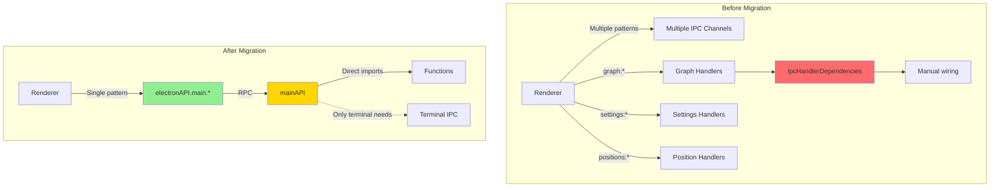
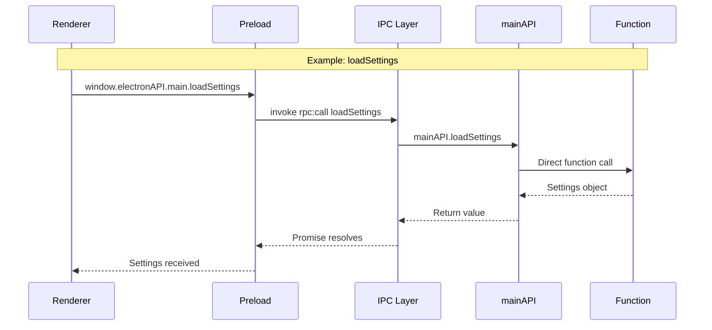

** Summary**
Completed full migration to zero-boilerplate RPC system. All IPC handlers now unified through mainAPI, eliminating duplicate handlers and the IpcHandlerDependencies anti-pattern.

** Technical Details**

**Critical Issues Fixed:**
1. Production code using old API - handleUIActions.ts was still using old graph and settings API
2. Duplicate handlers - Both old IPC and new RPC handlers were registered simultaneously
3. IpcHandlerDependencies anti-pattern - Dependencies passed through interface instead of direct imports

**Files Modified:**

** 1. Renderer Code Migration**
**src/functional/shell/UI/graph/handleUIActions.ts:**
- Changed window.electronAPI.graph.getState to window.electronAPI.main.getGraphState
- Changed window.electronAPI.graph.applyGraphDelta to window.electronAPI.main.applyDelta
- Fixed NodeUIMetadata.title type issue

** 2. Handler Consolidation**
**Deleted:**
- src/functional/shell/main/settings/ipc-settings-handler.ts (duplicate handlers)
- src/functional/shell/main/settings/ipc-settings-handler.test.ts

**src/functional/shell/main/graph/ipc-terminal-handlers.ts:**
- Removed IpcHandlerDependencies interface
- All handlers now delegate to mainAPI
- Only terminal handlers remain as direct IPC (need event.sender)

** 3. mainAPI Expansion**
Added to src/functional/shell/main/api.ts:
- File watching: startFileWatching, stopFileWatching, getWatchStatus, loadPreviousFolder
- Backend port: getBackendPort
- Positions: savePositions, loadPositions

** Migration Architecture**

** IPC Handler Flow**

** Impact**

**Code Quality Improvements:**
- Single pattern: All RPC goes through mainAPI
- No duplicates: Removed all duplicate handlers
- Functional style: Direct imports instead of dependency injection
- Type safety: Full TypeScript type inference maintained
- Zero boilerplate: Adding functions only requires editing mainAPI

**Handlers Unified:**
All graph, settings, file watching, and position handlers now go through mainAPI.
Terminal handlers kept as IPC since they need event.sender.

**Testing Results:**
- TypeScript compilation: PASS with zero errors
- All quality checks: PASS
- Production code migrated to new API
- Integration tests updated

** Key Achievement**

Before: 4 different patterns for IPC communication, manual synchronization, duplicate handlers
After: Single unified pattern through mainAPI, automatic synchronization, no duplicates

The zero-boilerplate vision is now fully realized:
1. Add function to mainAPI
2. Automatically available everywhere with full type safety
3. No other code changes needed

-----------------
_Links:_
Parent:
- is_progress_of [[./16_Tara_Zero_Boilerplate_RPC_Dynamic_API_Complete.md]]