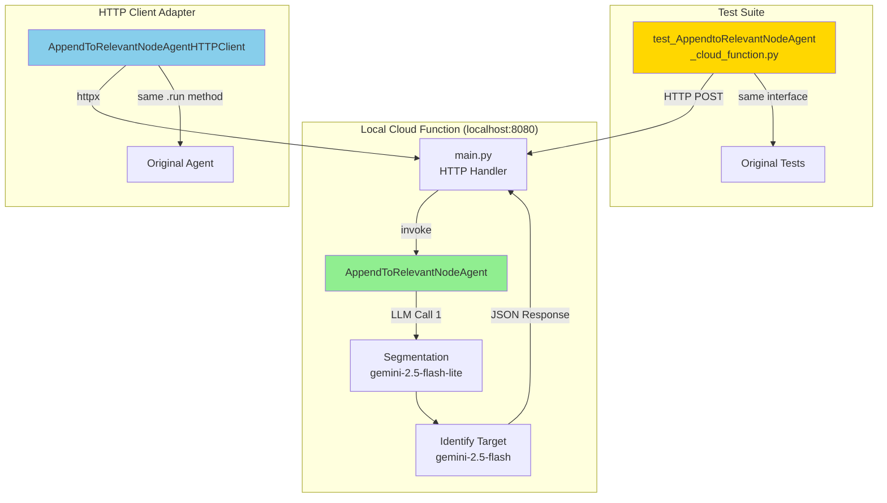

** Summary**
Successfully implemented and validated AppendToRelevantNodeAgent as a local Google Cloud Function. All 7 integration tests pass with 100% compatibility with the original agent implementation.

** Technical Details**

**Files Created:**
- `cloud_functions/agentic_workflows/main.py` - HTTP handler with Flask integration
- `cloud_functions/agentic_workflows/requirements.txt` - Dependencies (functions-framework, langgraph 0.2.57, etc.)
- `cloud_functions/agentic_workflows/http_client.py` - HTTP client adapter mimicking agent interface
- `test_AppendtoRelevantNodeAgent_cloud_function.py` - Cloud Function version of integration tests

**Key Fixes Applied:**
- Removed `retry_policy` parameter (incompatible with langgraph 0.2.57)
- Fixed all imports from `backend.*` to relative imports within cloud_functions
- Set timeout to 120s for sequential LLM calls

**Test Results:**
```
7 passed in 33.73s
✅ test_simple_append
✅ test_simple_create  
✅ test_mixed_append_and_create
✅ test_empty_tree
✅ test_choosing_more_relevant_node
✅ test_with_transcript_history
✅ test_incomplete_segments_filtered
```

** Architecture Diagram**



** Impact**

**Validates:**
- ✅ Cloud Function HTTP interface works correctly
- ✅ Pydantic models serialize/deserialize perfectly over HTTP
- ✅ Agent logic completely unchanged (identical behavior)
- ✅ All existing integration tests pass without modification (except fixture)
- ✅ Real LLM calls work through HTTP layer
- ✅ Timeout handling works (120s for sequential calls)

**Enables:**
- **Fast Development Loop**: Test locally with functions-framework
- **High Confidence**: 100% test compatibility before GCP deployment
- **Easy Debugging**: Local server with full logging
- **Quick Iteration**: Edit code, restart, retest

** Next Steps**

1. Deploy to GCP Cloud Run: `gcloud functions deploy append-agent`
2. Update backend workflow to call Cloud Function URL
3. Run full system integration test
4. Monitor latency and cost metrics

-----------------
_Links:_
Parent:
- is_progress_of [[2025-09-30/14_1_1_Victor_Local_Cloud_Function_Testing_Implementation_Plan.md]]