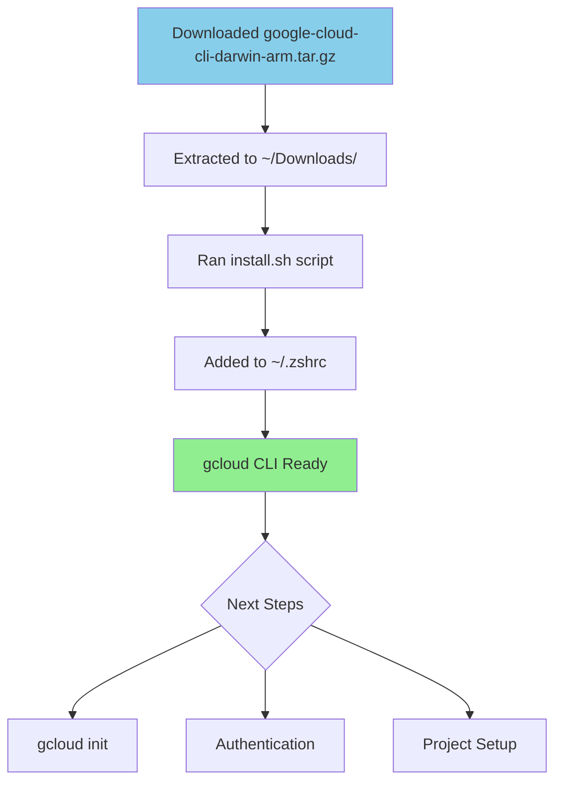

** Summary**
Successfully installed Google Cloud CLI version 540.0.0 on macOS (Darwin) using manual tar extraction method.

** Technical Details  **
- **Installation Method**: Manual download and tar extraction
- **Location**: ~/Downloads/google-cloud-sdk/
- **Version**: 540.0.0 with core components
- **Components Installed**: 
  - bq (BigQuery CLI) v2.1.23
  - gsutil (Cloud Storage CLI) v5.35
  - core libraries v2025.09.23
  - log-streaming v0.3.0
- **Shell Configuration**: Added to ~/.zshrc for PATH and completions

** Architecture/Flow Diagram**

** Impact**
The gcloud CLI is now available for:
- Deploying Cloud Functions (Google's serverless compute)
- Managing Google Cloud resources  
- Converting the append agent to a Cloud Function
- Setting up CI/CD pipelines

Ready for authentication and project configuration when you're ready to proceed.

-----------------
_Links:_
Parent:
- is_progress_of [[2025-09-30/4_Setup_G_Cloud_CLI.md]]
[[4_Setup_G_Cloud_CLI.md]]