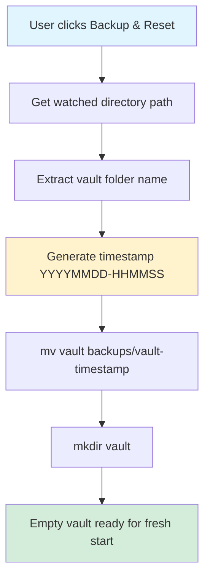

## Summary
Fixed the backup and reset command using a simple shell-based `mv` + `mkdir` approach with timestamp-based backup folder names.

## Technical Details
- **File Modified**: `VoiceTree/frontend/webapp/src/views/VoiceTreeGraphView.ts:605-630`
- **Method**: `createBackupTerminal()`
- **Key Changes**:
  - Changed from moving the entire vault folder (causing nesting) to moving with timestamp suffix
  - Pure shell solution - no TypeScript filesystem checks needed
  - Simple one-liner command with `$(date)` for unique naming

## Before and After

### Before (Buggy)
```typescript
const backupCommand = `mkdir -p "${watchDir}/../backups" && mv "${watchDir}" "${watchDir}/../backups/"`;
```
**Problem**: If `backups/vault` already exists, `mv` nests the folder as `backups/vault/vault`

### After (Fixed)
```typescript
// Extract vault folder name for backup naming
const vaultName = watchDir.split('/').pop() || 'vault';

// Generate command: move vault to timestamped backup, then recreate empty vault
const backupCommand = `mkdir -p "${watchDir}/../backups" && mv "${watchDir}" "${watchDir}/../backups/${vaultName}-$(date +%Y%m%d-%H%M%S)" && mkdir -p "${watchDir}"`;
```

**Example output**: `backups/vault-20251115-143022/`

## Command Flow Diagram


## Impact
- **Simplest Solution**: Pure shell one-liner with timestamp
- **No Overwrites**: Unique timestamp ensures no conflicts
- **No TypeScript Complexity**: All logic handled by shell command
- **Clean Separation**: Backup and reset in one atomic operation
- **No Breaking Changes**: The UI and user interaction remain the same

## Validation
- TypeScript compilation: ✅ Passed (`npx tsc --noEmit`)
- No type errors introduced
- Command properly escapes paths with quotes for spaces
- Shell `$(date)` command generates unique timestamps automatically

-----------------
_Links:_
Parent:
- is_progress_of [[./7_Bug_in_Agent_Conversation_Demonstration.md]]