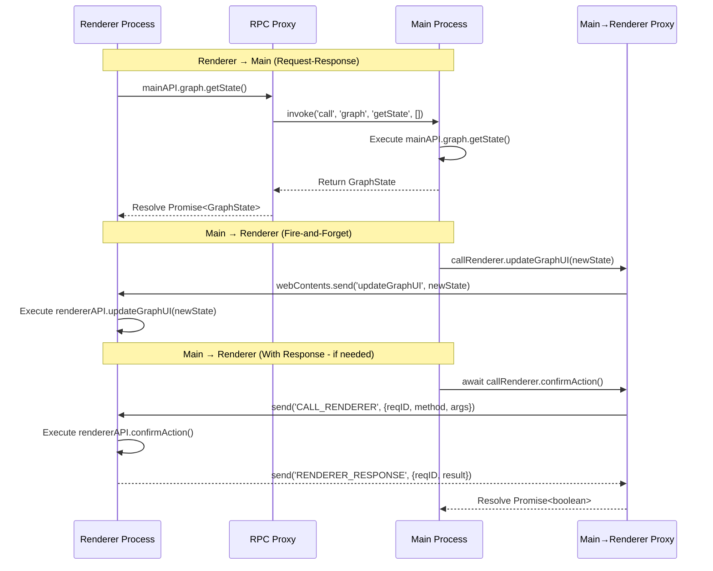

Analyzed VoiceTree's current IPC implementation 

and reviewed the symmetric RPC proposal from the agent conversation. The proposal is excellent and addresses real pain points.

** Technical Details**

** Current Architecture Issues**

**Files Modified Per Function:** 4
- `src/electron/preload.ts` (127 lines of manual IPC wrapping)
- `src/functional/shell/main/*/ipc-*-handlers.ts` (manual handler registration)
- `src/types/electron.d.ts` (duplicate type definitions)
- Renderer files (type assertions with `window.electronAPI?.`)

**Current IPC Channels:** 27 total
- Graph operations (4 channels)
- File watching (16 channels - events & control)
- Settings (2 channels)
- Terminal (6 channels)
- Position/config (7 channels)

** Proposal Assessment**

The symmetric RPC pattern from the conversation is **ideal for VoiceTree** because:

1. **Aligns with project philosophy:** Single solution principle, minimize complexity
2. **Functional design:** Functions as first-class citizens, clear edge boundaries
3. **Type safety:** Full TypeScript inference without duplication
4. **Reduces boilerplate:** 4 file changes → 1 function definition

** Architecture Comparison Diagram**

```mermaid
graph TB
    subgraph "Current Architecture (Verbose)"
        R1[Renderer Code]
        P1[preload.ts<br/>127 lines manual wrapping]
        T1[electron.d.ts<br/>Type definitions]
        H1[ipc-handlers.ts<br/>String-based channels]
        M1[Main Process Functions]
        
        R1 -->|"window.electronAPI?.graph.applyDelta()"| P1
        P1 -->|"ipcRenderer.invoke('graph:applyDelta')"| H1
        H1 -->|"manual dispatch"| M1
        T1 -.->|"type checking"| R1
        
        style P1 fill:#ff9999
        style T1 fill:#ff9999
        style H1 fill:#ff9999
    end
    
    subgraph "Proposed Architecture (Symmetric RPC)"
        R2[Renderer Code]
        P2[preload.ts<br/>~10 lines Proxy]
        A2[main/api.ts<br/>Single source of truth]
        RPC2[RPC Handler<br/>Generic dispatcher]
        
        R2 -->|"mainAPI.graph.applyDelta()"| P2
        P2 -->|"Proxy intercept"| RPC2
        RPC2 -->|"auto-dispatch"| A2
        A2 -.->|"TypeScript inference"| R2
        
        style P2 fill:#99ff99
        style A2 fill:#99ff99
        style RPC2 fill:#99ff99
    end
```



** Code Comparison**

** Before (Current - 4 files to change)**

```typescript
// 1. preload.ts
applyGraphDelta: (action) => ipcRenderer.invoke('graph:applyDelta', action)

// 2. ipc-terminal-handlers.ts
ipcMain.handle('graph:applyDelta', async (_event, action: GraphDelta) => {
  await applyGraphDeltaToDB(getGraph(), action)
})

// 3. electron.d.ts
applyGraphDelta: (action: GraphDelta) => Promise<unknown>

// 4. Renderer usage
await window.electronAPI?.graph.applyDelta(graphDelta)
```

** After (Proposed - 1 function definition)**

```typescript
// main/api.ts - ONLY place to add functions
export const mainAPI = {
  graph: {
    applyDelta: async (action: GraphDelta) => {
      await applyGraphDeltaToDB(getGraph(), action)
    }
  }
}

// Renderer usage - auto-typed, no changes needed
await mainAPI.graph.applyDelta(graphDelta)
```

** Bidirectional Flow Diagram**



** Impact**

** Positive Impacts**
1. **Development velocity:** Adding new IPC functions 4x faster
2. **Type safety:** Automatic inference, no drift between types and implementation
3. **Maintainability:** Single source of truth for all IPC functions
4. **Testing:** Easier to mock, functions can be tested independently
5. **Functional design:** Clear /edge boundary, honest about effects

** Migration Considerations**
1. **27 existing channels** need gradual migration
2. **Event-based channels** (file-watching events) need special handling
3. **Namespace structure** (graph, terminal, settings) should be preserved
4. **Backward compatibility** during transition period

** Risks**
1. **Learning curve:** Team needs to understand Proxy pattern
2. **Debugging:** Stack traces may be less clear with Proxy
3. **Type complexity:** TypeScript inference with nested Proxies can be tricky

** Next Steps**
1. Prototype with small subset (e.g., settings API - only 2 channels)
2. Design main/renderer API structure preserving namespaces
3. Handle event subscriptions (file-watching, terminal output)
4. Plan migration strategy for existing 27 channels

-----------------
_Links:_
Parent:
- is_progress_of [[./6_VoiceTree_IPC_Layer_Boilerplate_Removal.md]]
[[voicetree/ctx-nodes/9_Ruby_IPC_Layer_Analysis_Symmetric_RPC_Review_context_1766110198503.md]]