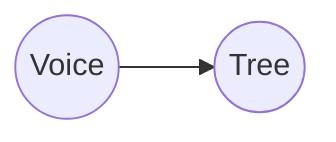

---
position:
  x: 1527.8230061237246
  y: -1616.3415144520961
isContextNode: false
---
# Hover over me

Recommended usage for agentic engineering:

1. Brainstorm a large task in the mindmap itself. Get AI to help review and suggest options as needed.

2. Start executing agents on branches of the brainstorm. For larger/harder parts of the project, Tell agents to "decompose plan into a dependency graph of nodes, and then spawn voicetree agents to work through it"

3. Rotate between the idle agents (cmd + [[ keyboard shortcut), to see if they need help or to be nudged towards true completion.

4. Since the feature will never be pixel perfect on the first iteration, for running next steps, spawn agents directly on handover notes automatically created by the previous sessions.

5. Zoom out to see the big picture of the shape of the work you and your agents did, useful for identifying productivity bottlenecks.


### Voicetree features

Above the node editor, you will see 6 buttons, these are all the actions you can perform on a node. Try adding a child node now.

Markdown support:

**Code blocks:**
```typescript
while (true) {
+  const x : string = "Hello World!"
-  // agents will automatically produce handover nodes with their diff  
  ...
}
```

**Mermaid diagram blocks:**


You can add edges to other nodes by typing a wikilink. Start typing double square brackets, and an autocomplete will pop up, to insert links to another nodes path like so: [to_the_other_nodes_relative_or_absolute_path.md]]]

# Hotkeys & other features

### Navigation
- Hold **space** to follow most recent node
- **Cmd + ] or [[** to cycle between terminals
- **Cmd + 1-5** to navigate to recently added or modified nodes (appear as tabs in the top left)
- **Cmd + E** to open the graph search / command pallete (nodes here are ordererd by recently selected), cmd + f, cmd + k also work

## Markdown nodes
- **Cmd + drag** to select nodes. Hover also selects node.
- **Cmd + n** to create new child node, or if no node is selected, creates orphan node
- **Cmd + backspace** to delete selected node(s)
- **Cmd + enter** to run this node the default agent (first agent in the agents array in settings.json)
- **Cmd + z** / **cmd + shift + z** to undo / redo 
- **Cmd + w** to close terminals and editors

- when a node is selected, you can speak directly into it! A chip with transcribed text will appear

### Settings
All settings are currently contained in the settings.json file (`~/Library/Application\ Support/VoiceTree/settings.json`) 

You can open the editor for this file in the floating menu on the right hand side of the graph.

### Agents

Agents can add nodes via their filesystem tools, since nodes are just markdown files. For example, you can tell agents to 'add a progress tree to the graph'

You can create custom agents in the settings

For example, you could create a "fix broken tests agent", which has a custom CLI command and prompt. 


#### Context nodes
When you run an agent, it will produce a context node, this is a traversal of nodes within distance=6 (configurable in the settings)
This is the context that will be injected into the agent at startup.

#### Works amazingly with spec driven development
VoiceTree pairs perfectly with OpenSpec for AI-assisted development.

Just tell your agent: "Please create an OpenSpec change proposal for this feature" - the markdown files will appear in the graph.
Works Amazingly With OpenSpec
VoiceTree pairs perfectly with OpenSpec for AI-assisted development.

Just tell your agent: "Please create an OpenSpec change proposal for this feature" - the markdown files will appear in the graph.

[[to_the_other_nodes_relative_or_absolute_path.md]]
[[to_the_other_nodes_relative_or_absolute_path.md]]