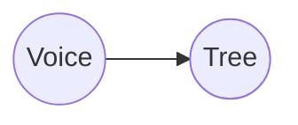

---
position:
  x: 1280.898464575175
  y: -1708.051135301995
isContextNode: false
---
# Hover over me

Above me, next to the node, you will see 6 buttons, these are all the actions you can perform on a node. Try adding a child node now.

Markdown support:

**Code blocks:**
```typescript
while (true) {
+  const x : string = "Hello World!"
-  // agents will automatically produce handover nodes with their diff  
  ...
}
```

**Mermaid diagram blocks:**


You can add edges to other nodes by adding a wikilink with double square brackets to another nodes path like so: [[[to_the_other_nodes_relative_or_absolute_path.md]]]


Some other features:
[[other_features.md]]
[[run_me.md]]