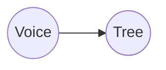

---
position:
  x: 1106.7987305114327
  y: -1178.3524834086386
isContextNode: false
---
# Hover Over Me

Above me you will see all the actions you can perform on a node. The two most important are adding a child node, and running a node.

Hovering on a node opens its floating editor.

It supports all *standard* markdown plus:

**code blocks:**
```typescript
while (true) {
  const x : string = "Hello World!"
  ...
}
```
**mermaid diagram blocks:**


You can add edges to other nodes by adding a wikilink with double square brackets to another nodes path like so: [[[to_the_other_nodes_relative_or_absolute_path.md]]]


Some other features:
[[right_click_to_open_terminal_0.md]]
[[right_click_to_open_terminal_1.md]]
[[right_click_to_open_terminal_2.md]]
[[voicetree/right_click_to_open_terminal_0.md]]
[[voicetree/right_click_to_open_terminal_1.md]]
[[voicetree/right_click_to_open_terminal_2.md]]
[[voicetree/right_click_to_open_terminal_3.md]]