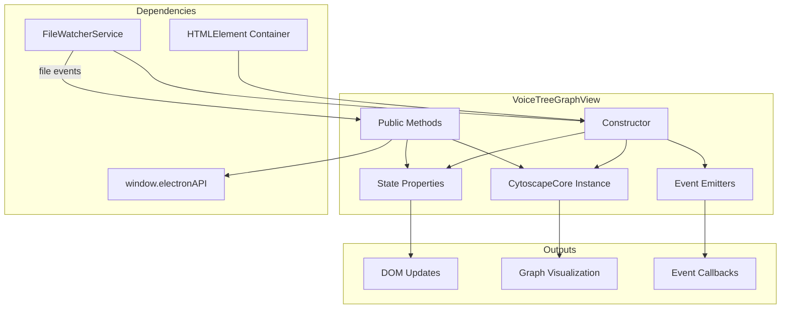

# VoiceTreeGraphView Contract Document

**Author:** Grace (Agent)
**Date:** 2025-10-28
**For:** Hugo (test writer) and Iris (implementer)

## Overview

This document specifies the exact behavior of the `VoiceTreeGraphView` class. It defines what the class does (behavior), what state it maintains (data), and how it interacts with dependencies (side effects).

**Purpose:**
- Hugo can write tests based on these specifications
- Iris can implement the class based on these specifications
- Both can work independently and in parallel

## Architecture



## Class Structure

### Extends
```typescript
class VoiceTreeGraphView extends Disposable
```

**Disposable Pattern:**
- Base class provides `dispose()` lifecycle method
- Subclass calls `super.dispose()` at end of cleanup
- Allows cleanup registration via `addDisposable()`

### Constructor Signature

```typescript
constructor(
  container: HTMLElement,
  fileWatcher: FileWatcherService,
  options?: VoiceTreeGraphViewOptions
)
```

**Parameters:**
1. `container: HTMLElement`
   - Where to render the graph
   - Will be cleared and populated with graph DOM structure
   - Must be a valid, attached HTMLElement

2. `fileWatcher: FileWatcherService`
   - Service providing file change events
   - Must implement all event subscription methods
   - Will be disposed when graph view is disposed

3. `options?: VoiceTreeGraphViewOptions` (optional)
   - `onError?: (error: string) => void` - Error callback
   - `onLoading?: (isLoading: boolean) => void` - Loading state callback
   - `initialDarkMode?: boolean` - Initial dark mode (default: read from localStorage)

**Constructor Behavior (Step by Step):**

1. Call `super()` to initialize Disposable base class
2. Store `container` and `fileWatcher` as instance properties
3. Initialize all state properties to default values
4. Call `setupDarkMode()`:
   - Read from localStorage ('darkMode') OR use options.initialDarkMode
   - Set `isDarkMode` property
   - Add/remove 'dark' class on document.documentElement
5. Call `render()`:
   - Clear container.innerHTML
   - Create DOM structure (cytoscape div, overlays, buttons)
   - Store references to DOM elements (statsOverlay, etc.)
6. Call `setupCytoscape()`:
   - Create new CytoscapeCore instance with cytoscape container
   - Enable auto-layout extension
   - Enable context menu extension
   - Enable floating windows extension
   - Set up Cytoscape event listeners (tap, layoutstop, etc.)
7. Call `setupEventListeners()`:
   - Add window resize listener
   - Add keyboard shortcut listeners
   - Register cleanup with addDisposable()
8. Call `setupFileListeners()`:
   - Subscribe to all FileWatcherService events
   - Bind handlers to this instance
   - Register cleanup with addDisposable()

**Side Effects:**
- Modifies container.innerHTML
- Reads localStorage
- May modify document.documentElement.classList
- Subscribes to window events
- Subscribes to file watcher events
- Creates Cytoscape instance

**Throws:**
- Never throws (fail fast is internal, constructor always succeeds)

## State Properties

All state is private and managed internally.

### Core Instances
```typescript
private cy: CytoscapeCore;
private container: HTMLElement;
private fileWatcher: FileWatcherService;
```

### Data Caches
```typescript
private markdownFiles: Map<string, string>;
```
- **Purpose:** Cache of file contents for quick editor lookup
- **Key:** Full file path (e.g., "/vault/concepts/introduction.md")
- **Value:** Markdown content
- **Updated:** On file add/change events
- **Cleared:** On watching stopped event

```typescript
private pendingNodePositions: Map<string, Position>;
```
- **Purpose:** Queue of positions for nodes created via right-click
- **Key:** Node ID (normalized filename, e.g., "introduction")
- **Value:** Graph coordinates {x, y}
- **Lifecycle:**
  - Set when "Add node at position" context menu action triggered
  - Applied when file watcher fires `onFileAdded` for that node
  - Removed after application

```typescript
private savedPositions: Record<string, Position>;
```
- **Purpose:** Positions loaded from disk for layout restoration
- **Key:** Full file path
- **Value:** Graph coordinates {x, y}
- **Updated:** On watching started event
- **Used:** During bulk file load to position nodes

### State Flags
```typescript
private nodeCount: number = 0;
private edgeCount: number = 0;
```
- **Purpose:** Display statistics (excluding ghost root and shadow nodes)
- **Updated:** After any graph mutation (add/delete nodes/edges)
- **Used:** By `updateStatsDisplay()` and `getStats()`

```typescript
private isInitialLoad: boolean = true;
```
- **Purpose:** Track whether in bulk load phase or incremental phase
- **State Machine:**
  - Initial: `true`
  - After `handleBulkFilesAdded`: `false`
  - On `handleWatchingStarted`: `true`
  - On `handleWatchingStopped`: `true`
- **Used:** To determine layout strategy (bulk fit vs. incremental layout)

```typescript
private isDarkMode: boolean;
```
- **Purpose:** Current theme state
- **Initialized:** From localStorage or options.initialDarkMode
- **Updated:** By `toggleDarkMode()`
- **Persisted:** To localStorage on change

```typescript
private currentTerminalIndex: number = 0;
```
- **Purpose:** Track terminal focus for Cmd+] / Cmd+[ cycling
- **Updated:** By keyboard shortcuts
- **Range:** 0 to (terminal count - 1)

### DOM References
```typescript
private statsOverlay: HTMLElement | null = null;
private loadingOverlay: HTMLElement | null = null;
private errorOverlay: HTMLElement | null = null;
private emptyStateOverlay: HTMLElement | null = null;
```
- **Purpose:** Direct access to overlay elements for manual updates
- **Created:** In `render()`
- **Updated:** By specific UI update methods

### Event Emitters
```typescript
private nodeSelectedEmitter: EventEmitter<string>;
private nodeDoubleClickEmitter: EventEmitter<string>;
private edgeSelectedEmitter: EventEmitter<{source: string, target: string}>;
private layoutCompleteEmitter: EventEmitter<void>;
```
- **Purpose:** Notify external subscribers of graph events
- **Created:** In constructor
- **Used:** By public `on*` methods

## Public API Specifications

### focusNode(nodeId: string): void

**Purpose:** Center viewport on a specific node with animation

**Preconditions:**
- Class has been constructed (cy exists)

**Behavior:**
1. Get Cytoscape Core instance
2. Find node by ID: `cy.getElementById(nodeId)`
3. If node exists and has length > 0:
   - Call `cy.fit(node, 600)` (600ms animation)
4. If node doesn't exist:
   - Do nothing (fail silently, no log, no error)

**Postconditions:**
- Viewport centered on node (if exists)
- No state changes

**Side Effects:**
- Updates Cytoscape viewport (pan, zoom)

**Example Test:**
```typescript
test('focusNode centers viewport on existing node', () => {
  const view = new VoiceTreeGraphView(container, fileWatcher);
  // Add node 'test-node' to graph via file event
  triggerFileAdded({ fullPath: 'test-node.md', content: '# Test' });

  view.focusNode('test-node');

  // Assert: viewport is centered on 'test-node'
  const node = getCytoscapeNode('test-node');
  expect(viewportIsCenter(node)).toBe(true);
});

test('focusNode does nothing for non-existent node', () => {
  const view = new VoiceTreeGraphView(container, fileWatcher);

  view.focusNode('does-not-exist');

  // Assert: no errors, no state changes
  expect(() => view.focusNode('nope')).not.toThrow();
});
```

---

### getSelectedNodes(): string[]

**Purpose:** Return IDs of currently selected nodes

**Preconditions:**
- Class has been constructed (cy exists)

**Behavior:**
1. Get Cytoscape Core instance
2. Get selected nodes: `cy.$(':selected')`
3. Filter to only nodes (not edges)
4. Filter out shadow nodes (floating windows)
5. Map to IDs
6. Return as array

**Postconditions:**
- No state changes

**Returns:**
- Array of node ID strings
- Empty array if no selection

**Example Test:**
```typescript
test('getSelectedNodes returns empty array initially', () => {
  const view = new VoiceTreeGraphView(container, fileWatcher);
  expect(view.getSelectedNodes()).toEqual([]);
});

test('getSelectedNodes returns IDs of selected nodes', () => {
  const view = new VoiceTreeGraphView(container, fileWatcher);
  addNodes(['node1', 'node2', 'node3']);
  selectNodes(['node1', 'node3']);

  expect(view.getSelectedNodes()).toEqual(['node1', 'node3']);
});
```

---

### refreshLayout(): void

**Purpose:** Re-run layout algorithm on entire graph

**Preconditions:**
- Class has been constructed (cy exists)

**Behavior:**
1. Get Cytoscape Core instance
2. Trigger layout:
   ```typescript
   cy.layout({
     name: 'cola',
     // ... cola options
   }).run();
   ```
3. Layout will trigger 'layoutstop' event when complete
4. 'layoutstop' handler will call `saveNodePositions()`

**Postconditions:**
- Layout algorithm running (async)
- Nodes will move to new positions
- Positions will be saved after completion

**Side Effects:**
- Updates node positions in graph
- Triggers async position save to disk

**Example Test:**
```typescript
test('refreshLayout triggers cola layout', () => {
  const view = new VoiceTreeGraphView(container, fileWatcher);
  addNodes(['node1', 'node2']);
  const spy = spyOnCytoscapeLayout();

  view.refreshLayout();

  expect(spy).toHaveBeenCalledWith({ name: 'cola', ... });
});
```

---

### fit(padding?: number): void

**Purpose:** Adjust viewport to show all nodes

**Preconditions:**
- Class has been constructed (cy exists)

**Parameters:**
- `padding?: number` - Padding in pixels (default: 50)

**Behavior:**
1. Get Cytoscape Core instance
2. Call `cy.fit(padding ?? 50)`

**Postconditions:**
- No state changes

**Side Effects:**
- Updates Cytoscape viewport (pan, zoom)

---

### toggleDarkMode(): void

**Purpose:** Switch between light and dark themes

**Preconditions:**
- Class has been constructed

**Behavior:**
1. Toggle `this.isDarkMode` (boolean flip)
2. Update document:
   ```typescript
   if (this.isDarkMode) {
     document.documentElement.classList.add('dark');
   } else {
     document.documentElement.classList.remove('dark');
   }
   ```
3. Save to localStorage:
   ```typescript
   localStorage.setItem('darkMode', String(this.isDarkMode));
   ```
4. Update Cytoscape styles:
   ```typescript
   const styleService = new StyleService();
   this.cy.getCore().style(styleService.getCombinedStylesheet());
   ```

**Postconditions:**
- `isDarkMode` flipped
- Document class list updated
- localStorage updated
- Graph styles updated

**Side Effects:**
- Modifies document.documentElement.classList
- Writes to localStorage
- Updates Cytoscape styles

---

### isDarkMode(): boolean

**Purpose:** Get current theme state

**Returns:** Current value of `this.isDarkMode`

---

### getStats(): { nodeCount: number; edgeCount: number }

**Purpose:** Get current graph statistics

**Returns:**
```typescript
{
  nodeCount: this.nodeCount,
  edgeCount: this.edgeCount
}
```

**Note:** Counts exclude ghost root and shadow nodes

---

### Event Emitters

All event emitter methods follow the same pattern:

```typescript
onNodeSelected(callback: (nodeId: string) => void): () => void {
  return this.nodeSelectedEmitter.on(callback);
}
```

**Returns:** Unsubscribe function

**Example Test:**
```typescript
test('onNodeSelected fires when node clicked', () => {
  const view = new VoiceTreeGraphView(container, fileWatcher);
  addNode('test-node');

  const callback = jest.fn();
  view.onNodeSelected(callback);

  clickNode('test-node');

  expect(callback).toHaveBeenCalledWith('test-node');
});

test('unsubscribe stops receiving events', () => {
  const view = new VoiceTreeGraphView(container, fileWatcher);
  const callback = jest.fn();
  const unsubscribe = view.onNodeSelected(callback);

  unsubscribe();
  clickNode('test-node');

  expect(callback).not.toHaveBeenCalled();
});
```

## File Watcher Event Handlers

### handleBulkFilesAdded(data: BulkFileEvent): void

**Purpose:** Process initial file scan (bulk load)

**Input:**
```typescript
{
  files: [
    { fullPath: '/vault/concepts/intro.md', content: '# Intro\n[[outro]]' },
    { fullPath: '/vault/concepts/outro.md', content: '# Outro\n[[intro]]' },
    // ... more files
  ]
}
```

**Behavior:**
1. Clear any existing graph elements (except ghost root)
2. Parse all files using `parseForCytoscape()`
3. Create ghost root if needed
4. Create all nodes using `GraphMutator.addNode()`
5. Create all edges using `GraphMutator.addEdge()`
6. Apply saved positions (from `this.savedPositions`) if available
7. If no saved positions, use `seedBulkPositions()` for angular layout
8. Trigger layout
9. Set `isInitialLoad = false`
10. Update `nodeCount` and `edgeCount`
11. Call `updateStatsDisplay()`
12. Cache all file contents in `this.markdownFiles`

**Postconditions:**
- Graph populated with all nodes and edges
- Positions applied (saved or seeded)
- Layout running
- Stats updated

**Side Effects:**
- Mutates Cytoscape graph
- Updates internal caches

---

### handleFileAdded(data: FileEvent): void

**Purpose:** Add single file to graph

**Input:**
```typescript
{
  fullPath: '/vault/concepts/newfile.md',
  content: '# New File\n[[intro]] [[outro]]'
}
```

**Behavior:**
1. Normalize filename to node ID
2. Check if node already exists (skip if yes)
3. Parse markdown content
4. Create node via `GraphMutator.addNode()`
5. Create edges to linked nodes via `GraphMutator.addEdge()`
6. Check `this.pendingNodePositions` for this node ID:
   - If found, position node at that location
   - Remove from pending map
7. If not in pending and not in initial load:
   - Trigger incremental layout
8. Update `nodeCount` and `edgeCount`
9. Call `updateStatsDisplay()`
10. Cache content in `this.markdownFiles`

**Postconditions:**
- Node added to graph
- Edges created
- Position applied (if pending)
- Stats updated
- Content cached

---

### handleFileChanged(data: FileEvent): void

**Purpose:** Update existing file in graph

**Input:**
```typescript
{
  fullPath: '/vault/concepts/intro.md',
  content: '# Updated Intro\n[[outro]] [[newfile]]' // changed content
}
```

**Behavior:**
1. Normalize filename to node ID
2. Find node in graph
3. If node doesn't exist, treat as `handleFileAdded()`
4. Parse new markdown content
5. Update node label
6. Remove old edges from this node
7. Create new edges based on new links
8. Trigger breathing animation (AnimationType.CONTENT_APPEND)
9. Update `edgeCount` (nodeCount unchanged)
10. Call `updateStatsDisplay()`
11. Update content in `this.markdownFiles`

**Postconditions:**
- Node updated
- Edges updated
- Animation triggered
- Stats updated
- Content cached

---

### handleFileDeleted(data: { fullPath: string }): void

**Purpose:** Remove file from graph

**Input:**
```typescript
{
  fullPath: '/vault/concepts/intro.md'
}
```

**Behavior:**
1. Normalize filename to node ID
2. Remove node via `GraphMutator.removeNode()`
3. GraphMutator handles edge cleanup automatically
4. Remove from `this.markdownFiles`
5. Update `nodeCount` and `edgeCount`
6. Call `updateStatsDisplay()`

**Postconditions:**
- Node removed
- Edges removed
- Cache cleared
- Stats updated

---

### handleWatchingStopped(): void

**Purpose:** Reset graph on watching stopped

**Behavior:**
1. Clear all graph elements (except ghost root)
2. Clear `this.markdownFiles`
3. Clear `this.savedPositions`
4. Set `nodeCount = 0`, `edgeCount = 0`
5. Set `isInitialLoad = true`
6. Call `updateStatsDisplay()`

---

### handleWatchingStarted(data: WatchingStartedEvent): void

**Purpose:** Load saved positions and reset state

**Input:**
```typescript
{
  directory: '/vault/concepts',
  positions: {
    '/vault/concepts/intro.md': { x: 100, y: 200 },
    '/vault/concepts/outro.md': { x: 300, y: 400 }
  }
}
```

**Behavior:**
1. Store `data.positions` in `this.savedPositions`
2. Set `isInitialLoad = true`
3. Positions will be applied during next bulk load

## Context Menu Integration

Context menu is configured in `setupContextMenu()` with callbacks:

### handleOpenEditor(nodeId: string): void

**Purpose:** Open markdown editor for node

**Behavior:**
1. Find content from `this.markdownFiles` using `getContentForNode(nodeId)`
2. Find file path using `getFilePathForNode(nodeId)`
3. If found:
   - Get node position from graph
   - Call `createFloatingEditor(nodeId, filePath, content, position)`

---

### handleExpandNode(node: NodeSingular): void

**Purpose:** Create child node

**Behavior:**
1. Call `createNewChildNode(node.id())`
2. This triggers IPC call to backend
3. Backend creates file
4. File watcher fires `onFileAdded`
5. Node appears in graph

---

### handleDeleteNode(node: NodeSingular): void

**Purpose:** Delete node and file

**Behavior:**
1. Show confirmation dialog
2. If confirmed:
   - Get file path for node
   - Call `window.electronAPI.deleteFile(filePath)`
3. File watcher fires `onFileDeleted`
4. Node removed from graph

---

### handleOpenTerminal(nodeId: string): void

**Purpose:** Open terminal window for node

**Behavior:**
1. Get node metadata (id, name, filePath)
2. Get node position
3. Call `createFloatingTerminal(nodeId, metadata, position)`

---

### handleCopyNodeName(nodeId: string): void

**Purpose:** Copy node ID to clipboard

**Behavior:**
1. Call `navigator.clipboard.writeText(nodeId)`

---

### handleAddNodeAtPosition(position: Position): void

**Purpose:** Create new node at right-click position

**Behavior:**
1. Generate unique node ID (e.g., `newNode_${timestamp}`)
2. Store position in `this.pendingNodePositions.set(nodeId, position)`
3. Call `window.electronAPI.createNode(nodeId)`
4. Backend creates file
5. File watcher fires `onFileAdded`
6. `handleFileAdded` applies pending position
7. Node appears at exact position

## Cleanup (dispose)

**Purpose:** Release all resources and prevent memory leaks

**Behavior:**
1. Remove window event listeners (resize)
2. Remove keyboard event listeners
3. Call `this.fileWatcher.dispose()`
4. Destroy all floating windows
5. Call `this.cy.destroy()`
6. Clear all maps (`markdownFiles`, `pendingNodePositions`, etc.)
7. Call `super.dispose()` to trigger base class cleanup

**MUST BE CALLED** when component unmounted/destroyed

## Helper Methods (Private)

### getContentForNode(nodeId: string): string | undefined

**Purpose:** Find file content by node ID

**Behavior:**
1. Iterate `this.markdownFiles` entries
2. For each entry, normalize path to node ID
3. If normalized ID matches, return content
4. If no match, return undefined

---

### getFilePathForNode(nodeId: string): string | undefined

**Purpose:** Find file path by node ID

**Behavior:**
1. Iterate `this.markdownFiles` entries
2. For each entry, normalize path to node ID
3. If normalized ID matches, return path
4. If no match, return undefined

---

### updateStatsDisplay(): void

**Purpose:** Update stats overlay DOM

**Behavior:**
1. If `this.statsOverlay` exists:
   - Set `textContent = "${nodeCount} nodes • ${edgeCount} edges"`
   - Set `display = nodeCount > 0 ? 'block' : 'none'`

---

### saveNodePositions(): Promise<void>

**Purpose:** Persist node positions to disk

**Behavior:**
1. Get watch directory from Electron IPC
2. Collect all non-shadow node positions
3. Map node IDs back to file paths using `this.markdownFiles`
4. Call `window.electronAPI.savePositions(directory, positions)`

**Side Effects:**
- IPC call to Electron main process
- File written to disk

## Testing Strategy

### Unit Tests (Hugo)

**Test File:** `tests/unit/VoiceTreeGraphView.test.ts`

**Test Categories:**

1. **Constructor & Initialization**
   - Creates Cytoscape instance
   - Sets up dark mode correctly
   - Renders DOM structure
   - Subscribes to file watcher events

2. **Public API**
   - `focusNode()` centers on existing node
   - `focusNode()` handles non-existent node
   - `getSelectedNodes()` returns correct IDs
   - `refreshLayout()` triggers layout
   - `toggleDarkMode()` updates theme
   - `getStats()` returns correct counts

3. **Event Emitters**
   - `onNodeSelected()` fires on click
   - Unsubscribe stops events
   - Multiple subscribers work

4. **File Events**
   - `handleBulkFilesAdded()` populates graph
   - `handleFileAdded()` adds single node
   - `handleFileChanged()` updates node
   - `handleFileDeleted()` removes node
   - Pending positions applied correctly

5. **Cleanup**
   - `dispose()` removes listeners
   - `dispose()` destroys Cytoscape
   - No memory leaks

### Integration Tests

**Test with real FileWatcherService and Electron IPC mocks**

### E2E Tests

**Test in Playwright with real Electron app**

## Implementation Notes for Iris

1. **Start with skeleton:**
   - Class declaration extending Disposable
   - All private properties declared
   - Constructor signature defined
   - Empty method stubs

2. **Implement constructor first:**
   - Follow step-by-step spec above
   - Each step is simple and independent

3. **Implement public API methods:**
   - Most are 1-5 lines wrapping Cytoscape
   - Easy to verify with tests

4. **Implement file handlers:**
   - Copy logic from React component
   - Remove `.current` refs
   - Use `this.` instead
   - Follow specs exactly

5. **Implement cleanup:**
   - Reverse of constructor
   - Track listeners to remove

6. **Test continuously:**
   - Run Hugo's tests after each method
   - Fix until green

## Questions?

If anything is unclear, create a new task node with:
- Specific question
- Why it matters
- Proposed options

Link it to this contract for context.

---

**Contract complete. Hugo and Iris can now work independently.**
