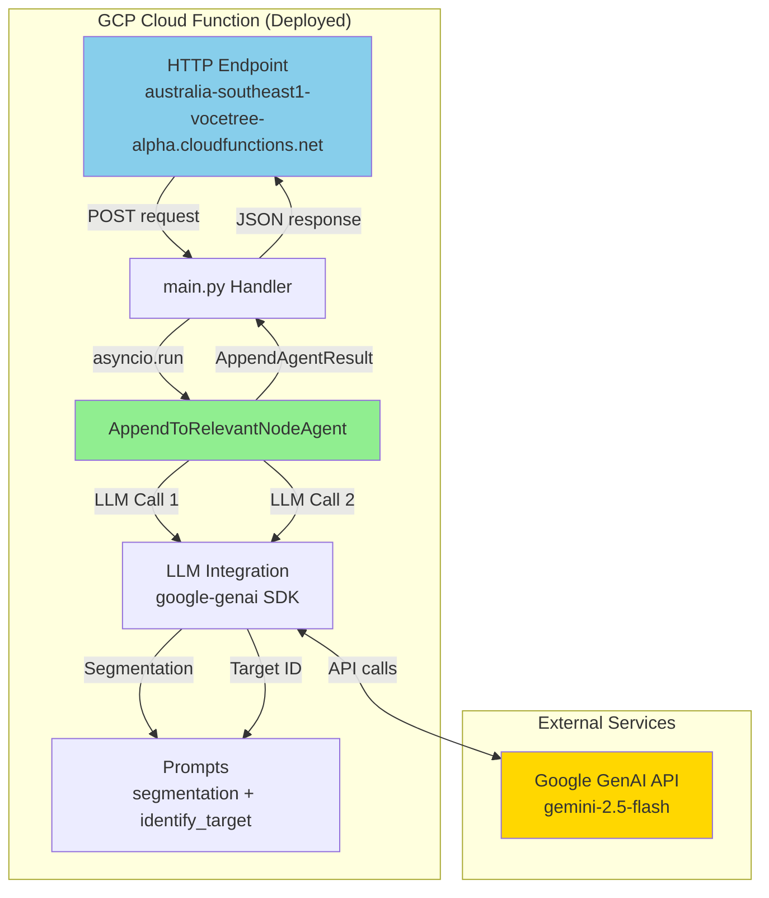

** Summary**
AppendToRelevantNodeAgent successfully deployed to Google Cloud Platform (australia-southeast1 region) as a Gen2 Cloud Function. Fixed dependency issue with google-genai package and verified endpoint is operational with live LLM calls.

** Technical Details**

**Deployment Configuration:**
- **Function Name**: append-agent
- **Region**: australia-southeast1 (Sydney)
- **Runtime**: Python 3.11
- **Timeout**: 120s
- **Memory**: 1GB
- **Max Instances**: 10
- **URL**: https://australia-southeast1-vocetree-alpha.cloudfunctions.net/append-agent

**Files Deployed:**
- main.py (HTTP handler)
- requirements.txt (dependencies)
- agents/ (AppendToRelevantNodeAgent)
- core/ (LLM integration, state management)
- prompts/ (segmentation.md, identify_target_node.md)
- models.py (Pydantic models)

**Key Fix Applied:**
Changed requirements.txt from `google-generativeai==0.8.3` to `google-genai>=1.20.0` to match the import statements in core/llm_integration.py (`from google import genai`).

**APIs Enabled:**
- cloudfunctions.googleapis.com
- cloudbuild.googleapis.com  
- run.googleapis.com

** Deployment Flow**

```mermaid
sequenceDiagram
    participant Dev as Developer
    participant GCloud as GCloud CLI
    participant Build as Cloud Build
    participant CF as Cloud Function
    participant Test as curl Test

    Dev->>GCloud: gcloud functions deploy
    GCloud->>Build: Upload source & build
    Build->>Build: Install dependencies
    Note over Build: Initial deploy failed<br/>google-generativeai wrong
    Dev->>Dev: Fix requirements.txt<br/>google-genai>=1.20.0
    Dev->>GCloud: Redeploy
    GCloud->>Build: Rebuild with correct deps
    Build->>CF: Deploy revision 00002-rap
    CF->>CF: Function ACTIVE
    Test->>CF: POST /append-agent
    CF->>CF: Run AppendToRelevantNodeAgent<br/>2 LLM calls (10s)
    CF->>Test: 200 OK with actions & segments
    
    style Build fill:#FFD700
    style CF fill:#90EE90
```

** Test Results**

**Test Request:**
```json
{
  "transcript_text": "We need to add an index to the users table.",
  "existing_nodes_formatted": "1. Database Design - Initial database design discussions",
  "transcript_history": ""
}
```

**Response (Success):**
```json
{
  "actions": [{
    "action": "APPEND",
    "target_node_id": 1,
    "target_node_name": "Database Design - Initial database design discussions",
    "content": "\n+++\nWe need to add an index to the users table."
  }],
  "segments": [{
    "reasoning": "This segment contains a clear and complete instruction...",
    "edited_text": "We need to add an index to the users table.",
    "raw_text": "We need to add an index to the users table.",
    "is_routable": true
  }]
}
```

**Performance:**
- Latency: ~10 seconds (2 sequential LLM calls)
- Status: 200 OK
- Memory usage: Within 1GB allocation

** Architecture**



** Impact**

**Completed Phases:**
- ✅ Phase 1: GCP Setup (APIs enabled, region configured)
- ✅ Phase 2: Function Deployment (deployed with correct dependencies)
- ✅ Phase 3: Remote Testing (curl test passed with real LLM calls)
- ⏳ Phase 4: Backend Integration (next step)

**Enables:**
- **Independent Scaling**: Agent now scales separately from backend
- **Serverless Architecture**: Pay-per-use instead of always-on
- **Regional Deployment**: Running in australia-southeast1 for low latency
- **Easy Updates**: Can redeploy function without touching backend

**Next Steps:**
1. Create HTTP client in backend (Task 4.1)
2. Update TreeActionDeciderWorkflow to use cloud function (Task 4.2)
3. Add APPEND_AGENT_CLOUD_FUNCTION_URL to backend/.env (Task 4.3)
4. Run system integration test (Task 4.4)

-----------------
_Links:_
Parent:
- is_progress_of [[2025-09-30/14_1_1_1_Victor_GCP_Cloud_Function_Deployment_Plan.md]]