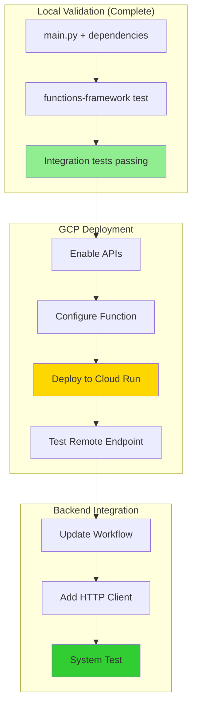
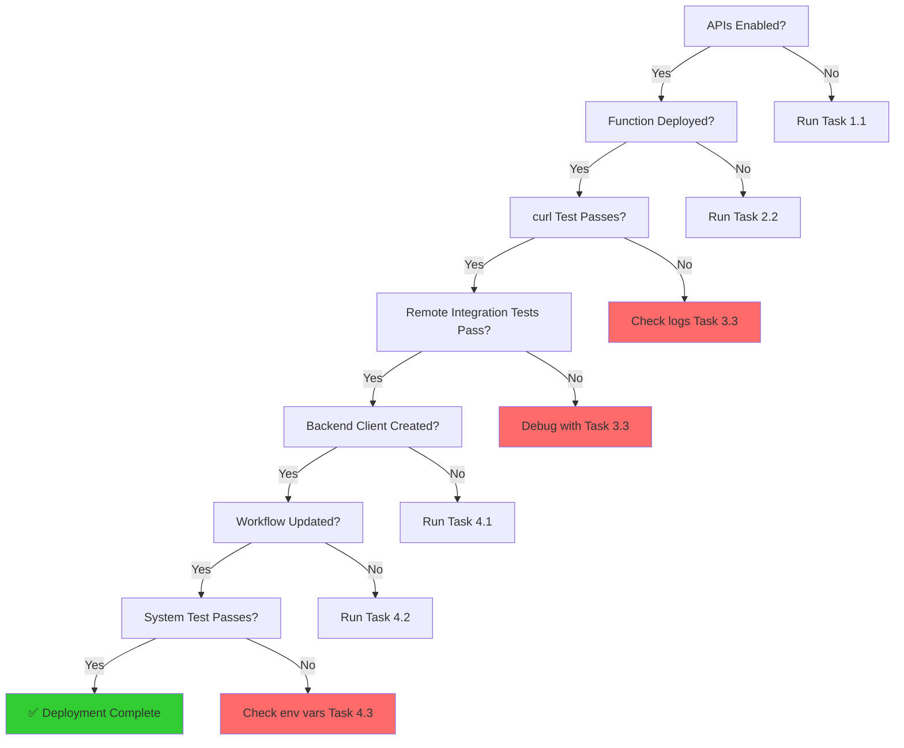

** Summary**
Step-by-step deployment plan to take the locally validated AppendToRelevantNodeAgent Cloud Function and deploy it to Google Cloud Platform, including all configuration, testing, and integration steps.

** Technical Details**

** Prerequisites**
- ✅ Local testing complete (all 7 integration tests passing)
- ✅ GCloud CLI configured (vocetree-alpha project)
- ✅ `main.py` validated with `functions-framework`
- ✅ `requirements.txt` finalized

** Deployment Architecture**



** Deployment Steps**

** Phase 1: GCP Setup (Sequential)**

**Task 1.1: Enable Required APIs**
```bash
** Enable Cloud Functions API**
gcloud services enable cloudfunctions.googleapis.com

** Enable Cloud Build API (required for deployment)**
gcloud services enable cloudbuild.googleapis.com

** Enable Cloud Run API (Gen2 functions use Cloud Run)**
gcloud services enable run.googleapis.com

** Verify enabled services**
gcloud services list --enabled | grep -E "cloudfunctions|cloudbuild|run"
```

**Task 1.2: Set Default Configuration**
```bash
** Set default region (Australia)**
gcloud config set functions/region australia-southeast1

** Verify current project**
gcloud config get-value project  # Should show: vocetree-alpha
```

** Phase 2: Deploy Function (Sequential after Phase 1)**

**Task 2.1: Prepare Deployment Directory**
```bash
cd cloud_functions/agentic_workflows

** Verify all required files present**
ls -la
** Should see:**
** - main.py**
** - requirements.txt**
** - agents/**
** - core/**
** - prompts/**
** - models.py**
```

**Task 2.2: Deploy to GCP Cloud Functions (Gen2)**
```bash
gcloud functions deploy append-agent \
  --gen2 \
  --runtime=python311 \
  --region=australia-southeast1 \
  --source=. \
  --entry-point=append_agent_handler \
  --trigger-http \
  --allow-unauthenticated \
  --timeout=120s \
  --memory=1GB \
  --max-instances=10 \
  --set-env-vars GOOGLE_API_KEY=${GOOGLE_API_KEY}
```

**Deployment Parameters Explained:**
- `--gen2`: Use Cloud Run-based functions (recommended)
- `--runtime=python311`: Python 3.11 runtime
- `--region=australia-southeast1`: Deploy to Australia region
- `--entry-point=append_agent_handler`: Function name in main.py
- `--trigger-http`: HTTP triggered function
- `--allow-unauthenticated`: Public endpoint (change for production)
- `--timeout=120s`: 2 minutes (for 2 sequential LLM calls)
- `--memory=1GB`: Adequate for LangGraph + LLM processing
- `--max-instances=10`: Auto-scaling limit
- `--set-env-vars`: Pass GOOGLE_API_KEY from local env

**Task 2.3: Capture Function URL**
```bash
** Get the deployed function URL**
gcloud functions describe append-agent \
  --region=australia-southeast1 \
  --gen2 \
  --format="value(serviceConfig.uri)"

** Save to environment variable for testing**
export CLOUD_FUNCTION_URL=$(gcloud functions describe append-agent --region=australia-southeast1 --gen2 --format="value(serviceConfig.uri)")

echo "Function deployed at: $CLOUD_FUNCTION_URL"
```

** Phase 3: Remote Testing (Sequential after Phase 2)**

**Task 3.1: Test Remote Endpoint with curl**
```bash
** Simple health check**
curl -X POST "$CLOUD_FUNCTION_URL" \
  -H "Content-Type: application/json" \
  -d '{
    "transcript_text": "We need to add an index to the users table.",
    "existing_nodes_formatted": "1. Database Design - Initial database design discussions",
    "transcript_history": ""
  }'

** Should return JSON with actions and segments**
```

**Task 3.2: Run Integration Tests Against Remote Function**
```bash
** Update test_client.py to use remote URL**
export CLOUD_FUNCTION_URL="https://append-agent-xyz.australia-southeast1.run.app"

** Run integration tests against production endpoint**
uv run pytest backend/tests/integration_tests/text_to_graph_pipeline/agentic_workflows/agents_and_prompts_tests/AppendToRelevantNodeAgent/test_AppendtoRelevantNodeAgent_cloud_function.py -v -s --cloud-url=$CLOUD_FUNCTION_URL
```

**Task 3.3: Monitor Function Logs**
```bash
** Stream logs in real-time**
gcloud functions logs read append-agent \
  --region=australia-southeast1 \
  --gen2 \
  --limit=50 \
  --format="table(time_utc, log)"

** Follow logs (like tail -f)**
gcloud functions logs read append-agent \
  --region=australia-southeast1 \
  --gen2 \
  --limit=50 \
  --format="table(time_utc, log)" \
  --follow
```

** Phase 4: Backend Integration (Sequential after Phase 3)**

**Task 4.1: Create HTTP Client in Backend**

Create `backend/text_to_graph_pipeline/agentic_workflows/clients/cloud_function_client.py`:
```python
import httpx
import os
from backend.text_to_graph_pipeline.agentic_workflows.models import AppendAgentResult

class CloudFunctionAppendAgent:
    def __init__(self):
        self.url = os.getenv('APPEND_AGENT_CLOUD_FUNCTION_URL')
        if not self.url:
            raise ValueError("APPEND_AGENT_CLOUD_FUNCTION_URL not set")
    
    async def run(self, transcript_text, existing_nodes_formatted, transcript_history=""):
        async with httpx.AsyncClient(timeout=120.0) as client:
            response = await client.post(
                self.url,
                json={
                    "transcript_text": transcript_text,
                    "existing_nodes_formatted": existing_nodes_formatted,
                    "transcript_history": transcript_history
                }
            )
            response.raise_for_status()
            data = response.json()
            
            ** Reconstruct AppendAgentResult**
            return AppendAgentResult.parse_obj(data)
```

**Task 4.2: Update TreeActionDeciderWorkflow**

Modify `backend/text_to_graph_pipeline/chunk_processing_pipeline/tree_action_decider_workflow.py`:
```python
** Line 24-26: Replace local import with cloud client**
from backend.text_to_graph_pipeline.agentic_workflows.clients.cloud_function_client import (
    CloudFunctionAppendAgent,
)

** Line 88: Update instantiation**
self.append_agent: CloudFunctionAppendAgent = CloudFunctionAppendAgent()
```

**Task 4.3: Add Environment Variable**
```bash
** Add to .env file**
echo "APPEND_AGENT_CLOUD_FUNCTION_URL=https://append-agent-xyz.australia-southeast1.run.app" >> backend/.env
```

**Task 4.4: Run System Integration Test**
```bash
** Test full workflow with Cloud Function**
uv run pytest backend/tests/integration_tests/text_to_graph_pipeline/agentic_workflows/test_real_examples.py -v -s

** This tests: transcript → workflow → Cloud Function → tree updates**
```

** Deployment Verification Checklist**



** Cost & Performance Monitoring**

**Task 5.1: Set Up Monitoring Dashboard**
```bash
** View function metrics**
gcloud functions describe append-agent \
  --region=australia-southeast1 \
  --gen2

** Get invocation count**
gcloud monitoring time-series list \
  --filter='metric.type="cloudfunctions.googleapis.com/function/execution_count"' \
  --format="table(metric.labels.function_name, points[0].value)"
```

**Task 5.2: Set Budget Alerts**
```bash
** Create budget alert for Cloud Functions**
gcloud billing budgets create \
  --billing-account=$(gcloud billing projects describe vocetree-alpha --format="value(billingAccountName)") \
  --display-name="Append Agent Function Budget" \
  --budget-amount=50AUD \
  --threshold-rule=percent=80 \
  --threshold-rule=percent=100
```

** Rollback Plan**

**If deployment fails or tests don't pass:**
```bash
** Delete the deployed function**
gcloud functions delete append-agent \
  --region=australia-southeast1 \
  --gen2 \
  --quiet

** Revert backend changes**
git checkout backend/text_to_graph_pipeline/chunk_processing_pipeline/tree_action_decider_workflow.py

** Remove cloud client**
rm backend/text_to_graph_pipeline/agentic_workflows/clients/cloud_function_client.py

** Continue using local agent until issues resolved**
```

** Success Metrics**

- ✅ Function deploys without errors
- ✅ curl test returns valid JSON
- ✅ All 7 remote integration tests pass
- ✅ System integration test passes
- ✅ Latency < 5s for typical requests
- ✅ No errors in Cloud Function logs
- ✅ Cost < $1/day for development usage

** Impact**

** Enables**
- **Independent Scaling**: Append agent scales separately from backend
- **Cost Optimization**: Pay-per-use vs always-on backend process
- **Regional Deployment**: Can deploy to multiple regions
- **Easy Updates**: Update function without backend redeployment
- **A/B Testing**: Run multiple versions simultaneously

** Risks Mitigated**
- Tested locally first (no surprise failures)
- Rollback plan ready
- Budget alerts configured
- Monitoring in place

** Next Steps After Deployment**
1. Monitor latency and error rates for 24 hours
2. Compare costs: Cloud Function vs local execution
3. Consider authentication (remove `--allow-unauthenticated`)
4. Set up CI/CD for automated deployments
5. Extract other agents (optimizer, orphan connector)

-----------------
_Links:_
Parent:
- is_the_next_step_after [[2025-09-30/14_1_1_Victor_Local_Cloud_Function_Testing_Implementation_Plan.md]]