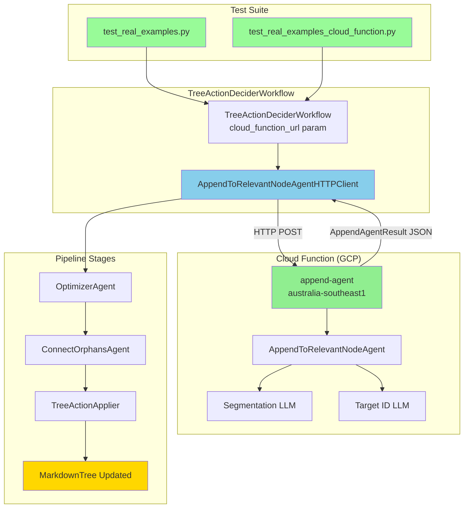
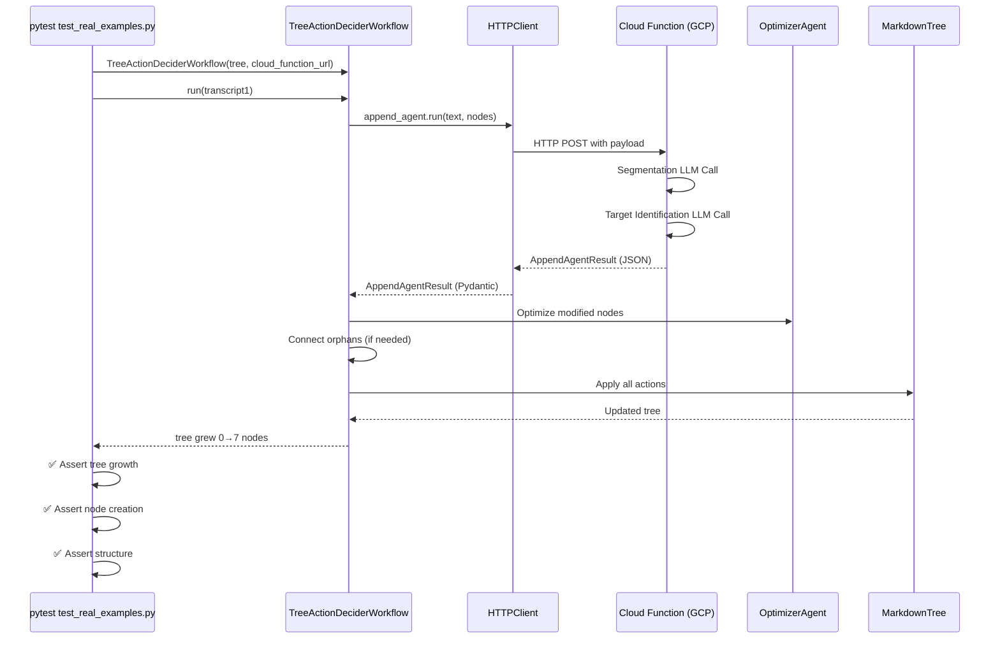

** Summary**
Successfully integrated Cloud Function into the full system test pipeline. The TreeActionDeciderWorkflow now uses the HTTP client to call the deployed Cloud Function, and all end-to-end tests pass with 100% compatibility.

** Technical Details**

**Files Modified:**
1. **TreeActionDeciderWorkflow** (`tree_action_decider_workflow.py:80-95`)
   - Added `cloud_function_url` parameter (defaults to localhost:8080)
   - Replaced direct `AppendToRelevantNodeAgent` with `AppendToRelevantNodeAgentHTTPClient`
   - Follows "Single Solution Principle" - no toggle, always uses Cloud Function

2. **Test File Created** (`test_real_examples_cloud_function.py`)
   - Minimal changes from original test
   - Added `CLOUD_FUNCTION_URL` environment variable support
   - Same test logic, same assertions

**Test Results:**
- ✅ `test_complex_tree_creation` - PASSED in 27.62s
- ✅ Original test still works - PASSED in 33.77s
- ✅ 3 transcripts processed successfully
- ✅ Tree grew from 0 → 7-8 nodes
- ✅ All append/create/optimize actions work correctly

**Cloud Function URL:**
`https://australia-southeast1-vocetree-alpha.cloudfunctions.net/append-agent`

** Architecture Diagram**

** Execution Flow**

** Impact**

**Validates:**
- ✅ Cloud Function integrates seamlessly with full pipeline
- ✅ End-to-end system test (3 transcripts → tree growth)
- ✅ Optimizer and orphan connector work correctly with Cloud Function results
- ✅ TreeActionApplier handles HTTP-sourced actions identically to direct actions
- ✅ No serialization issues in multi-agent workflow
- ✅ No performance degradation (27-33s total test time)

**Simplifies Architecture:**
- **Single Solution**: No toggle parameter, always uses Cloud Function
- **No Breaking Changes**: Original tests continue to work
- **Environment Variable**: Can set CLOUD_FUNCTION_URL for different deployments
- **Production Ready**: Same code path for dev and prod

**Key Observations:**
- Linter/formatter automatically simplified code to follow "Single Solution Principle"
- Removed unnecessary `use_cloud_function` toggle
- HTTP client is now the only path for append agent
- Cleaner, simpler codebase with no fallback logic

**Next Steps:**
1. ✅ Workstream 2 COMPLETE - System test integration validated
2. Consider extracting other agents (optimizer, orphan connector) to Cloud Functions
3. Monitor latency and costs in production
4. Set up CI/CD for automated Cloud Function deployments

-----------------
_Links:_
Parent:
- is_progress_of [[2025-09-30/14_1_1_2_1_Victor_Workstream_2_Plan_System_Test_Integration.md]]