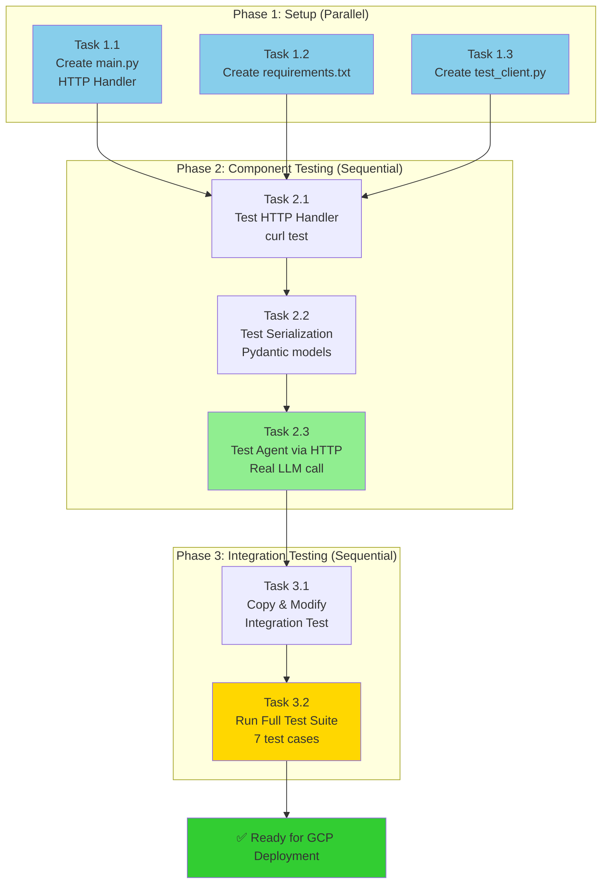
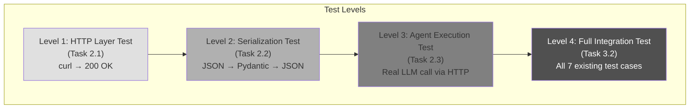

** Summary**
Detailed step-by-step plan to test the AppendToRelevantNodeAgent as a local Google Cloud Function, using existing integration tests to validate each component in isolation before full end-to-end testing.

** Technical Details**

** Testing Philosophy**
- **Test-Driven Approach**: Validate each component before integration
- **Isolation First**: Test HTTP layer, serialization, and agent logic separately
- **Reuse Existing Tests**: Leverage existing integration test suite (7 test cases with real LLM calls)
- **Local Development Loop**: No GCP deployment until validated locally

** Task Breakdown**

**# Phase 1: Setup Infrastructure (Parallel Tasks)**
1. **Task 1.1: Create main.py HTTP Handler**
   - Location: `cloud_functions/agentic_workflows/main.py`
   - Responsibility: Wrap `append_agent.run()` in HTTP endpoint
   - Test: Manual curl test with mock data
   
2. **Task 1.2: Create requirements.txt**
   - Location: `cloud_functions/agentic_workflows/requirements.txt`
   - Dependencies: functions-framework, langgraph, google-generativeai, pydantic, python-dotenv
   - Test: `pip install -r requirements.txt` succeeds

3. **Task 1.3: Create Test Client Adapter**
   - Location: `cloud_functions/agentic_workflows/test_client.py`
   - Responsibility: HTTP client that mimics `AppendToRelevantNodeAgent` interface
   - Test: Unit test for serialization/deserialization

**# Phase 2: Component Testing (Sequential after Phase 1)**
4. **Task 2.1: Test HTTP Handler in Isolation**
   - Start: `functions-framework --target=append_agent_handler --debug`
   - Test: Send simple curl request with minimal payload
   - Validates: HTTP routing, request parsing, response formatting
   
5. **Task 2.2: Test Pydantic Model Serialization**
   - Test: Send request with full `AppendAction` and `CreateAction` examples
   - Validates: Models serialize/deserialize correctly over HTTP
   
6. **Task 2.3: Test Agent Execution via HTTP**
   - Test: Send real transcript text + existing nodes
   - Validates: Agent runs successfully through HTTP layer with real LLM calls

**# Phase 3: Integration Testing (Sequential after Phase 2)**
7. **Task 3.1: Copy Integration Test File**
   - Copy: `test_AppendtoRelevantNodeAgent.py` → `test_AppendtoRelevantNodeAgent_cloud_function.py`
   - Modify: Replace agent fixture to use `CloudFunctionAppendAgent`
   
8. **Task 3.2: Run All 7 Integration Tests Against Local Cloud Function**
   - Terminal 1: Cloud Function running on localhost:8080
   - Terminal 2: `uv run pytest test_AppendtoRelevantNodeAgent_cloud_function.py -v -s`
   - Validates: Full compatibility with existing test suite

** Architecture Diagram**



** Detailed Test Strategy**

** Test Pyramid**


** Test Commands Reference**

** Phase 2 Testing**
```bash
** Task 2.1: HTTP Handler Test**
cd cloud_functions/agentic_workflows
export GOOGLE_API_KEY=your_key
functions-framework --target=append_agent_handler --debug --port=8080

** In another terminal**
curl -X POST http://localhost:8080 -H "Content-Type: application/json" -d '{"transcript_text": "test", "existing_nodes_formatted": "test nodes", "transcript_history": ""}'

** Task 2.3: Real Agent Test**
curl -X POST http://localhost:8080 -H "Content-Type: application/json" -d '{"transcript_text": "We need to add an index to the users table.", "existing_nodes_formatted": "1. Database Design - Initial database design discussions", "transcript_history": ""}'
```

** Phase 3 Testing**
```bash
** Terminal 1: Keep Cloud Function running**
cd cloud_functions/agentic_workflows
functions-framework --target=append_agent_handler --debug --port=8080

** Terminal 2: Run integration tests**
uv run pytest backend/tests/integration_tests/text_to_graph_pipeline/agentic_workflows/agents_and_prompts_tests/AppendToRelevantNodeAgent/test_AppendtoRelevantNodeAgent_cloud_function.py -v -s
```

** Impact**

** Validates**
- ✅ HTTP interface works correctly
- ✅ Pydantic models serialize/deserialize over HTTP
- ✅ Agent logic unchanged (same behavior as direct instantiation)
- ✅ All 7 existing test cases pass with Cloud Function
- ✅ Real LLM calls work through HTTP layer
- ✅ Timeout handling (120s for 2 sequential LLM calls)

** Enables**
- **Fast Development Loop**: Test locally without GCP deployment
- **Confidence**: All existing tests pass before deployment
- **Debugging**: Easy to debug with functions-framework
- **Iteration**: Quick changes to main.py and retest

** Next Steps After Validation**
1. Deploy to GCP Cloud Run: `gcloud functions deploy append-agent`
2. Update backend workflow to call Cloud Function URL
3. Run full system integration test
4. Monitor latency and cost metrics

-----------------
_Links:_
Parent:
- is_progress_of [[2025-09-30/14_1_Victor_Append_Agent_Extraction_Analysis_Complete.md]]