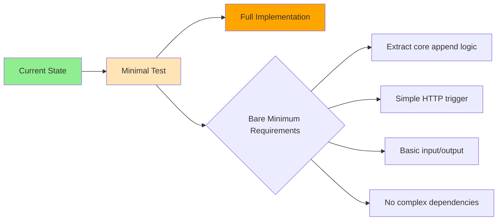

** Summary**
Google Cloud CLI fully configured and ready for bare minimum append agent conversion test, as suggested in nodes 18 and 19.

** Setup Achievements**
- ✅ GCloud CLI installed and authenticated
- ✅ Project configured: vocetree-alpha  
- ✅ Region set: australia-southeast1 (Sydney)
- ✅ All required APIs enabled
- ✅ Ready for Cloud Function deployment

** Next Step: Minimal Viable Cloud Function**
Based on node 19's guidance, focus on bare minimum conversion:

** Strategy Alignment**
- **Node 18 Concern**: Avoid over-complexity initially
- **Node 19 Solution**: Start with absolute minimum for quick test
- **Current Status**: Infrastructure ready for either approach

** Recommended Next Actions**
1. Identify core append agent functionality
2. Create minimal Cloud Function wrapper
3. Deploy and test basic functionality
4. Iterate based on results

The GCloud CLI setup is complete and optimized for Australian deployment.

-----------------
_Links:_
Parent:
- enables [[2025-09-30/4_Setup_G_Cloud_CLI.md]]