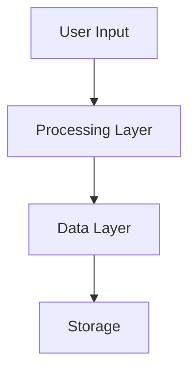

# Architecture

The system architecture follows the principles outlined in [[core-principles]].

## Overview

## Components

### Frontend
Handles user interactions and visualization. See [[workflow]] for user flows.

### Backend
Processes data and manages state. The [[api-design]] defines the interfaces.

### Storage
Persistent data management.

## Connections

- Implements [[core-principles]]
- Used by [[../projects/main-project]]
- Tested via [[../projects/testing-strategy]]