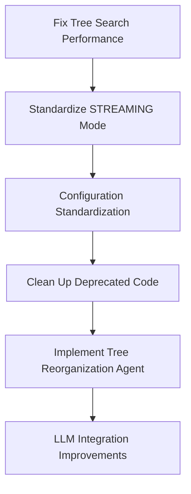

# VoiceTree TODO Implementation Master Plan

## Overview
This document provides a comprehensive plan for addressing all 28 TODOs found in the VoiceTree codebase. The plan is organized into 6 complex subtasks, each with detailed implementation guides.

## Implementation Order & Dependencies

## Phase 1: Foundation (Week 1)

### 1. Fix Tree Search Performance (Critical)
**File**: `/meta/current_tasks/subtask_02_fix_tree_search_performance.md`
- **Priority**: HIGHEST - This is a scaling bottleneck
- **Complexity**: Medium - Well-defined problem with clear solution
- **Risk**: Low - Can be tested incrementally
- **Key Outcome**: O(1) node lookups instead of O(n)

### 2. Standardize on STREAMING Mode
**File**: `/meta/current_tasks/subtask_01_standardize_streaming_mode.md`
- **Priority**: HIGH - Removes major source of confusion
- **Complexity**: High - Touches many files
- **Risk**: Medium - Breaking change
- **Key Outcome**: Single execution path, no mode confusion

## Phase 2: Cleanup & Standardization (Week 2)

### 3. Configuration Standardization
**File**: `/meta/current_tasks/subtask_06_configuration_standardization.md`
- **Priority**: HIGH - Improves developer experience
- **Complexity**: Medium - Mostly refactoring
- **Risk**: Low - Can be done incrementally
- **Key Outcome**: Centralized, clear configuration

### 4. Clean Up Deprecated Code
**File**: `/meta/current_tasks/subtask_04_clean_up_deprecated_code.md`
- **Priority**: MEDIUM - Technical debt reduction
- **Complexity**: Low - Clear what to remove
- **Risk**: Medium - Might break hidden dependencies
- **Key Outcome**: Cleaner, more maintainable codebase

## Phase 3: Feature Implementation (Week 3-4)

### 5. Implement Tree Reorganization Agent
**File**: `/meta/current_tasks/subtask_03_implement_tree_reorganization_agent.md`
- **Priority**: HIGH - Core missing functionality
- **Complexity**: Very High - New feature with LLM integration
- **Risk**: High - Complex implementation
- **Key Outcome**: Automatic tree optimization (TROA)

### 6. LLM Integration Improvements
**File**: `/meta/current_tasks/subtask_05_llm_integration_improvements.md`
- **Priority**: MEDIUM - Enhancement
- **Complexity**: High - Framework migration
- **Risk**: Medium - LangGraph learning curve
- **Key Outcome**: Better LLM integration, parent node rewriting

## Critical Path & Timeline

### Week 1: Foundation
- **Day 1-2**: Fix tree search performance
- **Day 3-5**: Begin STREAMING mode standardization

### Week 2: Standardization
- **Day 1-2**: Complete STREAMING mode changes
- **Day 3-4**: Configuration standardization
- **Day 5**: Start deprecated code cleanup

### Week 3: Core Features
- **Day 1**: Complete code cleanup
- **Day 2-5**: Begin tree reorganization agent

### Week 4: Enhancement
- **Day 1-3**: Complete tree reorganization agent
- **Day 4-5**: LLM integration improvements

## Risk Mitigation Strategy

### High-Risk Items
1. **STREAMING Mode Change**: Use feature flag for gradual rollout
2. **Tree Reorganization Agent**: Implement behind experimental flag
3. **Code Cleanup**: Comprehensive dependency search first

### Testing Strategy
- Each phase must pass all tests before proceeding
- Performance benchmarks after tree search fix
- Integration tests after each major change
- Quality benchmarks for LLM improvements

## Success Metrics

### Technical Metrics
- Tree search: < 1ms for 10,000 nodes
- Test coverage: Maintain > 80%
- Code reduction: Remove 1000+ lines of deprecated code
- Performance: No regression in any operation

### Quality Metrics
- Developer confusion: Zero "What is correct?" TODOs
- Configuration: Single source of truth
- Tree quality: 30% improvement with TROA
- LLM costs: < $0.10 per operation

## Coordination Points

### Cross-Task Dependencies
1. Tree search fix enables efficient tree reorganization
2. STREAMING mode must be done before cleanup
3. Configuration standardization helps all other tasks
4. LLM improvements depend on tree reorganization design

### Team Communication
- Daily progress updates during implementation
- Code reviews for each subtask
- Performance benchmarks published after each phase
- Documentation updates with each merge

## Post-Implementation

### Documentation Updates
- Update all README files
- Create migration guide for STREAMING mode
- Document new tree reorganization feature
- Update configuration documentation

### Monitoring
- Track tree search performance in production
- Monitor LLM costs after improvements
- Check for any mode-related errors
- Measure tree quality improvements

## Conclusion

This plan addresses all 28 TODOs through 6 well-structured subtasks. The implementation order minimizes risk while maximizing value delivery. Each subtask has detailed implementation guides with clear success criteria.

**Total Estimated Time**: 4 weeks
**Total Subtasks**: 6 major tasks covering 28 TODOs
**Risk Level**: Medium (mitigated through phased approach)
**Expected Outcome**: Significantly improved codebase with better performance, clearer architecture, and enhanced functionality