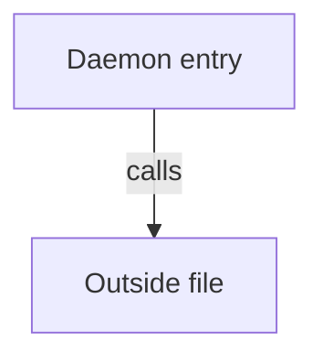

# Subtree Escape Child Fixture

```mermaid
flowchart TD
  daemon[Daemon entry]
  outside[Outside file]
  daemon -->|calls| outside
  click daemon "packages/systems/graph-db-server/src/daemon.ts"
  click outside "packages/systems/agent-runtime/src/outside.ts"
```
