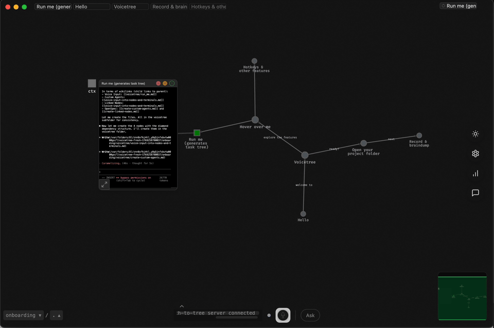

## Voicetree

**The spatial IDE for recursive multi-agent orchestration with human-in-the-loop**

Voicetree is an Obsidian-style mindmap of Markdown files - a shared context-graph for you and your coding agents.



[](https://github.com/voicetreelab/voicetree/actions/workflows/release.yml)


[](https://discord.gg/r2ZBtJ9zvk)

### What Problem Does This Solve?

| Challenge                                                           | Voicetree Solution                                           |
|---------------------------------------------------------------------|--------------------------------------------------------------|
| Manual agent coordination                                           | Agents can recursively spawn children and subgraphs          |
| 4-10 agent terminals is overwhelming                                | Spatial organisation on an infinite canvas                   |
| Agents lose context on restart                                      | Agents automatically save progress to graph                  |
| Agents suffer context-rot in long sessions                          | Defaults to short, focussed sessions with automatic handover |
| Your working memory is overloaded                                   | Automatically externalise it 1:1 onto the mindmap            |
| Agents don't know what you know                                     | You share the same memory pool with agents                   |
| Context-switching is draining                                       | Zoom to a task to see only the relevant information          |

### How

Voicetree is a peaceful canvas for agentic engineering. Your agents (Claude Code, Codex, Opencode, Gemini etc.) live inside the graph, next to their tasks, plans, and progress updates. 

Agents see all context within a distance around them, and can execute semantic search against local embeddings. This means agents see what you see. You share the same memory, the same second brain.

Agents can operate within the graph like you, building subgraphs to break their problems down into small chunks that are easy for you to review and glance at the high-level view. 

The agents can spawn and orchestrate their own subagents into the graph, but as native terminals offering you full visibility and control.

As your project & context grows, this scales. You use your brains most efficient form of memory: remembering where things are in space. 
Each node can represent any concept at any level of abstraction. You can see and reason about the structure between these concepts more easily as it is represented exactly as your brain represented them.
This lets you externalise your working memory, freeing up cognitive load for the real problem-solving. 

## Installation

### macOS (Apple Silicon)

[Download for Mac (Apple Silicon)](https://github.com/voicetreelab/voicetree/releases/latest/download/voicetree-arm64.dmg)

Or install via Homebrew:

```bash
brew tap voicetreelab/voicetree && brew install voicetree
```

### macOS (Intel)

[Download for Mac (Intel)](https://github.com/voicetreelab/voicetree/releases/latest/download/voicetree-x64.dmg)

Or install via Homebrew:

```bash
brew tap voicetreelab/voicetree && brew install voicetree
```

### Windows

[Download for Windows](https://github.com/voicetreelab/voicetree/releases/latest/download/voicetree.exe)

### Linux

[Download AppImage](https://github.com/voicetreelab/voicetree/releases/latest/download/voicetree.AppImage)

Or install via script:

```bash
curl -fsSL https://raw.githubusercontent.com/voicetreelab/voicetree/main/install.sh | sh
```


### Divide and Conquer with Transparent Subagent Orchestration

Long, complex tasks make agents unpredictable. Simple, isolated tasks make them reliable.

Voicetree lets you architect and then automatically break work into subtasks: what needs to happen, in what order, and what can run in parallel. Each agent gets one clear job. When agents are reliable, their outputs become building blocks — you assemble massive projects fractally from tiny tasks.

Agents can spawn their own subagents automatically. In other tools, this is invisible. In Voicetree, every subagent is fully transparent and controllable, running live on the graph in its own terminal.

### Built for Flow

- **No cold starts**: Step away for a minute or a week. The graph will be exactly as you left it.
- **Spatial navigation**: Your project becomes a map you can explore. Agents become landmarks, not just another terminal pane.
- **Hackable**: Everything is stored on-device as markdown files. Keep your same Claude settings and workflows.
- **Efficient**: Pruning context leads to ammoritzed fewer input tokens and more accurate responses.

## Beyond Agents: Voice & Thinking

Voicetree also works as a tool for thinking. Use speech-to-graph mode to capture ideas hands-free — your voice becomes nodes on the canvas.

**Use cases:**
- **Day-to-day work**: Organize tasks and decisions as you think through them
- **Deep problem-solving**: Let the graph offload your working memory, freeing your cognition
- **Human-agent collaboration**: Build the graph yourself, then let agents continue in the background
- **Context compression**: The graph structure naturally solves the LLM long-context problem.

Everything is local markdown files. Use it with agents, with voice, or just as a spatial thinking tool.

## Development

### Prerequisites

- **Node.js 18+** - Required for the main app
- **Python 3.13** - Required for the text-to-tree server 
- **uv** - Python package manager 

### App Setup

```bash
# Navigate to frontend
cd frontend/webapp

# Install npm dependencies
npm install

# Start the Electron app in dev mode
npm run electron
```

### Backend Text-To-Tree server Setup

```bash
# Install Python dependencies using uv, from project root 
uv sync

# Run backend tests
uv run pytest
```

## License

This project is licensed under the Business Source License 1.1 (BSL 1.1).

The code automatically converts to Apache 2.0 after 4 years.

See the [LICENSE](LICENSE) file for full details.

## Contact

Need help? Join the discord. https://discord.gg/r2ZBtJ9zvk

Feedback is immensely valuable. Ping us with any thoughts, criticisms, or feature requests.


[^1]: Chroma Research, "Context Rot: How Increasing Input Tokens Impacts LLM Performance" (July 2025). LongMemEval benchmark showed 30-60% performance gaps between focused (~300 token) and full (~113k token) prompts. https://research.trychroma.com/context-rot
