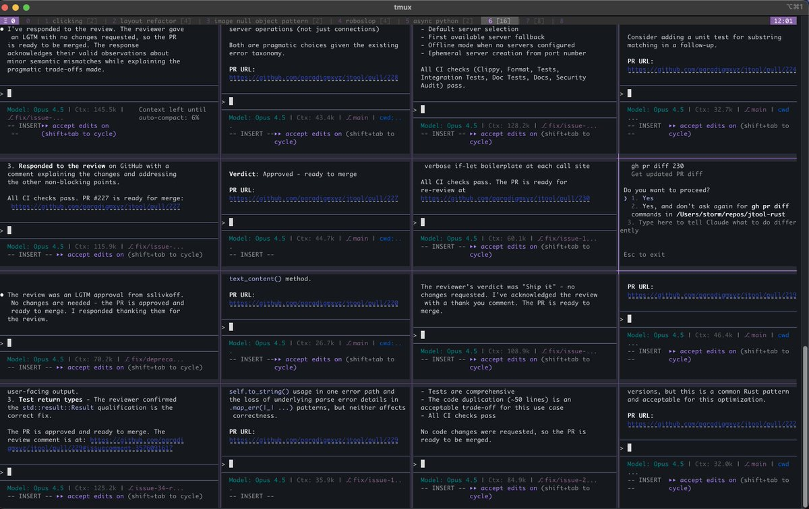
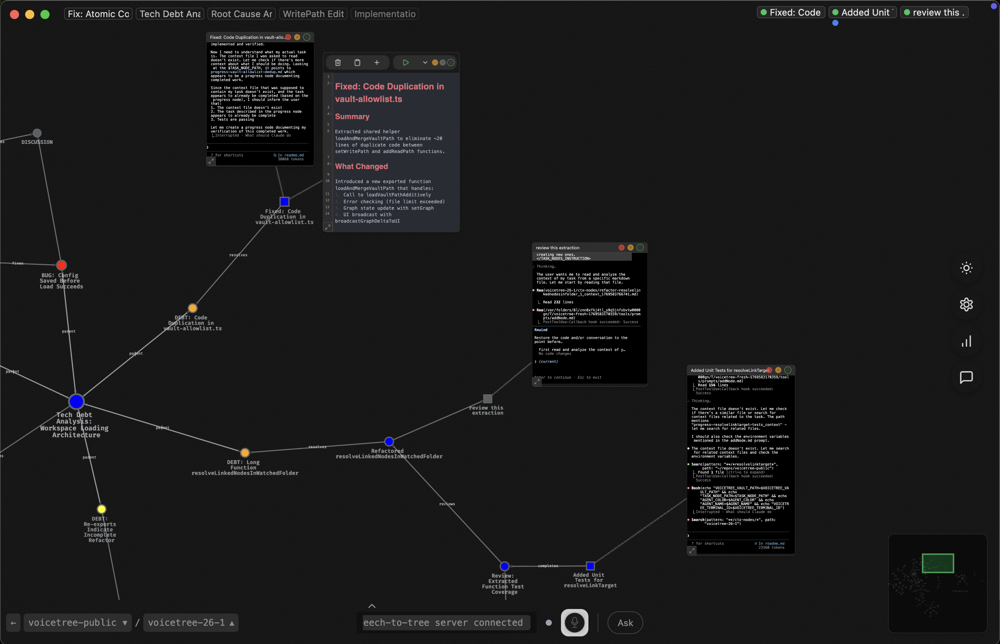

## The spatial IDE for recursive multi-agent orchestration.


### The Problem



Managing >4 terminals is claustrophobic and overwhelming. See image. 

It's a pain to memorize what each is doing. Scrolling through terminal history to keep track. 

And then, when an agent stops with a half finished task you are faced with a dilemma: 
- suffer context-rot if you reprompt it within the same session (decreasing quality by 50%^1). 
- Get the agent to save a handover document with its notes to warm up a new session. 10 sessions later and now you are lost in a another claustrophobic sea of unorganized notes.  

### The Solution

Voicetree is a canvas where every agent sits next to its task, planning documents, and progress updates. All visible at a glance. The closer something is, the more relevant it is.

Now you can effortlessly switch between swarms of parallel agents across your project. Your project becomes an interactive graph view made of markdown files and terminals. All stored locally.
## Installation

### macOS (Apple Silicon)

[Download for Mac (Apple Silicon)](https://github.com/voicetreelab/voicetree/releases/latest/download/voicetree-arm64.dmg)

Or install via Homebrew:

```bash
brew tap voicetreelab/voicetree && brew install voicetree
```

### macOS (Intel)

[Download for Mac (Intel)](https://github.com/voicetreelab/voicetree/releases/latest/download/voicetree-x64.dmg)

Or install via Homebrew:

```bash
brew tap voicetreelab/voicetree && brew install voicetree
```

### Windows

[Download for Windows](https://github.com/voicetreelab/voicetree/releases/latest/download/voicetree.exe)

### Linux

[Download AppImage](https://github.com/voicetreelab/voicetree/releases/latest/download/voicetree.AppImage)

Or install via script:

```bash
curl -fsSL https://raw.githubusercontent.com/voicetreelab/voicetree/main/install.sh | sh
```


**Discord community:** https://discord.gg/3z4Gbquv

### Divide and Conquer

Long, complex tasks make agents unpredictable. Simple, isolated tasks make them reliable.

VoiceTree lets you break work into subtasks: what needs to happen, in what order, and what can run in parallel. Each agent gets one clear job. When agents are reliable, their outputs become building blocks — you assemble massive projects fractally from tiny tasks.

### Transparent Orchestration

Agents can spawn their own subagents automatically. In other tools, this is invisible. In VoiceTree, every subagent is fully transparent and controllable, running live on the graph in its own terminal.

### Built for Flow

- **No cold starts**: Step away for a minute or a week. The graph will be exactly as you left it.
- **Spatial navigation**: Your project becomes a map you can explore. Agents become landmarks, not just another terminal pane.
- **Hackable**: Everything is stored on-device as markdown files. Keep your same Claude settings and workflows.
- **Efficient**: Pruning context leads to ammoritzed fewer input tokens and more accurate responses.


## Beyond Agents: Voice & Thinking

VoiceTree also works as a tool for thinking. Use speech-to-graph mode to capture ideas hands-free — your voice becomes nodes on the canvas.

**Use cases:**
- **Day-to-day work**: Organize tasks and decisions as you think through them
- **Deep problem-solving**: Let the graph offload your working memory, freeing your cognition
- **Human-agent collaboration**: Build the graph yourself, then let agents continue in the background
- **Context compression**: The graph structure naturally solves the LLM long-context problem

Everything is local markdown files. Use it with agents, with voice, or just as a spatial thinking tool.

## Development

### Prerequisites

- **Node.js 18+** - Required for the main app
- **Python 3.13** - Required for the text-to-tree server 
- **uv** - Python package manager 

### App Setup

```bash
# Navigate to frontend
cd frontend/webapp

# Install npm dependencies
npm install

# Start the Electron app in dev mode
npm run electron
```

### Backend Text-To-Tree server Setup

```bash
# Install Python dependencies using uv, from project root 
uv sync

# Run backend tests
uv run pytest

# add VITE_SONIOX_API_KEY to frontend/webapp/.env to have STT work 
``

## Contact

Need help? Reach out to us at hello@voicetree.io

Feedback is immensely valuable. Email us with any thoughts, criticisms, or feature requests.

## License

This project is licensed under the Business Source License 1.1 (BSL 1.1).

The code automatically converts to Apache 2.0 after 4 years.

See the [LICENSE](LICENSE) file for full details.