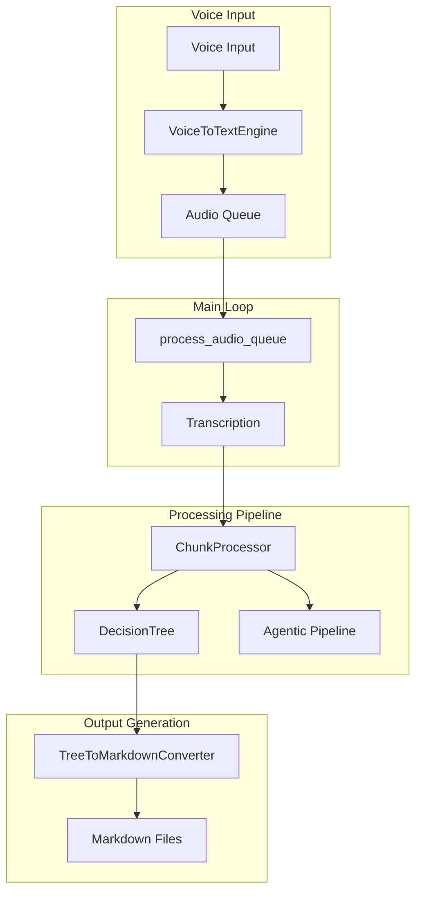

# VoiceTreePoc - Development Guide

## Overview

VoiceTreePoc is a voice-to-knowledge-graph system that transforms spoken input into structured markdown knowledge trees through an agentic workflow pipeline.

## Current Architecture

### High-Level System Flow



### Component Details

...

#### 3. Text Buffer Management
- core complexity the system must handle: voice transcript comes continously, but we have to process discretely in chunks.
  - When do we do this? How do we manage unfinished content? Questions like this are answered in backend/text_to_graph_pipeline/text_buffer_manager

#### 4. Agentic Workflow (4 Stages)

The Tree-Action-Decider-Agent (TADA) processes small chunks of text (1-3 sentences) and updates a tree representation. The agent has two actions: append content to an existing node, or create a new node.

**Core Pipeline Stages:**
1. **Segmentation** - Breaks transcripts into atomic ideas
2. **Relationship Analysis** - Analyzes connections to existing knowledge  
3. **Integration Decision** - Decides CREATE vs APPEND actions

### Key Configuration

- **LLM Models**: 
  - Primary: `gemini-2.5-pro-preview-06-05`
  - Fast: `gemini-2.0-flash`
- **Voice Model**: `large-v3` (alt: `distil-large-v3`)
- **Recent Nodes Context**: 10

## Directory Structure & Development Guides

### 🏗️ Core System Components

- **[`backend/`](backend/README-dev.md)** - Core system architecture, main entry points, and business logic
  - Main system orchestration and configuration
  - Voice-to-text processing


## Quick Start

### Prerequisites

```bash
# Install dependencies
pip install -r requirements.txt

# Set up API key
export GOOGLE_API_KEY="your_gemini_api_key"
```

### Essential Commands

```bash
# Run the main system
python backend/main.py

# Run unit tests
pytest backend/tests/unit_tests

# Run integration tests
pytest backend/tests/integration_tests/

# Run benchmarker for quality testing
python backend/benchmarker/src/quality_LLM_benchmarker.py
```

All tests and scripts should always be run from the root directory for consistency.


### Quality Debugging Workflow
1. Run benchmarker to generate output: `python -m backend.benchmarker.src.quality_LLM_benchmarker`
2. Check generated markdown files in `output/` directory
3. Identify quality issues (missing content, poor structure)
4. Review debug logs in `output/debug_output_[timestamp]/`
5. Trace problems through the 4-stage pipeline
6. Fix at the appropriate stage

See for more detail:
  **[`backend/benchmarker/Benchmarker_Agentic_feedback_loop_guide.md`](backend/benchmarker/Benchmarker_Agentic_feedback_loop_guide.md)**
    *   **Purpose**: The primary guide for developers. It explains how to test, debug, and improve the agentic workflows.
    *   **Why second?**: It introduces the core developer loop of testing and analysis, which is crucial for making meaningful contributions.


## Navigation

- 📖 **[Backend Architecture](backend/README-dev.md)** - Core system components
- 🌳 **[Tree Management](backend/text_to_graph_pipeline/tree_manager/README-dev.md)** - Data structures and buffer management  
- 🤖 **[Agentic Workflows](backend/text_to_graph_pipeline/agentic_workflows/README-dev.md)** - LLM processing pipeline
- 📊 **[Quality & Benchmarking](backend/benchmarker/README-dev.md)** - Testing and performance measurement

For specific development tasks, see `meta/current_tasks/` for active work and `meta/memories/` for architectural decisions and lessons learned. 