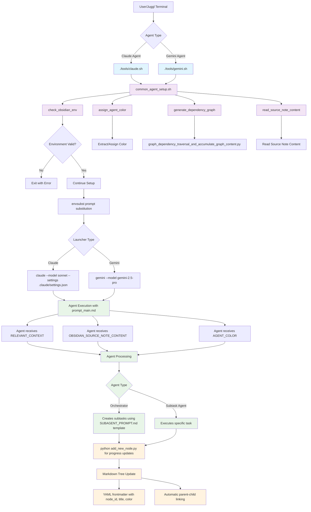

# VoiceTree Agent Launching System Architecture

## Overview

The VoiceTree agent launching system provides a modular framework for deploying LLM agents with consistent environment setup, context provision, and markdown tree integration. The system supports both Claude and Gemini backends with identical setup flows.

## Architecture Diagram



## Key Components

### Agent Launchers
- **`claude.sh`**: Main agent launcher using Claude Sonnet model
- **`gemini.sh`**: Alternative launcher using Gemini 2.5 Pro model
- Both use identical setup flow through `common_agent_setup.sh`

### Common Setup Functions (`common_agent_setup.sh`)
1. **Environment Validation**: Checks for required `OBSIDIAN_SOURCE_NOTE` environment variable
2. **Color Assignment**: Extracts existing color from source note or assigns random color for visual differentiation
3. **Dependency Graph Generation**: Runs graph traversal to provide relevant context
4. **Source Note Reading**: Loads the content of the spawning markdown note

### Prompt Templates
- **`prompt_main.md`**: Main orchestrator agent prompt with enhanced content requirements
- **`SUBAGENT_PROMPT.md`**: Template for creating focused subtask agents
- **`NODE_CREATION_REMINDER.md`**: Guidelines for creating rich progress nodes

### Node Creation System (`add_new_node.py`)
- Automatic node ID generation using hierarchical numbering
- YAML frontmatter with metadata (node_id, title, color)
- Automatic parent-child linking in markdown tree
- Header sanitization to prevent rendering issues

### Configuration
- **`.claude/settings.json`**: Claude-specific settings including hooks for reminders and validation
- **Environment Variables**: `AGENT_COLOR`, `OBSIDIAN_SOURCE_NOTE`, `OBSIDIAN_VAULT_PATH`, etc.

## Agent Types

### Orchestrator Agents
- Receive high-level tasks and break them into subtasks
- Use `SUBAGENT_PROMPT.md` template to create focused sub-agents
- Create subtask nodes using `add_new_node.py` with specific colors

### Subtask Agents  
- Execute focused, specific tasks within larger workflows
- Inherit color from parent task for visual consistency
- Create progress nodes documenting technical changes with Mermaid diagrams

## Key Features

### Modular Agent Deployment
- Common setup ensures consistent environment across all agents
- Pluggable LLM backends (Claude/Gemini) with identical interfaces

### Dynamic Color Assignment
- Visual differentiation of agent contributions in markdown tree
- Color inheritance from parent tasks to subtasks
- Random assignment when no parent color exists

### Context-Aware Execution
- Agents receive relevant dependency graph content via TF-IDF search
- Source note content provides task-specific context
- Environment variables pass metadata between system components

### Automated Tree Management
- Node creation with proper hierarchical linking
- Automatic YAML frontmatter generation
- Header sanitization for consistent rendering

### Rich Progress Tracking
- Mandatory Mermaid diagrams in all progress nodes
- Structured content format: Summary, Technical Details, Architecture Diagram, Impact
- Visual representation of system changes and architectural evolution

## Usage Examples

### Launching a Claude Agent
```bash
# Set environment variables (typically done by Juggl terminal)
export OBSIDIAN_SOURCE_NOTE="2025-08-08/8_Request_for_Architecture_Diagram.md"
export OBSIDIAN_VAULT_PATH="$USER_ROOT_DIR/repos/VoiceTree/markdownTreeVault"

# Launch agent
./tools/claude.sh
```

### Creating Progress Nodes
```bash
# From within an agent
python tools/add_new_node.py "$OBSIDIAN_VAULT_PATH/$OBSIDIAN_SOURCE_NOTE" \
  "Progress Update Title" \
  "## Summary\n[Accomplishment]\n\n## Technical Details\n...\n\n## Mermaid Diagram\n..." \
  is_progress_of
```

## System Benefits

- **Scalable Architecture**: Easy to add new LLM backends or agent types
- **Visual Traceability**: Color-coded progress tracking with architectural diagrams  
- **Consistent Environment**: Shared setup eliminates configuration drift
- **Rich Documentation**: Automatic generation of detailed progress records
- **Context Preservation**: Dependency graphs maintain awareness of related work